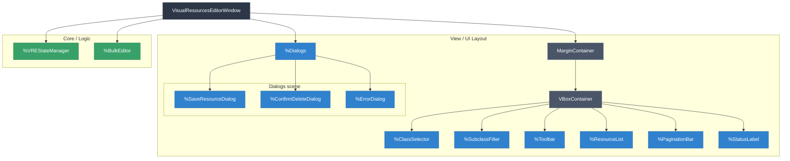
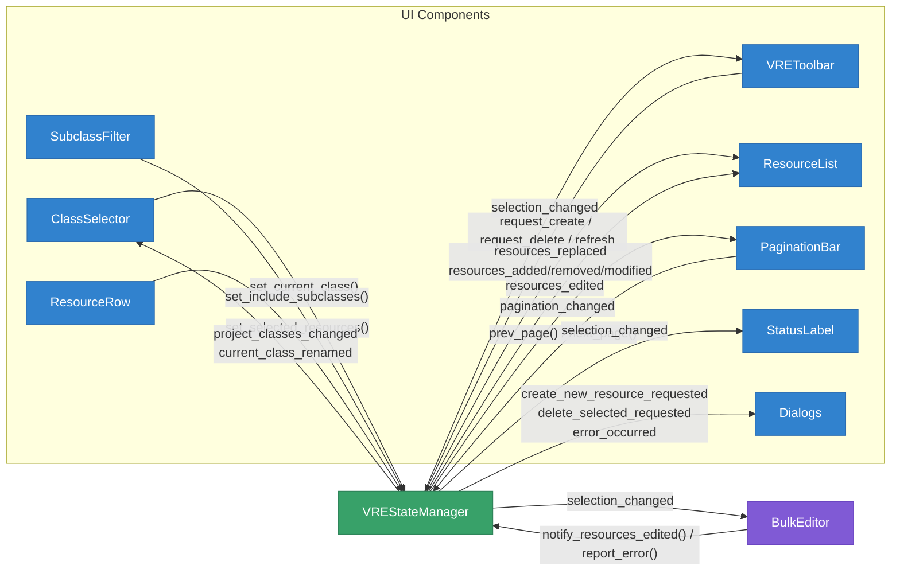
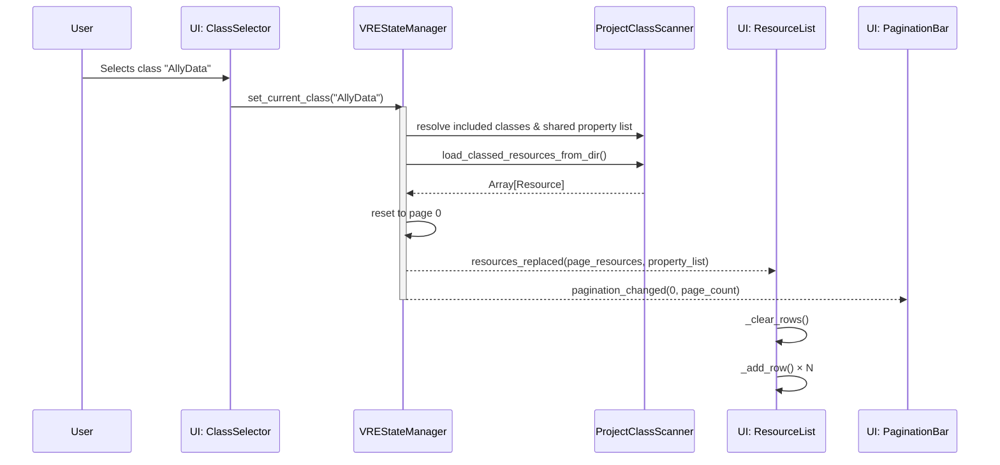
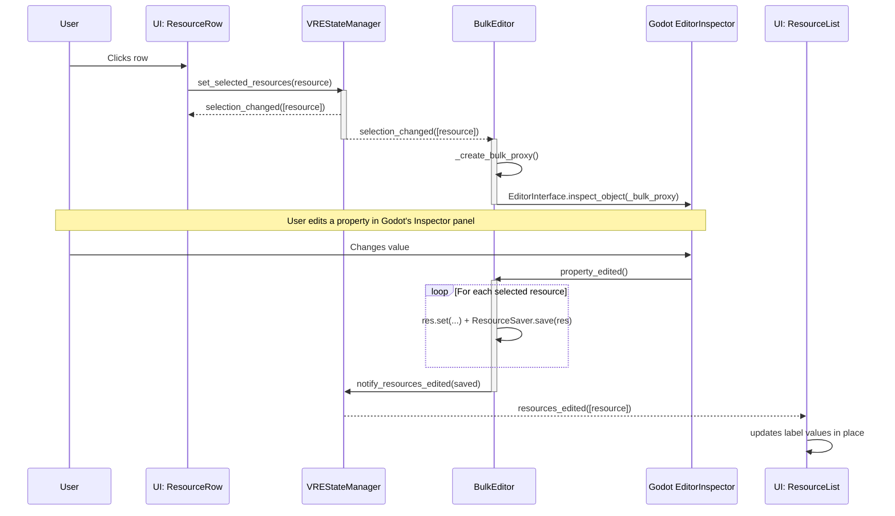
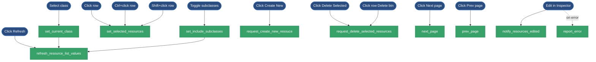
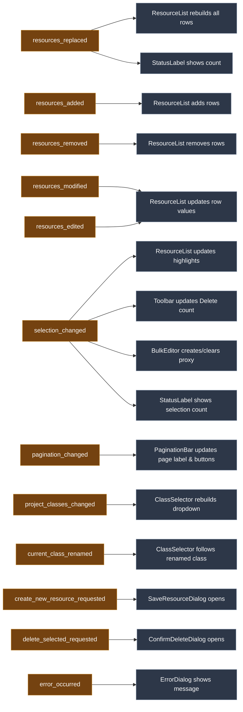

# Visual Resources Editor — Architecture

A Godot 4 `@tool` editor plugin for visually browsing, creating, bulk-editing, and deleting `.tres` resource files filtered by class type. 

---

## Architecture Overview

```text
visual_resources_editor/
├── visual_resources_editor_plugin.gd   # EditorPlugin entry point (adds toolbar menu)
├── visual_resources_editor_toolbar.gd  # Toolbar menu: instantiates the editor window
├── core/
│   ├── data_models/
│   │   ├── resource_property.gd        # Typed data model for a single property definition
│   │   └── class_definition.gd         # Typed data model for a class (name, path, properties)
│   ├── project_class_scanner.gd        # Static utility: scans project classes, properties, .tres files
│   ├── state_manager.gd                # VREStateManager: central state (resources, properties, selection, pagination)
│   ├── state_manager.tscn              # Scene for VREStateManager + DebounceTimer child
│   └── bulk_editor.gd                  # BulkEditor: proxy-based multi-resource editing via Godot inspector
├── ui/
│   ├── visual_resources_editor_window.gd/.tscn  # Main Window: assigns state_manager to children, owns error dialog
│   ├── class_selector/
│   │   └── class_selector.gd/.tscn     # Class dropdown selector
│   ├── subclass_filter/
│   │   └── subclass_filter.gd/.tscn    # "Include subclasses" checkbox + warning label
│   ├── toolbar/
│   │   └── toolbar.gd/.tscn            # VREToolbar: New/Delete Selected/Refresh + owns SaveResourceDialog & ConfirmDeleteDialog
│   ├── resource_list/
│   │   ├── resource_list.gd/.tscn      # Table container: header + scrollable rows, supports incremental add/remove/modify
│   │   ├── header_row.gd/.tscn         # Column header labels
│   │   ├── resource_row.gd/.tscn       # One row per resource (Button with toggle_mode, self-contained delete)
│   │   ├── resource_field_label.gd/.tscn  # Label for a single property cell (owns display/format logic)
│   │   ├── header_field_label.tscn      # Label for a single header cell
│   │   └── field_separator.tscn         # VSeparator between columns
│   ├── pagination_bar/
│   │   └── pagination_bar.gd/.tscn     # Prev/Next page buttons + page label
│   ├── status_label.gd                 # Script-only Label: shows resource count or selection count
│   └── dialogs/
│       ├── save_resource_dialog.gd      # EditorFileDialog for creating new resources
│       ├── confirm_delete_dialog.gd     # ConfirmationDialog for deleting resources (moves to OS trash)
│       └── error_dialog.gd             # AcceptDialog for error messages
└── plugin.cfg
```

## Data Flow

1. **Class scanning**: `ProjectClassScanner` reads `ProjectSettings.get_global_class_list()` to discover all project classes that descend from `Resource`. Results are cached in `VREStateManager` as maps (`global_class_map`, `global_class_to_path_map`, `global_class_to_parent_map`) and the filtered list `global_class_name_list`.

2. **Resource scanning**: When a class is selected via `set_current_class()`, `VREStateManager` uses `set_current_class_resources(reseting: true)` to load all `.tres` files matching the class (and optionally its subclasses) via `ProjectClassScanner.load_classed_resources_from_dir()`. On filesystem changes, `set_current_class_resources(reseting: false)` performs an incremental scan via `_scan_class_resources_for_changes()` using mtime comparison. The scanner reads the first line of each `.tres` file via `FileAccess` to extract `script_class=` — it does NOT load the full resource for classification.

3. **State → UI (granular signals)**: `VREStateManager` emits different signals depending on the type of change:
   - `resources_replaced(resources, property_list)` — full page rebuild. Carries the current page slice + shared property list. `ResourceList.replace_resources()` rebuilds all rows.
   - `resources_added(resources)` — incremental, new .tres files detected.
   - `resources_removed(resources)` — incremental, deleted .tres files detected.
   - `resources_modified(resources)` — incremental, modified .tres files detected.
   - `pagination_changed(page, page_count)` — always emitted alongside data changes to keep pagination in sync.

4. **Two-tier resource state**: `VREStateManager` maintains two levels of resource state:
   - `current_class_resources` + `_current_class_resources_mtimes`
   - `_current_page_resources` + `current_page_resources_mtimes`
   This allows diffing to emit granular signals.

5. **Selection**: `VREStateManager` owns all selection state. `set_selected_resources()` dispatches based on modifiers and emits `selection_changed`.

6. **Bulk editing**: `BulkEditor` creates a proxy resource matching the selected resources' script. When the user edits the proxy in Godot's Inspector, `BulkEditor` propagates the change to all selected resources and saves them.

7. **Filesystem reactivity**: Two `EditorFileSystem` signals drive updates:
   - `script_classes_updated` → debounced → `_handle_global_classes_updated()`
   - `filesystem_changed` → debounced → `_refresh_current_class_resources()`

8. **Delete flow**:
   - **Single row delete**: Each `ResourceRow` owns a `ConfirmDeleteDialog` child. Files are moved to OS trash.
   - **Bulk delete**: `VREToolbar` owns a `ConfirmDeleteDialog`. 

## Design Decisions

### Scene Unique Nodes (`%NodeName`)
All child node references use `%UniqueNode` directly in code. Nodes are marked with `unique_name_in_owner = true` in their `.tscn`.

### Signal Connections: Scene vs Code
Signals are connected via scene (`[connection]` in `.tscn`) when both source and target are in the same scene. Code connections are used for dynamic nodes or forwarding.

### SubclassFilter & Toolbar as Separate Scenes
The "Include subclasses" checkbox is a standalone scene (`ui/subclass_filter/subclass_filter.tscn`). The toolbar is also its own scene (`ui/toolbar/toolbar.tscn`), owning `SaveResourceDialog` and `ConfirmDeleteDialog`.

### Delete Moves to OS Trash
Both `ConfirmDeleteDialog` and `ResourceRow` use `OS.move_to_trash()`. No undo/redo for deletion — version control is the secondary safety net.

---

## Diagrams & Information Flow

The plugin currently uses a **"Hub and Spoke" / Facade pattern**. The `VisualResourcesEditorWindow` is a pure **dependency injector**: its only job in `_ready()` is to hand the `VREStateManager` reference to every child component. After that, components talk directly to the state manager facade.

*(Note: We are planning a refactor to break this Dependency Injection into specialized stores.)*

### 1. Window Subdivision (Component Hierarchy)



### 2. High-Level Information Flow (Current Architecture)



### 3. Proposed Target Architecture (Granular Dependency Injection)

*To resolve the "God Object" DI issue (Interface Segregation Principle).*

```mermaid
graph TD
    Coordinator[VREStateManager (Coordinator)] --> Selection[SelectionManager]
    Coordinator --> Pagination[PaginationManager]
    Coordinator --> Resources[ResourceRepository]
    Coordinator --> Registry[ClassRegistry]
    Coordinator --> FSListener[EditorFileSystemListener]

    Window[VisualResourcesEditorWindow] --> Coordinator

    Window --> ClassSelector
    Window --> ResourceList
    Window --> PaginationBar
    Window --> BulkEditor

    ClassSelector -. "depends only on" .-> Registry
    ResourceList -. "depends only on" .-> Resources
    ResourceList -. "depends only on" .-> Selection
    PaginationBar -. "depends only on" .-> Pagination
    BulkEditor -. "depends only on" .-> Selection
    BulkEditor -. "depends only on" .-> Resources
```

### 4. Data Flow: Selecting a Class



### 5. Data Flow: Selection & Bulk Editing



---

## Event Catalog

### A. User Actions

| # | Action | Where |
|---|--------|--------|
| 1 | Open the plugin (F3 / menu) | VisualResourcesEditorToolbar menu |
| 2 | Close the plugin (Escape / ✕) | Window title bar or keyboard |
| 3 | Select a class | ClassSelector dropdown |
| 4 | Toggle "Include Subclasses" | SubclassFilter checkbox |
| 5 | Click a resource row — single select | ResourceRow button |
| 6 | Ctrl+click a resource row — toggle | ResourceRow button |
| 7 | Shift+click a resource row — range select | ResourceRow button |
| 8 | Click "Create New" | VREToolbar |
| 9 | Click "Delete Selected" | VREToolbar |
| 10 | Click a row's own Delete button | ResourceRow |
| 11 | Click "Refresh" | VREToolbar |
| 12 | Click Next page / Prev page | PaginationBar |
| 13 | Edit a property in Godot Inspector (bulk edit) | Godot EditorInspector |
| 14a | Create a `.tres` of the viewed class externally | File system |
| 14b | Create a `.tres` of a different class externally | File system |
| 15a | Delete a `.tres` of the viewed class externally | File system |
| 15b | Delete a `.tres` of a different class externally | File system |
| 16a | Modify a `.tres` of the viewed class externally | File system |
| 16b | Modify a `.tres` of a different class externally | File system |
| 17 | Create a new `.gd` script with `class_name` extending Resource | File system |
| 18 | Delete a `.gd` script (remove class) | File system |
| 19 | Rename a class (`class_name` line changes) | File system |
| 20 | Add/remove/change `@export` properties in a `.gd` script | File system |

### B. Editor-Triggered Events (automatic Godot behavior)

| # | Event | Notes |
|---|-------|-------|
| 1 | `EditorFileSystem.filesystem_changed` | Fires after Godot's internal scan detects any file add/remove/modify |
| 2 | `EditorFileSystem.script_classes_updated` | Fires when the global class map changes |
| 3 | Both fire sequentially on `.gd` change | `script_classes_updated` first, then `filesystem_changed` in the same scan cycle |
| 4 | `EditorInspector.property_edited(property)` | Fires when user changes any Inspector value; BulkEditor listens |
| 5 | `EditorFileSystemDirectory` refresh | Godot frees and recreates the directory tree on every scan — never cache these references |

### C. Desired Outcomes

| # | Observable result |
|---|-------------------|
| 1 | Class names populate ClassSelector dropdown on plugin open |
| 2 | New class appears in ClassSelector dropdown |
| 3 | Class disappears from ClassSelector dropdown |
| 4 | ClassSelector follows a renamed class (selection updates to new name) |
| 5 | New row appears in ResourceList |
| 6 | Row disappears from ResourceList |
| 7 | Row values update in ResourceList |
| 8 | Columns update in ResourceList header and rows (schema change) |
| 9 | Selection highlights update in ResourceList |
| 10 | Selection is preserved after list refresh (same paths re-selected) |
| 11 | PaginationBar shows/hides based on page count |
| 12 | PaginationBar prev/next disabled correctly at boundaries |
| 13 | StatusLabel shows visible resource count |
| 14 | StatusLabel shows selection count while something is selected |
| 15 | Inspector shows bulk proxy when resources are selected |
| 16 | Inspector clears when selection is empty or cross-class |
| 17 | Error dialog appears on save/delete failures |
| 18 | View clears when current class is deleted and not renamed |

---

### D. User Action → Call Chain → state_manager

| User Action | Component | Handler | Intermediate steps | state_manager method |
|-------------|-----------|---------|-------------------|---------------------|
| Open plugin (F3 / menu) | VisualResourcesEditorToolbar | `_on_menu_id_pressed(0)` | `open_visual_editor_window()` → instantiate window → `_ready()` sets all `.state_manager` properties | — (no direct call; setup only) |
| Close plugin (Esc / ✕) | VisualResourcesEditorWindow | `_unhandled_input()` | `close_requested.emit()` → `_on_close_requested()` → `queue_free()` | — |
| Select a class | ClassSelector | `_on_class_dropdown_item_selected(idx)` | — | `set_current_class(name)` |
| Toggle Include Subclasses | SubclassFilter | `_on_include_subclasses_check_toggled(pressed)` | — | `set_include_subclasses(pressed)` |
| Click row (no modifier) | ResourceRow | `_on_pressed()` | reads `Input.is_key_pressed()` | `set_selected_resources(res, false, false)` |
| Ctrl+click row | ResourceRow | `_on_pressed()` | reads `Input.is_key_pressed(KEY_CTRL/META)` | `set_selected_resources(res, true, false)` |
| Shift+click row | ResourceRow | `_on_pressed()` | reads `Input.is_key_pressed(KEY_SHIFT)` | `set_selected_resources(res, false, true)` |
| Click "Create New" | VREToolbar | `_on_create_btn_pressed()` | — | `request_create_new_resouce()` → emits `create_new_resource_requested` → SaveResourceDialog shows → after user picks path: `ResourceSaver.save()` → filesystem event |
| Click "Delete Selected" | VREToolbar | `_on_delete_selected_pressed()` | reads `state_manager._selected_paths` | `request_delete_selected_resources(paths)` → emits `delete_selected_requested` → ConfirmDeleteDialog shows → after confirm: `OS.move_to_trash()` + `efs.update_file()` → filesystem event |
| Click row's Delete button | ResourceRow | `_on_delete_pressed()` | — | `request_delete_selected_resources([resource.resource_path])` → same dialog flow as above |
| Click "Refresh" | VREToolbar | `_on_refresh_btn_pressed()` | — | `refresh_resource_list_values()` |
| Click Next page | PaginationBar | `%NextBtn.pressed` connected | — | `next_page()` |
| Click Prev page | PaginationBar | `%PrevBtn.pressed` connected | — | `prev_page()` |
| Edit property in Inspector | Godot EditorInspector | `property_edited` signal | BulkEditor `_on_inspector_property_edited()` → `res.set()` + `ResourceSaver.save()` per resource | `notify_resources_edited(saved)` and/or `report_error(msg)` |

---

### E. state_manager Method → Desired Outcomes

| state_manager method | What it does internally | Signals emitted | Outcomes |
|----------------------|------------------------|----------------|---------|
| `set_current_class(name)` | Calls `refresh_resource_list_values()` | `resources_replaced`, `pagination_changed` | ResourceList rebuilds all rows; PaginationBar resets to page 0; StatusLabel updates count |
| `set_include_subclasses(value)` | Calls `refresh_resource_list_values()` | `resources_replaced`, `pagination_changed` | Same as above |
| `refresh_resource_list_values()` | Resolves classes, scans properties, loads resources, resets page, restores selection | `resources_replaced`, `pagination_changed`, `selection_changed` | Full list rebuild; columns update; selection preserved |
| `set_selected_resources(res, ctrl, shift)` | Shift=range, Ctrl=toggle, none=single; updates `selected_resources` | `selection_changed` | Row highlights update; toolbar count updates; BulkEditor creates/clears inspector proxy |
| `request_create_new_resouce()` | Emits signal only; dialog + filesystem do the rest | `create_new_resource_requested` | SaveResourceDialog opens |
| `request_delete_selected_resources(paths)` | Emits signal only; dialog + filesystem do the rest | `delete_selected_requested` | ConfirmDeleteDialog opens |
| `next_page()` / `prev_page()` | Clamps page, slices new page window, diffs against previous | `resources_added`, `resources_removed`, `resources_modified`, `pagination_changed` | ResourceList adds/removes/updates rows for the new page; PaginationBar updates |
| `notify_resources_edited(resources)` | Emits signal only | `resources_edited` | ResourceList refreshes display values in affected rows (no rebuild) |
| `report_error(message)` | Emits signal only | `error_occurred` | ErrorDialog shows the message |
| `_on_filesystem_changed()` (auto) | Debounces → `_scan_class_resources_for_changes()` → mtime diff → restores selection | `resources_added`, `resources_removed`, `resources_modified`, `pagination_changed`, `selection_changed` | New/deleted/modified rows update in place; selection restored by path |
| `_handle_global_classes_updated()` (auto) | Rebuilds class maps; detects renames, deletions, subclass-set changes, schema changes | `project_classes_changed`, `current_class_renamed`, `resources_replaced`, `pagination_changed` | Dropdown updates; class rename followed; view clears or refreshes |

---

## Diagrams: User Actions → state_manager → Outcomes

### User Actions → state_manager calls



### state_manager signals → UI outcomes


