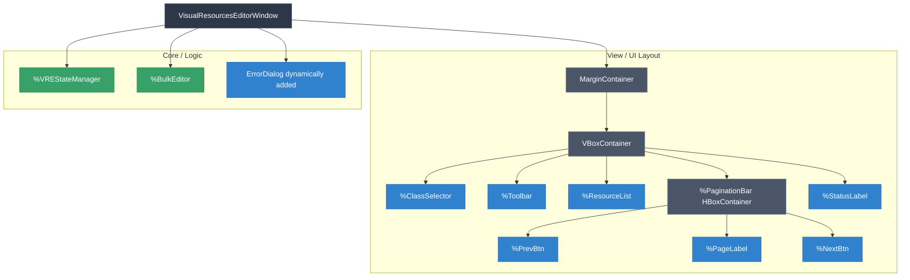
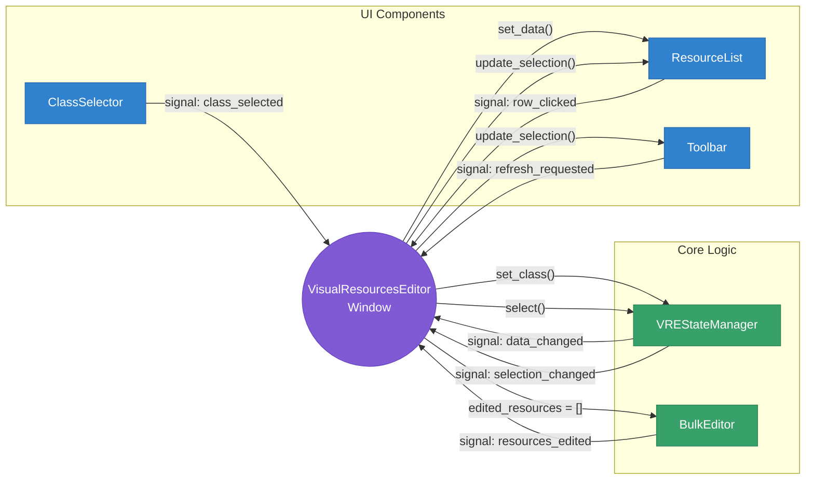
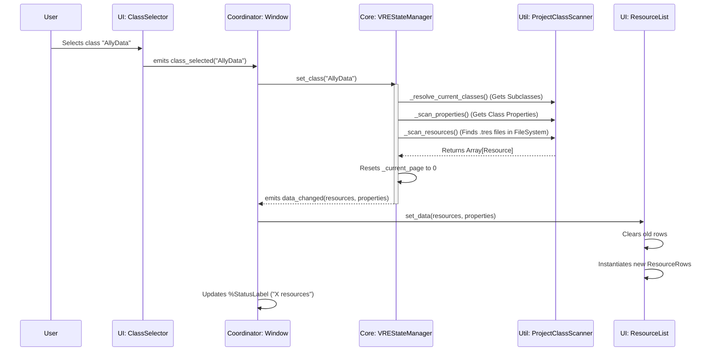
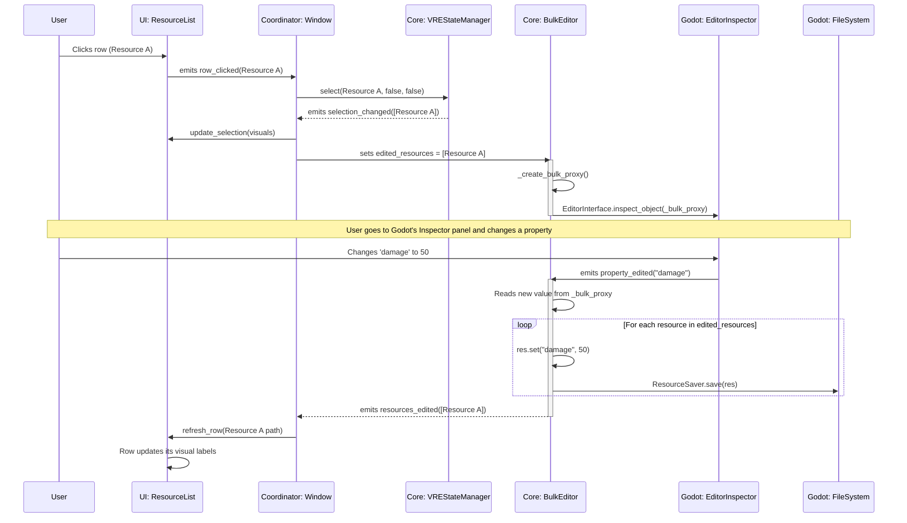

# Visual Resources Editor - Architecture & Information Flow

## Previous State

Based on the code analysis of the `addons/diablohumastudio/visual_resources_editor` directory, the plugin is structured using a very clean, modular **MVVM-like (Model-View-ViewModel) or Coordinator pattern**. 

The main entry point is the `VisualResourcesEditorWindow`, which acts as the central coordinator connecting pure UI components (Views) with the core logic managers (Models/State).

Here is a detailed breakdown and diagrams explaining the subdivision and the information flow.

---

### 1. Window Subdivision (Component Hierarchy)

The `VisualResourcesEditorWindow.tscn` is divided into a clear visual layer (the layout) and a logic layer (State and Editor nodes attached directly to the window).

**Subdivision Breakdown:**
*   **Top Bar (`%ClassSelector`)**: A dropdown to select which `Resource` class to inspect, along with a toggle to include its subclasses.
*   **Actions (`%Toolbar`)**: Contains global actions like "Create New", "Delete Selected", and "Refresh".
*   **Main Content (`%ResourceList`)**: A scrollable table/list showing the resource instances and their properties.
*   **Bottom Bar (`%PaginationBar` & `%StatusLabel`)**: Handles navigation for large sets of resources and displays the current selection/visible count.
*   **Invisible Logic Nodes**: `%VREStateManager` (holds all data and file tracking) and `%BulkEditor` (intercepts Godot Editor inspector changes to apply them to multiple resources).

---

### 2. High-Level Information Flow Architecture

The `VisualResourcesEditorWindow` script acts strictly as a **Coordinator**. UI components never talk directly to the State Manager or Bulk Editor. Instead, UI components emit signals (`class_selected`, `row_clicked`), the Window listens to them, calls methods on the State Manager, and the State Manager emits signals back (`data_changed`, `selection_changed`) which the Window uses to update the UI.

---

### 3. Detailed Data Flow: Selecting a Class & Loading Data

When the user selects a class from the dropdown, a complex chain of data processing happens inside the `VREStateManager` before it reaches the UI.

---

### 4. Detailed Data Flow: Multi-Selection & Bulk Editing

The `BulkEditor` is a very clever node. It tracks selection changes, creates a dummy "proxy" object to show in the native Godot Inspector, and when the user changes a value in the inspector, it applies that value to *all* selected resources.

### 5. File System Tracking (The Background Loop)
The `VREStateManager` stays in sync with Godot's native filesystem.

1. It connects to Godot's `EditorFileSystem.filesystem_changed` and `script_classes_updated`.
2. When a file changes externally, Godot triggers the signal.
3. `VREStateManager` waits briefly using a Debounce Timer to prevent spam.
4. It then runs `_rescan_resources_only()`. It checks modified times (`mtimes`) of known paths. 
5. If a new resource was added, it appends it. If one was deleted, it removes it. If changed, it reloads it.
6. It then fires `data_changed` back to the window while **preserving the user's current pagination page and selection**.

---

## Event Catalog

### A. User Actions (things the user can do)

1. **Open the plugin** — press F3
2. **Close the plugin** — press Escape or click close
3. **Select a class** from ClassSelector dropdown
4. **Toggle "Include Subclasses"** checkbox
5. **Click a resource row** — single select (no modifier key)
6. **Ctrl+click a resource row** — toggle in/out of multi-selection
7. **Shift+click a resource row** — range select from last anchor
8. **Click "Create New"** — SaveResourceDialog → save a new `.tres`
9. **Click "Delete Selected"** — ConfirmDeleteDialog → `OS.move_to_trash()`
10. **Click "Refresh"**
11. **Click Next/Prev page**
12. **Edit a property in Godot Inspector** — BulkEditor applies value to all selected resources
13a. **Create a `.tres` of the current viewed class** outside the plugin
13b. **Create a `.tres` of a different class** outside the plugin
14a. **Delete a `.tres` of the current viewed class** outside the plugin
14b. **Delete a `.tres` of a different class** outside the plugin
15a. **Modify a `.tres` of the current viewed class** outside the plugin
15b. **Modify a `.tres` of a different class** outside the plugin
16a. **Rename/move a `.tres` of the current viewed class** outside the plugin
16b. **Rename/move a `.tres` of a different class** outside the plugin
17. **Create a new `.gd` script** with a `class_name` that extends a resource class (includes subclass creation)
18. **Delete a `.gd` script** (remove a class from the project)
19. **Rename a class** — change the `class_name` line in a `.gd` script
20. **Add/remove/change properties** in a `.gd` script (schema change)

### B. Editor-Triggered Events (automatic Godot behavior)

1. **`EditorFileSystem.filesystem_changed`** — fires when Godot detects files added, removed, or modified on disk (after its internal scan completes)
2. **`EditorFileSystem.script_classes_updated`** — fires when the global class map changes (a `class_name` was added, removed, or the script it points to changed)
3. **Both fire sequentially** — when a `.gd` script changes, `script_classes_updated` fires first, then `filesystem_changed` fires shortly after (same scan cycle)
4. **`EditorInspector.property_edited(property)`** — fires when the user changes any property in the Inspector panel; BulkEditor listens to this
5. **`EditorInterface.inspect_object(obj)`** — focuses the Inspector on the given object; BulkEditor uses this to show/clear the bulk proxy
6. **`EditorFileSystemDirectory` refresh** — Godot frees and recreates the directory tree on every `efs.scan()`. Cached references become invalid (freed object)

### C. Desired Outcomes (observable things that should happen in the UI)

1. Class names populate in ClassSelector dropdown
2. New class appears in ClassSelector dropdown
3. Class disappears from ClassSelector dropdown
4. ClassSelector follows a renamed class (selection updates to new name)
5. New row appears in ResourceList
6. Row disappears from ResourceList
7. Row values update in ResourceList
8. Columns update in ResourceList (schema/property change)
9. Selection highlights update in ResourceList
10. Selection is preserved after list refresh
11. PaginationBar shows/hides based on page count
12. PaginationBar page number updates
13. StatusLabel shows resource count
14. StatusLabel shows selection count
15. BulkEditor proxy appears in Inspector
16. BulkEditor proxy clears from Inspector
17. Error dialog appears
18. View clears (current class deleted, no class selected)

