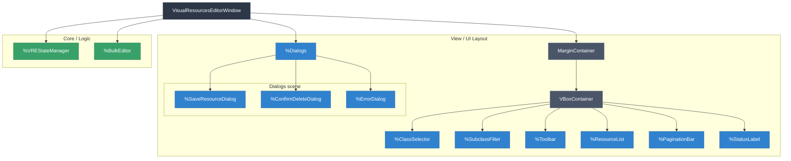
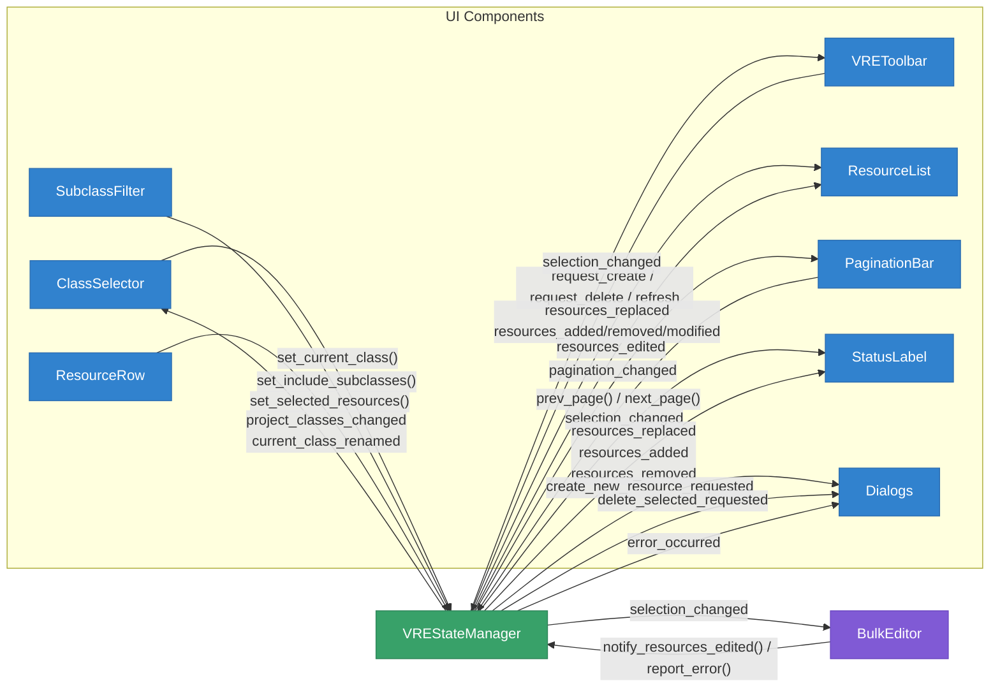
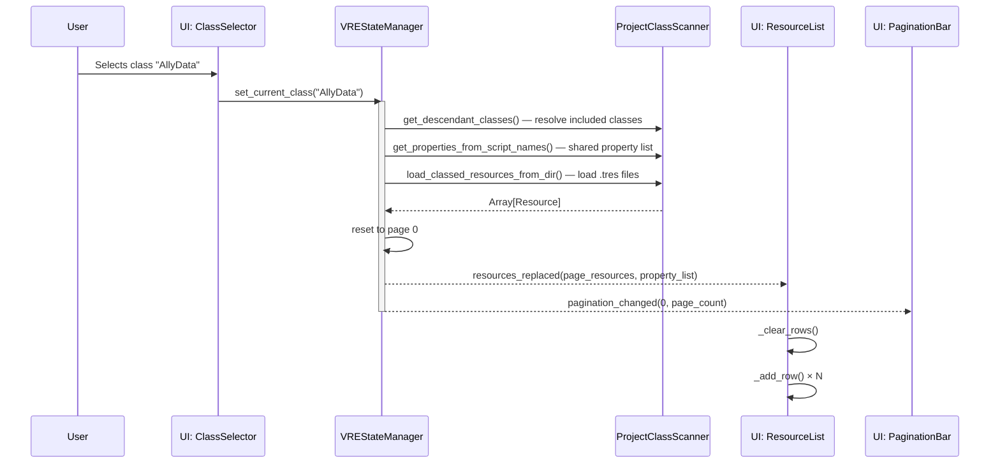
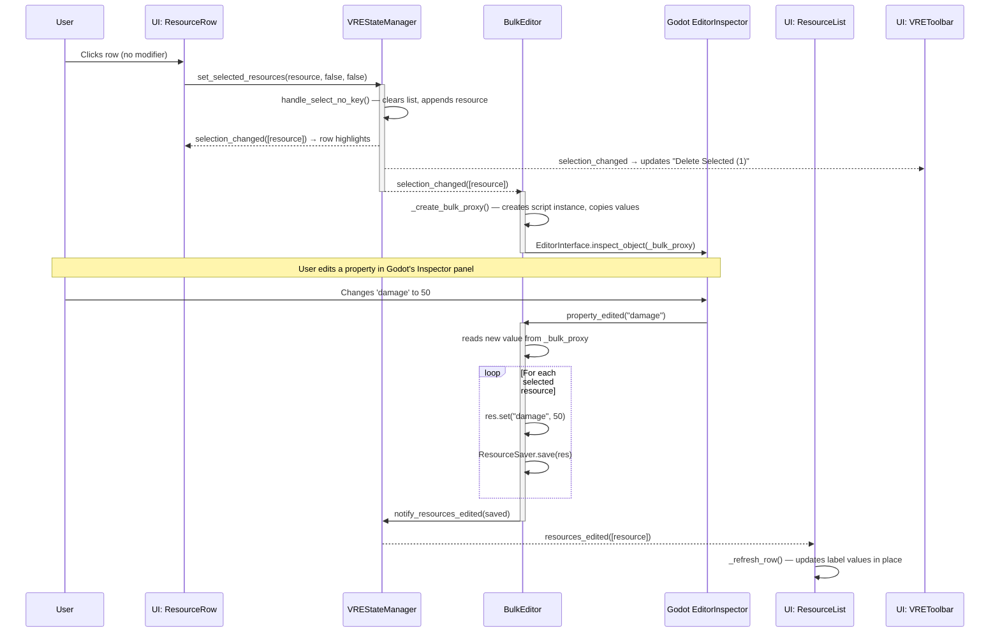
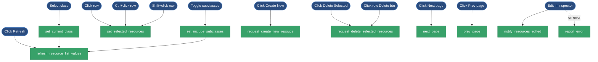
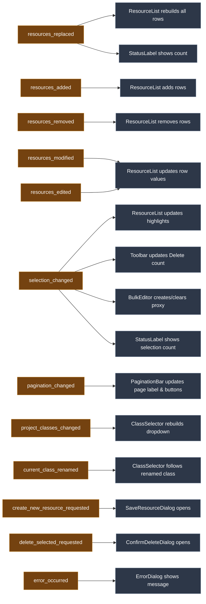

# Visual Resources Editor - Architecture & Information Flow

The plugin uses a clean **MVVM-like pattern**. The `VisualResourcesEditorWindow` is a pure **dependency injector**: its only job in `_ready()` is to hand the `VREStateManager` reference to every child component. After that, components talk directly to `state_manager` — no coordinator in the middle.

---

## 1. Window Subdivision (Component Hierarchy)

**Component responsibilities:**
- **`%ClassSelector`**: dropdown to pick the resource class; follows class renames automatically.
- **`%SubclassFilter`**: toggle to include/exclude subclass instances.
- **`%Toolbar`**: Create, Delete Selected, Refresh buttons.
- **`%ResourceList`**: scrollable table of resource rows. Each `ResourceRow` calls state_manager directly on press.
- **`%PaginationBar`**: Prev/Next buttons wired directly to `state_manager.prev_page` / `next_page`.
- **`%StatusLabel`**: shows resource count or selection count.
- **`%Dialogs`**: owns `SaveResourceDialog`, `ConfirmDeleteDialog`, `ErrorDialog`. Each listens to a specific state_manager signal.
- **`%VREStateManager`**: all data, all signals, all filesystem tracking.
- **`%BulkEditor`**: listens to `selection_changed`, maintains the inspector proxy, applies edits to all selected resources.

---

## 2. High-Level Information Flow

Window is a pure DI injector. Every component holds a `state_manager` reference and calls it or listens to it directly. There are no intermediate signals relayed through the window.

---

## 3. Data Flow: Selecting a Class

---

## 4. Data Flow: Selection & Bulk Editing

---

## 5. Data Flow: Filesystem Events (Background Loop)

Two separate paths depending on what changed on disk:

**A — File added/removed/modified (no class change):**
`EditorFileSystem.filesystem_changed` → `VREStateManager._on_filesystem_changed()` → debounce (`RescanDebounceTimer`) → `_refresh_current_class_resources()` → `_scan_class_resources_for_changes()` (mtime comparison) → granular `resources_added / resources_removed / resources_modified` emitted → `pagination_changed`.

Selection is restored: `_restore_selection()` re-matches previous paths in the new resource list.

**B — Script class changed (added/removed/renamed class or property schema):**
`EditorFileSystem.script_classes_updated` → `_on_script_classes_updated()` → debounce → `_handle_global_classes_updated()`:
- If class list unchanged: checks for property schema changes → if changed, resaves all resources of that class, emits `resources_replaced`.
- If class list changed: emits `project_classes_changed` → ClassSelector updates dropdown.
  - If current class was renamed: emits `current_class_renamed` → ClassSelector follows it.
  - If current class was deleted: clears view.
  - If subclass set changed: calls `refresh_resource_list_values()`.
- Orphaned resources (from a deleted class) are resaved to strip the missing script reference.

Note: when a `.gd` script changes, both signals fire in the same scan cycle. The `_classes_update_pending` flag on path B suppresses path A until B finishes.

---

## Event Catalog

### A. User Actions

| # | Action | Where |
|---|--------|--------|
| 1 | Open the plugin (F3 / menu) | VisualResourcesEditorToolbar menu |
| 2 | Close the plugin (Escape / ✕) | Window title bar or keyboard |
| 3 | Select a class | ClassSelector dropdown |
| 4 | Toggle "Include Subclasses" | SubclassFilter checkbox |
| 5 | Click a resource row — single select | ResourceRow button |
| 6 | Ctrl+click a resource row — toggle | ResourceRow button |
| 7 | Shift+click a resource row — range select | ResourceRow button |
| 8 | Click "Create New" | VREToolbar |
| 9 | Click "Delete Selected" | VREToolbar |
| 10 | Click a row's own Delete button | ResourceRow |
| 11 | Click "Refresh" | VREToolbar |
| 12 | Click Next page / Prev page | PaginationBar |
| 13 | Edit a property in Godot Inspector (bulk edit) | Godot EditorInspector |
| 14a | Create a `.tres` of the viewed class externally | File system |
| 14b | Create a `.tres` of a different class externally | File system |
| 15a | Delete a `.tres` of the viewed class externally | File system |
| 15b | Delete a `.tres` of a different class externally | File system |
| 16a | Modify a `.tres` of the viewed class externally | File system |
| 16b | Modify a `.tres` of a different class externally | File system |
| 17 | Create a new `.gd` script with `class_name` extending Resource | File system |
| 18 | Delete a `.gd` script (remove class) | File system |
| 19 | Rename a class (`class_name` line changes) | File system |
| 20 | Add/remove/change `@export` properties in a `.gd` script | File system |

### B. Editor-Triggered Events (automatic Godot behavior)

| # | Event | Notes |
|---|-------|-------|
| 1 | `EditorFileSystem.filesystem_changed` | Fires after Godot's internal scan detects any file add/remove/modify |
| 2 | `EditorFileSystem.script_classes_updated` | Fires when the global class map changes |
| 3 | Both fire sequentially on `.gd` change | `script_classes_updated` first, then `filesystem_changed` in the same scan cycle |
| 4 | `EditorInspector.property_edited(property)` | Fires when user changes any Inspector value; BulkEditor listens |
| 5 | `EditorFileSystemDirectory` refresh | Godot frees and recreates the directory tree on every scan — never cache these references |

### C. Desired Outcomes

| # | Observable result |
|---|-------------------|
| 1 | Class names populate ClassSelector dropdown on plugin open |
| 2 | New class appears in ClassSelector dropdown |
| 3 | Class disappears from ClassSelector dropdown |
| 4 | ClassSelector follows a renamed class (selection updates to new name) |
| 5 | New row appears in ResourceList |
| 6 | Row disappears from ResourceList |
| 7 | Row values update in ResourceList |
| 8 | Columns update in ResourceList header and rows (schema change) |
| 9 | Selection highlights update in ResourceList |
| 10 | Selection is preserved after list refresh (same paths re-selected) |
| 11 | PaginationBar shows/hides based on page count |
| 12 | PaginationBar prev/next disabled correctly at boundaries |
| 13 | StatusLabel shows visible resource count |
| 14 | StatusLabel shows selection count while something is selected |
| 15 | Inspector shows bulk proxy when resources are selected |
| 16 | Inspector clears when selection is empty or cross-class |
| 17 | Error dialog appears on save/delete failures |
| 18 | View clears when current class is deleted and not renamed |

---

### D. User Action → Call Chain → state_manager

| User Action | Component | Handler | Intermediate steps | state_manager method |
|-------------|-----------|---------|-------------------|---------------------|
| Open plugin (F3 / menu) | VisualResourcesEditorToolbar | `_on_menu_id_pressed(0)` | `open_visual_editor_window()` → instantiate window → `_ready()` sets all `.state_manager` properties | — (no direct call; setup only) |
| Close plugin (Esc / ✕) | VisualResourcesEditorWindow | `_unhandled_input()` | `close_requested.emit()` → `_on_close_requested()` → `queue_free()` | — |
| Select a class | ClassSelector | `_on_class_dropdown_item_selected(idx)` | — | `set_current_class(name)` |
| Toggle Include Subclasses | SubclassFilter | `_on_include_subclasses_check_toggled(pressed)` | — | `set_include_subclasses(pressed)` |
| Click row (no modifier) | ResourceRow | `_on_pressed()` | reads `Input.is_key_pressed()` | `set_selected_resources(res, false, false)` |
| Ctrl+click row | ResourceRow | `_on_pressed()` | reads `Input.is_key_pressed(KEY_CTRL/META)` | `set_selected_resources(res, true, false)` |
| Shift+click row | ResourceRow | `_on_pressed()` | reads `Input.is_key_pressed(KEY_SHIFT)` | `set_selected_resources(res, false, true)` |
| Click "Create New" | VREToolbar | `_on_create_btn_pressed()` | — | `request_create_new_resouce()` → emits `create_new_resource_requested` → SaveResourceDialog shows → after user picks path: `ResourceSaver.save()` → filesystem event |
| Click "Delete Selected" | VREToolbar | `_on_delete_selected_pressed()` | reads `state_manager._selected_paths` | `request_delete_selected_resources(paths)` → emits `delete_selected_requested` → ConfirmDeleteDialog shows → after confirm: `OS.move_to_trash()` + `efs.update_file()` → filesystem event |
| Click row's Delete button | ResourceRow | `_on_delete_pressed()` | — | `request_delete_selected_resources([resource.resource_path])` → same dialog flow as above |
| Click "Refresh" | VREToolbar | `_on_refresh_btn_pressed()` | — | `refresh_resource_list_values()` |
| Click Next page | PaginationBar | `%NextBtn.pressed` connected | — | `next_page()` |
| Click Prev page | PaginationBar | `%PrevBtn.pressed` connected | — | `prev_page()` |
| Edit property in Inspector | Godot EditorInspector | `property_edited` signal | BulkEditor `_on_inspector_property_edited()` → `res.set()` + `ResourceSaver.save()` per resource | `notify_resources_edited(saved)` and/or `report_error(msg)` |

---

### E. state_manager Method → Desired Outcomes

| state_manager method | What it does internally | Signals emitted | Outcomes |
|----------------------|------------------------|----------------|---------|
| `set_current_class(name)` | Calls `refresh_resource_list_values()` | `resources_replaced`, `pagination_changed` | ResourceList rebuilds all rows; PaginationBar resets to page 0; StatusLabel updates count |
| `set_include_subclasses(value)` | Calls `refresh_resource_list_values()` | `resources_replaced`, `pagination_changed` | Same as above |
| `refresh_resource_list_values()` | Resolves classes, scans properties, loads resources, resets page, restores selection | `resources_replaced`, `pagination_changed`, `selection_changed` | Full list rebuild; columns update; selection preserved |
| `set_selected_resources(res, ctrl, shift)` | Shift=range, Ctrl=toggle, none=single; updates `selected_resources` | `selection_changed` | Row highlights update; toolbar count updates; BulkEditor creates/clears inspector proxy |
| `request_create_new_resouce()` | Emits signal only; dialog + filesystem do the rest | `create_new_resource_requested` | SaveResourceDialog opens |
| `request_delete_selected_resources(paths)` | Emits signal only; dialog + filesystem do the rest | `delete_selected_requested` | ConfirmDeleteDialog opens |
| `next_page()` / `prev_page()` | Clamps page, slices new page window, diffs against previous | `resources_added`, `resources_removed`, `resources_modified`, `pagination_changed` | ResourceList adds/removes/updates rows for the new page; PaginationBar updates |
| `notify_resources_edited(resources)` | Emits signal only | `resources_edited` | ResourceList refreshes display values in affected rows (no rebuild) |
| `report_error(message)` | Emits signal only | `error_occurred` | ErrorDialog shows the message |
| `_on_filesystem_changed()` (auto) | Debounces → `_scan_class_resources_for_changes()` → mtime diff → restores selection | `resources_added`, `resources_removed`, `resources_modified`, `pagination_changed`, `selection_changed` | New/deleted/modified rows update in place; selection restored by path |
| `_handle_global_classes_updated()` (auto) | Rebuilds class maps; detects renames, deletions, subclass-set changes, schema changes | `project_classes_changed`, `current_class_renamed`, `resources_replaced`, `pagination_changed` | Dropdown updates; class rename followed; view clears or refreshes |

---

## Diagrams: User Actions → state_manager → Outcomes

### User Actions → state_manager calls

### state_manager signals → UI outcomes

