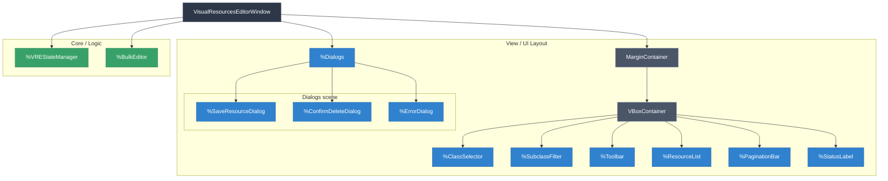
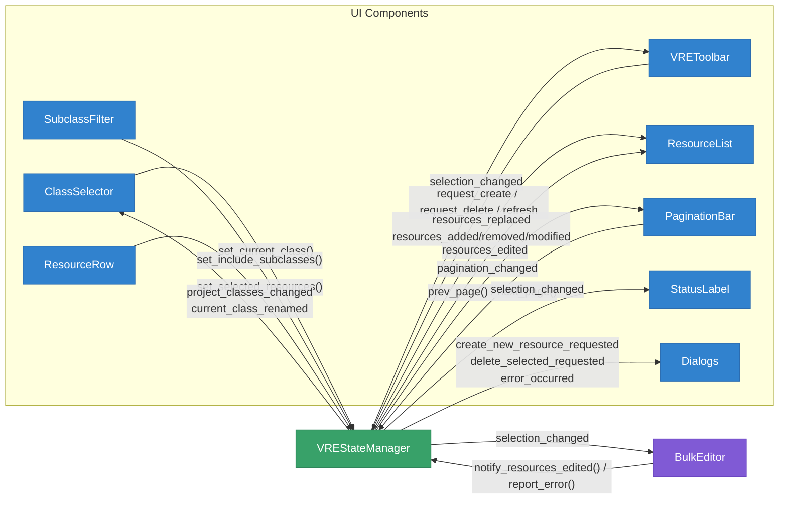
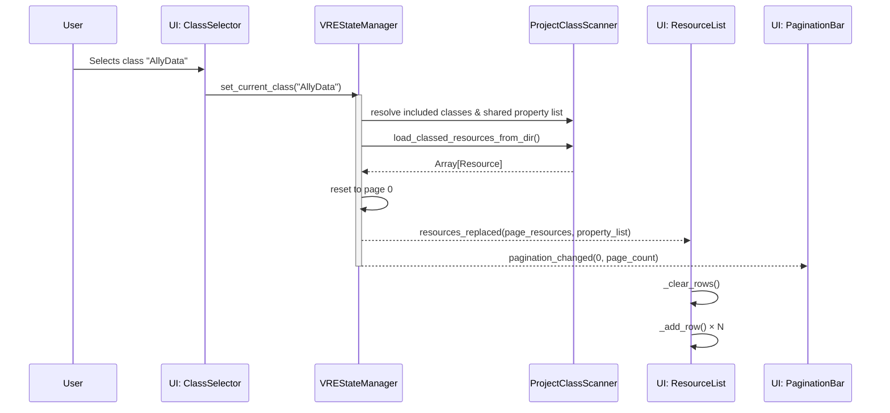
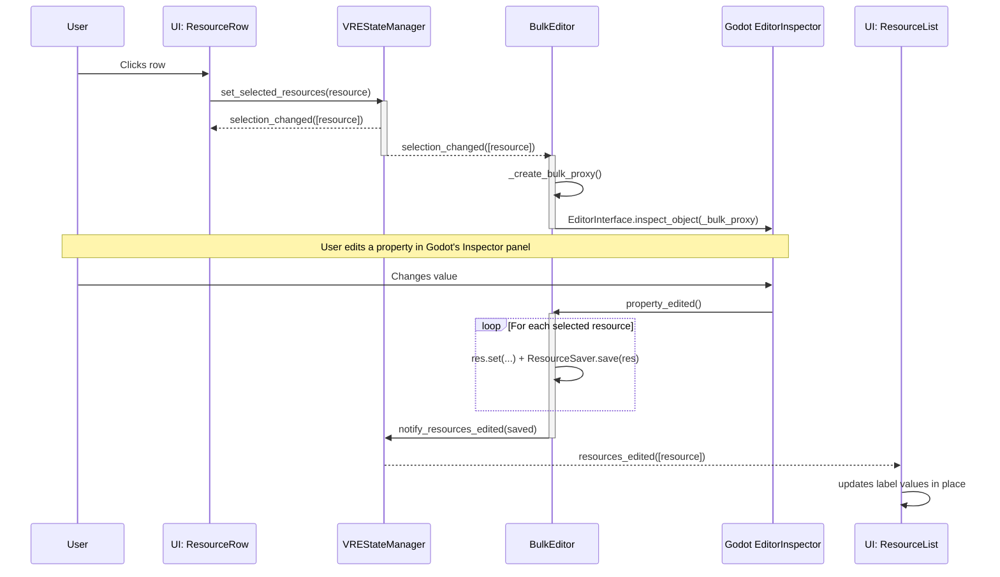
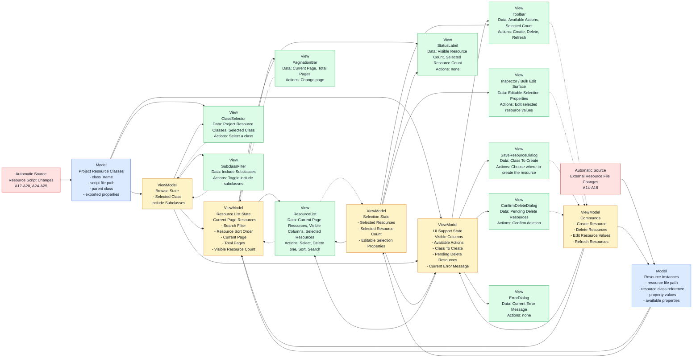

# Visual Resources Editor — Architecture

A Godot 4 `@tool` editor plugin for visually browsing, creating, bulk-editing, and deleting `.tres` resource files filtered by class type. 

---

## Architecture Overview

```text
visual_resources_editor/
├── visual_resources_editor_plugin.gd   # EditorPlugin entry point (adds toolbar menu)
├── visual_resources_editor_toolbar.gd  # Toolbar menu: instantiates the editor window
├── core/
│   ├── data_models/
│   │   ├── resource_property.gd        # Typed data model for a single property definition
│   │   └── class_definition.gd         # Typed data model for a class (name, path, properties)
│   ├── project_class_scanner.gd        # Static utility: scans project classes, properties, .tres files
│   ├── state_manager.gd                # VREStateManager: central state (resources, properties, selection, pagination)
│   ├── state_manager.tscn              # Scene for VREStateManager + DebounceTimer child
│   └── bulk_editor.gd                  # BulkEditor: proxy-based multi-resource editing via Godot inspector
├── ui/
│   ├── visual_resources_editor_window.gd/.tscn  # Main Window: assigns state_manager to children, owns error dialog
│   ├── class_selector/
│   │   └── class_selector.gd/.tscn     # Class dropdown selector
│   ├── subclass_filter/
│   │   └── subclass_filter.gd/.tscn    # "Include subclasses" checkbox + warning label
│   ├── toolbar/
│   │   └── toolbar.gd/.tscn            # VREToolbar: New/Delete Selected/Refresh + owns SaveResourceDialog & ConfirmDeleteDialog
│   ├── resource_list/
│   │   ├── resource_list.gd/.tscn      # Table container: header + scrollable rows, supports incremental add/remove/modify
│   │   ├── header_row.gd/.tscn         # Column header labels
│   │   ├── resource_row.gd/.tscn       # One row per resource (Button with toggle_mode, self-contained delete)
│   │   ├── resource_field_label.gd/.tscn  # Label for a single property cell (owns display/format logic)
│   │   ├── header_field_label.tscn      # Label for a single header cell
│   │   └── field_separator.tscn         # VSeparator between columns
│   ├── pagination_bar/
│   │   └── pagination_bar.gd/.tscn     # Prev/Next page buttons + page label
│   ├── status_label.gd                 # Script-only Label: shows resource count or selection count
│   └── dialogs/
│       ├── save_resource_dialog.gd      # EditorFileDialog for creating new resources
│       ├── confirm_delete_dialog.gd     # ConfirmationDialog for deleting resources (moves to OS trash)
│       └── error_dialog.gd             # AcceptDialog for error messages
└── plugin.cfg
```

## Data Flow

1. **Class scanning**: `ProjectClassScanner` reads `ProjectSettings.get_global_class_list()` to discover all project classes that descend from `Resource`. Results are cached in `VREStateManager` as maps (`global_class_map`, `global_class_to_path_map`, `global_class_to_parent_map`) and the filtered list `global_class_name_list`.

2. **Resource scanning**: When a class is selected via `set_current_class()`, `VREStateManager` uses `set_current_class_resources(reseting: true)` to load all `.tres` files matching the class (and optionally its subclasses) via `ProjectClassScanner.load_classed_resources_from_dir()`. On filesystem changes, `set_current_class_resources(reseting: false)` performs an incremental scan via `_scan_class_resources_for_changes()` using mtime comparison. The scanner reads the first line of each `.tres` file via `FileAccess` to extract `script_class=` — it does NOT load the full resource for classification.

3. **State → UI (granular signals)**: `VREStateManager` emits different signals depending on the type of change:
   - `resources_replaced(resources, property_list)` — full page rebuild. Carries the current page slice + shared property list. `ResourceList.replace_resources()` rebuilds all rows.
   - `resources_added(resources)` — incremental, new .tres files detected.
   - `resources_removed(resources)` — incremental, deleted .tres files detected.
   - `resources_modified(resources)` — incremental, modified .tres files detected.
   - `pagination_changed(page, page_count)` — always emitted alongside data changes to keep pagination in sync.

4. **Two-tier resource state**: `VREStateManager` maintains two levels of resource state:
   - `current_class_resources` + `_current_class_resources_mtimes`
   - `_current_page_resources` + `current_page_resources_mtimes`
   This allows diffing to emit granular signals.

5. **Selection**: `VREStateManager` owns all selection state. `set_selected_resources()` dispatches based on modifiers and emits `selection_changed`.

6. **Bulk editing**: `BulkEditor` creates a proxy resource matching the selected resources' script. When the user edits the proxy in Godot's Inspector, `BulkEditor` propagates the change to all selected resources and saves them.

7. **Filesystem reactivity**: Two `EditorFileSystem` signals drive updates:
   - `script_classes_updated` → debounced → `_handle_global_classes_updated()`
   - `filesystem_changed` → debounced → `_refresh_current_class_resources()`

8. **Delete flow**:
   - **Single row delete**: Each `ResourceRow` owns a `ConfirmDeleteDialog` child. Files are moved to OS trash.
   - **Bulk delete**: `VREToolbar` owns a `ConfirmDeleteDialog`. 

## Design Decisions

### Scene Unique Nodes (`%NodeName`)
All child node references use `%UniqueNode` directly in code. Nodes are marked with `unique_name_in_owner = true` in their `.tscn`.

### Signal Connections: Scene vs Code
Signals are connected via scene (`[connection]` in `.tscn`) when both source and target are in the same scene. Code connections are used for dynamic nodes or forwarding.

### SubclassFilter & Toolbar as Separate Scenes
The "Include subclasses" checkbox is a standalone scene (`ui/subclass_filter/subclass_filter.tscn`). The toolbar is also its own scene (`ui/toolbar/toolbar.tscn`), owning `SaveResourceDialog` and `ConfirmDeleteDialog`.

### Delete Moves to OS Trash
Both `ConfirmDeleteDialog` and `ResourceRow` use `OS.move_to_trash()`. No undo/redo for deletion — version control is the secondary safety net.

---

## Diagrams & Information Flow

The plugin currently uses a **"Hub and Spoke" / Facade pattern**. The `VisualResourcesEditorWindow` is a pure **dependency injector**: its only job in `_ready()` is to hand the `VREStateManager` reference to every child component. After that, components talk directly to the state manager facade.

The [Property × Function Matrix](props_to_funcs_table.html) lays out how each VREStateManager property (columns) relates to the public methods and signals (rows) summarized in these diagrams.

*(Note: We are planning a refactor to break this Dependency Injection into specialized stores.)*

### 1. Window Subdivision (Component Hierarchy)



### 2. High-Level Information Flow (Current Architecture)



### 3. Proposed Target Architecture (Granular Dependency Injection)

*To resolve the "God Object" DI issue (Interface Segregation Principle).*

```mermaid
graph TD
    Coordinator[VREStateManager (Coordinator)] --> Selection[SelectionManager]
    Coordinator --> Pagination[PaginationManager]
    Coordinator --> Resources[ResourceRepository]
    Coordinator --> Registry[ClassRegistry]
    Coordinator --> FSListener[EditorFileSystemListener]

    Window[VisualResourcesEditorWindow] --> Coordinator

    Window --> ClassSelector
    Window --> ResourceList
    Window --> PaginationBar
    Window --> BulkEditor

    ClassSelector -. "depends only on" .-> Registry
    ResourceList -. "depends only on" .-> Resources
    ResourceList -. "depends only on" .-> Selection
    PaginationBar -. "depends only on" .-> Pagination
    BulkEditor -. "depends only on" .-> Selection
    BulkEditor -. "depends only on" .-> Resources
```

### 4. Data Flow: Selecting a Class



### 5. Data Flow: Selection & Bulk Editing



---

## Design Criteria

This section reframes the editor in product terms rather than current
`VREStateManager` calls and signals. If we move toward a real MVVM design,
these are the view-facing needs and change drivers the ViewModels
should satisfy.

### A. User and Environment Inputs

| # | Type | Input | Where / Source |
|---|---|-------|----------------|
| 1 | U | Open the plugin (F3 / menu) | VisualResourcesEditorToolbar menu |
| 2 | U | Close the plugin (Escape / ✕) | Window title bar or keyboard |
| 3 | U | Select a class | ClassSelector dropdown |
| 4 | U | Toggle "Include Subclasses" | SubclassFilter checkbox |
| 5 | U | Click a resource row — single select | ResourceRow button |
| 6 | U | Ctrl+click a resource row — toggle | ResourceRow button |
| 7 | U | Shift+click a resource row — range select | ResourceRow button |
| 8 | U | Click "Create New" | VREToolbar |
| 9 | U | Click "Delete Selected" | VREToolbar |
| 10 | U | Click a row's own Delete button | ResourceRow |
| 11 | U | Click "Refresh" | VREToolbar |
| 12 | U | Change page | PaginationBar |
| 13 | U | Edit a property in Godot Inspector (bulk edit) | Godot EditorInspector |
| 14a | A | Create a `.tres` of the viewed class externally | File system |
| 14b | A | Create a `.tres` of a different class externally | File system |
| 15a | A | Delete a `.tres` of the viewed class externally | File system |
| 15b | A | Delete a `.tres` of a different class externally | File system |
| 16a | A | Modify a `.tres` of the viewed class externally | File system |
| 16b | A | Modify a `.tres` of a different class externally | File system |
| 17 | A | Create a new `.gd` script with `class_name` extending Resource | File system |
| 18 | A | Delete a `.gd` script (remove class) | File system |
| 19 | A | Rename a class (`class_name` line changes) | File system |
| 20 | A | Add/remove/change `@export` properties in a `.gd` script | File system |
| 21 | U | Change resource ordering | Resource list controls |
| 22 | U | Change resource search filter | Resource list controls |
| 23 | U | Change page size | Window |
| 24 | A | Move a resource class `.gd` script | File system |
| 25 | A | Change what a resource class inherits from | File system |
| 26 | U | Choose where to create the new resource | SaveResourceDialog |
| 27 | U | Confirm deletion of pending resources | ConfirmDeleteDialog |

### B. View Data and Change Drivers

This list is intentionally phrased as "what the user sees" instead of
"which current code property feeds it".

- `ClassSelector`
  Data shown:
  - browsable resource classes
    - sources:
      - `(M)` `Project Resource Classes`
    - changes:
      - browsable resource classes are added (17) `A`
        - `(M)` Source: `Project Resource Classes` are added
      - browsable resource classes are removed (18) `A`
        - `(M)` Source: `Project Resource Classes` are removed
  - selected class
    - sources:
      - `(VM)` `Selected Class`
    - changes:
      - the selected class changes (3) `U`
        - `(VM)` Source: `Selected Class` is changed
      - the selected class is renamed (19) `A`
        - `(M)` Source: `Project Resource Classes` rename the `Selected Class`
      - the selected class becomes invalid (18) `A`
        - `(M)` Source: `Project Resource Classes` remove the `Selected Class`
  User Actions:
  - select a class from the dropdown (3) `U`
    - `(VM)` Source: `Selected Class` is changed

- `SubclassFilter`
  Data shown:
  - are subclasses included
    - sources:
      - `(VM)` `Include Subclasses`
    - changes:
      - subclass inclusion is toggled (4) `U`
        - `(VM)` Source: `Include Subclasses` is changed
  User Actions:
  - toggle subclass inclusion (4) `U`
    - `(VM)` Source: `Include Subclasses` is changed

- `Toolbar`
  Data shown:
  - available actions
    - sources:
      - `(VM)` `Available Actions`
    - changes:
      - the selected class changes in a way that affects which actions are available (3) `U`
        - `(VM)` Source: `Selected Class` is changed
  - selected count
    - sources:
      - `(VM)` `Selected Count`
    - changes:
      - the selection changes (5) `U`, (6) `U`, (7) `U`
        - `(VM)` Source: `Selected Resources` change
  User Actions:
  - request creation of a new resource (8) `U`
    - `(VM)` Source: `Create Resource Command` is requested
  - request deletion of the selected resources (9) `U`
    - `(VM)` Source: `Pending Delete Resources` are changed
  - request a refresh of the current resources (11) `U`
    - `(VM)` Source: `Load / Refresh Resources Command` is executed

- `ResourceList`
  Data shown:
  - visible resources
    - sources:
      - `(VM)` `Current Page Resources`
    - changes:
      - the selected class changes (3) `U`
        - `(VM)` Source: `Selected Class` is changed
      - subclass inclusion changes (4) `U`
        - `(VM)` Source: `Include Subclasses` is changed
      - `CurrentClass Resources` are created (8) `U`, (14a) `A`
        - `(M)` Source: `CurrentClass Resources` are created
      - `CurrentClass Resources` are deleted (9) `U`, (10) `U`, (15a) `A`
        - `(M)` Source: `CurrentClass Resources` are deleted
      - resource ordering changes (21) `U`
        - `(VM)` Source: `Resource Sort Order` is changed
      - resource search changes (22) `U`
        - `(VM)` Source: `Search Filter` is changed
      - the current page changes (12) `U`
        - `(VM)` Source: `Current Page` is changed
  - visible columns
    - sources:
      - `(VM)` `Visible Columns`
    - changes:
      - the selected class changes (3) `U`
        - `(VM)` Source: `Selected Class` is changed
      - subclass inclusion changes (4) `U`
        - `(VM)` Source: `Include Subclasses` is changed
      - class properties are added (20) `A`
        - `(M)` Source: `Class Properties` are added
      - class properties are removed (20) `A`
        - `(M)` Source: `Class Properties` are removed
      - class properties are changed (20) `A`
        - `(M)` Source: `Class Properties` are changed
  - row values
    - sources:
      - `(VM)` `Current Page Resources`
    - changes:
      - `CurrentClass Resources` are edited (13) `U`, (16a) `A`
        - `(M)` Source: `CurrentClass Resources` are edited
      - class properties are added (20) `A`
        - `(M)` Source: `Class Properties` are added
      - class properties are removed (20) `A`
        - `(M)` Source: `Class Properties` are removed
      - class properties are changed (20) `A`
        - `(M)` Source: `Class Properties` are changed
  - row selection state
    - sources:
      - `(VM)` `Selected Resources`
    - changes:
      - the selection changes (5) `U`, (6) `U`, (7) `U`
        - `(VM)` Source: `Selected Resources` change
  User Actions:
  - select one resource (5) `U`
    - `(VM)` Source: `Selected Resources` change
  - toggle one resource in the selection (6) `U`
    - `(VM)` Source: `Selected Resources` change
  - select a range of resources (7) `U`
    - `(VM)` Source: `Selected Resources` change
  - request deletion of one resource (10) `U`
    - `(VM)` Source: `Pending Delete Resources` are changed
  - change resource ordering (21) `U`
    - `(VM)` Source: `Resource Sort Order` is changed
  - change resource search filter (22) `U`
    - `(VM)` Source: `Search Filter` is changed

- `PaginationBar`
  Data shown:
  - current page
    - sources:
      - `(VM)` `Current Page`
    - changes:
      - the current page changes (12) `U`
        - `(VM)` Source: `Current Page` is changed
  - total pages
    - sources:
      - `(VM)` `Total Pages`
    - changes:
      - the selected class changes (3) `U`
        - `(VM)` Source: `Selected Class` is changed
      - subclass inclusion changes (4) `U`
        - `(VM)` Source: `Include Subclasses` is changed
      - the number of `CurrentClass Resources` changes (8) `U`, (9) `U`, (10) `U`, (14a) `A`, (15a) `A`, (22) `U`
        - `(M)` Source: `CurrentClass Resources` are created
        - `(M)` Source: `CurrentClass Resources` are deleted
      - the page size changes (23) `U`
        - `(VM)` Source: `Page Size` is changed
  User Actions:
  - change page (12) `U`
    - `(VM)` Source: `Current Page` is changed

- `StatusLabel`
  Data shown:
  - visible resource count
    - sources:
      - `(VM)` `Visible Resource Count`
    - changes:
      - the selected class changes (3) `U`
        - `(VM)` Source: `Selected Class` is changed
      - subclass inclusion changes (4) `U`
        - `(VM)` Source: `Include Subclasses` is changed
      - the current page changes (12) `U`
        - `(VM)` Source: `Current Page` is changed
      - the number of `CurrentClass Resources` changes (8) `U`, (9) `U`, (10) `U`, (14a) `A`, (15a) `A`, (22) `U`
        - `(M)` Source: `CurrentClass Resources` are created
        - `(M)` Source: `CurrentClass Resources` are deleted
  - selected resource count
    - sources:
      - `(VM)` `Selected Resource Count`
    - changes:
      - the selection changes (5) `U`, (6) `U`, (7) `U`
        - `(VM)` Source: `Selected Resources` change
  User Actions:
  - no direct user actions on this element

- `Inspector / Bulk Edit Surface`
  Data shown:
  - editable properties for the current selection
    - sources:
      - `(VM)` `Editable Selection Properties`
    - changes:
      - the selection changes (5) `U`, (6) `U`, (7) `U`
        - `(VM)` Source: `Selected Resources` change
      - the selected class changes and clears / replaces the current selection (3) `U`
        - `(VM)` Source: `Selected Class` is changed
      - class properties are added (20) `A`
        - `(M)` Source: `Class Properties` are added
      - class properties are removed (20) `A`
        - `(M)` Source: `Class Properties` are removed
      - class properties are changed (20) `A`
        - `(M)` Source: `Class Properties` are changed
  User Actions:
  - edit the properties of the current selection (13) `U`
    - `(VM)` Source: `Edit Resource Values Command` is executed

- `SaveResourceDialog`
  Data shown:
  - class to create
    - sources:
      - `(VM)` `Class To Create`
    - changes:
      - the selected class changes (3) `U`
        - `(VM)` Source: `Selected Class` is changed
  User Actions:
  - choose where to create the new resource (26) `U`
    - `(VM)` Source: `Create Resource Command` is executed

- `ConfirmDeleteDialog`
  Data shown:
  - resources pending deletion
    - sources:
      - `(VM)` `Pending Delete Resources`
    - changes:
      - pending resources change (9) `U`, (10) `U`
        - `(VM)` Source: `Pending Delete Resources` are changed
  User Actions:
  - confirm deletion of the pending resources (27) `U`
    - `(VM)` Source: `Delete Resources Command` is executed

- `ErrorDialog`
  Data shown:
  - the latest user-visible error message
    - sources:
      - `(VM)` `Current Error Message`
    - changes:
      - the current error state changes (8) `U`, (9) `U`, (10) `U`, (11) `U`, (13) `U`, (14a) `A`, (15a) `A`, (16a) `A`, (17) `A`, (18) `A`, (19) `A`, (20) `A`
        - `(M)` Source: `Create Operations` fail
        - `(M)` Source: `Save Operations` fail
        - `(M)` Source: `Delete Operations` fail
        - `(M)` Source: `Load Operations` fail
        - `(M)` Source: `Validation` rejects an action
  User Actions:
  - no direct user actions on this element

### C. Model Data and Change Drivers

This section mirrors the view-side list, but from the domain side.
These are the project/editor concepts that exist independently of how the
window chooses to present them.

- `Project Resource Classes`
  Internal data:
  - `class_name` of each script that inherits `Resource`
    - sources:
      - `(M)` `Resource Script Files`
    - changes:
      - a resource class is declared (17) `A`
        - `(M)` Source: `Resource Script Files` add a resource `class_name`
      - a resource class is removed (18) `A`
        - `(M)` Source: `Resource Script Files` remove a resource `class_name`
      - a resource class is renamed (19) `A`
        - `(M)` Source: `Resource Script Files` rename a resource `class_name`
  - script file path for each resource class
    - sources:
      - `(M)` `Resource Script Files`
    - changes:
      - a resource class script is moved (24) `A`
        - `(M)` Source: `Resource Script Files` change a script path
  - parent class for each resource class
    - sources:
      - `(M)` `Resource Script Files`
    - changes:
      - a resource class is reparented (25) `A`
        - `(M)` Source: `Resource Script Files` change the inherited parent class
  - exported properties for each resource class
    - sources:
      - `(M)` `Resource Script Files`
    - changes:
      - exported properties are added (20) `A`
        - `(M)` Source: `Resource Script Files` add exported properties
      - exported properties are removed (20) `A`
        - `(M)` Source: `Resource Script Files` remove exported properties
      - exported properties are changed (20) `A`
        - `(M)` Source: `Resource Script Files` change exported properties

- `Resource Instances`
  Internal data:
  - resource file path
    - sources:
      - `(M)` `Resource Files on Disk`
    - changes:
      - a resource instance is created from the editor (8) `U`
        - `(VM)` Source: `Create Resource Command` is executed
      - a resource instance is created externally (14a) `A`, (14b) `A`
        - `(M)` Source: `Resource Files on Disk` add a resource file
      - a resource instance is deleted from the editor (9) `U`, (10) `U`
        - `(VM)` Source: `Delete Resources Command` is executed
      - a resource instance is deleted externally (15a) `A`, (15b) `A`
        - `(M)` Source: `Resource Files on Disk` remove a resource file
  - resource class reference
    - sources:
      - `(M)` `Resource Files on Disk`
      - `(M)` `Project Resource Classes`
    - changes:
      - a resource file changes its class reference (16a) `A`, (16b) `A`
        - `(M)` Source: `Resource Files on Disk` change a resource class reference
      - project resource classes are renamed or removed (18) `A`, (19) `A`
        - `(M)` Source: `Project Resource Classes` change
  - property values
    - sources:
      - `(M)` `Resource Files on Disk`
    - changes:
      - a resource is edited from the editor (13) `U`
        - `(VM)` Source: `Edit Resource Values Command` is executed
      - resource files are modified externally (16a) `A`, (16b) `A`
        - `(M)` Source: `Resource Files on Disk` change property values
  - available properties for the resource instance
    - sources:
      - `(M)` `Project Resource Classes`
    - changes:
      - the resource class reference changes (16a) `A`, (16b) `A`
        - `(M)` Source: `Resource Files on Disk` change a resource class reference
      - class properties are added (20) `A`
        - `(M)` Source: `Project Resource Classes` add exported properties
      - class properties are removed (20) `A`
        - `(M)` Source: `Project Resource Classes` remove exported properties
      - class properties are changed (20) `A`
        - `(M)` Source: `Project Resource Classes` change exported properties



### D. Shared Change Drivers Across Views

Not every view update corresponds to a domain-data mutation. Some changes
mutate the underlying resource/class state, while others only change how the
same data is projected to the user.

| Change Driver | Changes Underlying Data? | Can Be Presentation-Only? | Views Affected |
|---|---|---|---|
| Selected class changed | Yes | No | ClassSelector, Toolbar, ResourceList, PaginationBar, StatusLabel, Inspector / Bulk Edit Surface, SaveResourceDialog |
| `Include Subclasses` changed | Yes | No | SubclassFilter, ResourceList, PaginationBar, StatusLabel |
| Project class catalog changed (class added/removed/renamed) | Yes | No | ClassSelector, ResourceList, Inspector / Bulk Edit Surface, SaveResourceDialog, sometimes SubclassFilter and PaginationBar through selected-class invalidation |
| `CurrentClass Resources` collection changed (create/delete/external discovery) | Yes | No | ResourceList, PaginationBar, StatusLabel, Inspector / Bulk Edit Surface if selection validity changes |
| Resource values changed | Yes | No | ResourceList, Inspector / Bulk Edit Surface, sometimes ErrorDialog if the edit/save fails |
| Resource schema changed (properties added/removed/changed) | Yes | No | ResourceList, Inspector / Bulk Edit Surface, SaveResourceDialog |
| Selection changed | No | Yes | ResourceList, Toolbar, StatusLabel, Inspector / Bulk Edit Surface |
| Visible slice changed (pagination, resource sorting, resource searching) | No | Yes | ResourceList, PaginationBar, StatusLabel |
| Command intent changed (create requested / delete requested) | No | Yes | SaveResourceDialog, ConfirmDeleteDialog |
| Error state changed | No | Yes | ErrorDialog |

The main MVVM takeaway is that several views move together around the same
conceptual drivers:

- Changing the selected class is the broadest driver. It reshapes the list, schema, pagination, status, creation context, and bulk-edit context at the same time.
- Changing `Include Subclasses` is a narrower driver. It changes which resources belong to the current list, which then affects list contents, pagination, and counts.
- Selection changes are a separate cross-view driver. They do not change the resource dataset, but they do change row highlights, toolbar affordances, status text, and the inspector surface.
- Resource-collection changes and schema changes are different drivers. Collection changes mostly affect list/pagination/counts, while schema changes affect any view that renders fields/properties.
- Presentation-only projection changes such as pagination, sorting, and filtering should not be modeled the same way as domain mutations. They change what part of the data the view is showing, not the underlying resources themselves.
- Dialog visibility is another separate concern. "Create requested", "delete requested", and "error occurred" are UI-state changes, not resource-list changes.

### E. Desired Outcomes

| # | Observable result |
|---|-------------------|
| 1 | Class names populate ClassSelector dropdown on plugin open |
| 2 | New class appears in ClassSelector dropdown |
| 3 | Class disappears from ClassSelector dropdown |
| 4 | ClassSelector follows a renamed class (selection updates to new name) |
| 5 | New row appears in ResourceList |
| 6 | Row disappears from ResourceList |
| 7 | Row values update in ResourceList |
| 8 | Columns update in ResourceList header and rows (schema change) |
| 9 | Selection highlights update in ResourceList |
| 10 | Selection is preserved after list refresh (same paths re-selected) |
| 11 | PaginationBar shows/hides based on page count |
| 12 | PaginationBar prev/next disabled correctly at boundaries |
| 13 | StatusLabel shows visible resource count |
| 14 | StatusLabel shows selection count while something is selected |
| 15 | Inspector shows bulk proxy when resources are selected |
| 16 | Inspector clears when selection is empty or cross-class |
| 17 | Error dialog appears on save/delete failures |
| 18 | View clears when current class is deleted and not renamed |
