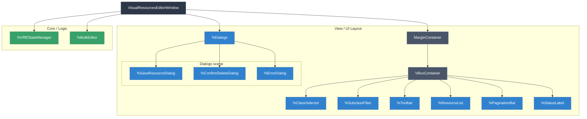
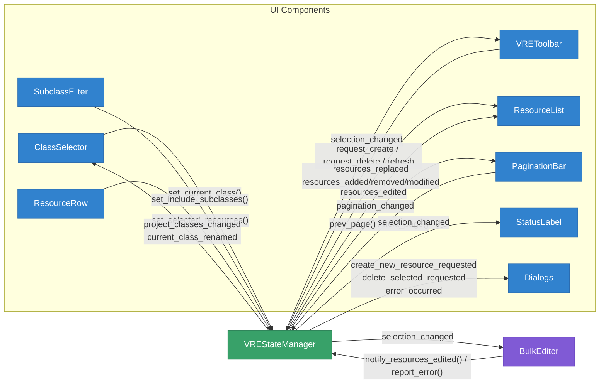
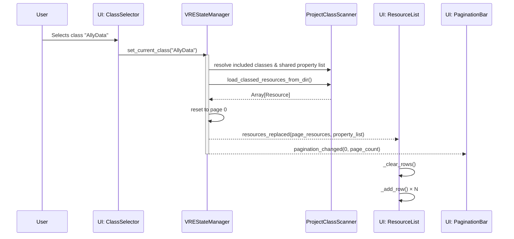
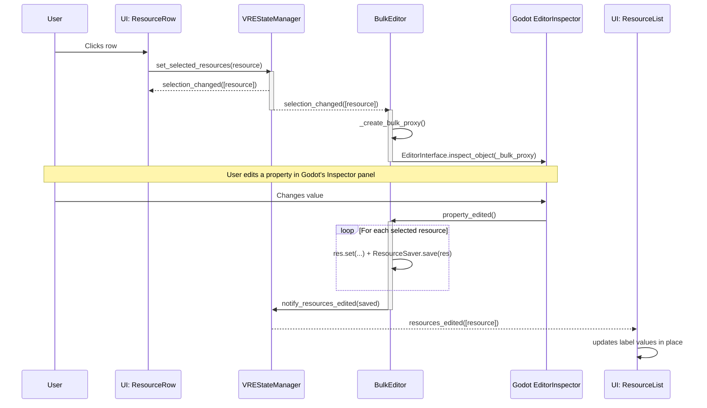

# Visual Resources Editor — Architecture

A Godot 4 `@tool` editor plugin for visually browsing, creating, bulk-editing, and deleting `.tres` resource files filtered by class type. 

---

## Architecture Overview

```text
visual_resources_editor/
├── visual_resources_editor_plugin.gd   # EditorPlugin entry point (adds toolbar menu)
├── visual_resources_editor_toolbar.gd  # Toolbar menu: instantiates the editor window
├── core/
│   ├── data_models/
│   │   ├── resource_property.gd        # Typed data model for a single property definition
│   │   └── class_definition.gd         # Typed data model for a class (name, path, properties)
│   ├── project_class_scanner.gd        # Static utility: scans project classes, properties, .tres files
│   ├── state_manager.gd                # VREStateManager: central state (resources, properties, selection, pagination)
│   ├── state_manager.tscn              # Scene for VREStateManager + DebounceTimer child
│   └── bulk_editor.gd                  # BulkEditor: proxy-based multi-resource editing via Godot inspector
├── ui/
│   ├── visual_resources_editor_window.gd/.tscn  # Main Window: assigns state_manager to children, owns error dialog
│   ├── class_selector/
│   │   └── class_selector.gd/.tscn     # Class dropdown selector
│   ├── subclass_filter/
│   │   └── subclass_filter.gd/.tscn    # "Include subclasses" checkbox + warning label
│   ├── toolbar/
│   │   └── toolbar.gd/.tscn            # VREToolbar: New/Delete Selected/Refresh + owns SaveResourceDialog & ConfirmDeleteDialog
│   ├── resource_list/
│   │   ├── resource_list.gd/.tscn      # Table container: header + scrollable rows, supports incremental add/remove/modify
│   │   ├── header_row.gd/.tscn         # Column header labels
│   │   ├── resource_row.gd/.tscn       # One row per resource (Button with toggle_mode, self-contained delete)
│   │   ├── resource_field_label.gd/.tscn  # Label for a single property cell (owns display/format logic)
│   │   ├── header_field_label.tscn      # Label for a single header cell
│   │   └── field_separator.tscn         # VSeparator between columns
│   ├── pagination_bar/
│   │   └── pagination_bar.gd/.tscn     # Prev/Next page buttons + page label
│   ├── status_label.gd                 # Script-only Label: shows resource count or selection count
│   └── dialogs/
│       ├── save_resource_dialog.gd      # EditorFileDialog for creating new resources
│       ├── confirm_delete_dialog.gd     # ConfirmationDialog for deleting resources (moves to OS trash)
│       └── error_dialog.gd             # AcceptDialog for error messages
└── plugin.cfg
```

## Data Flow

1. **Class scanning**: `ProjectClassScanner` reads `ProjectSettings.get_global_class_list()` to discover all project classes that descend from `Resource`. Results are cached in `VREStateManager` as maps (`global_class_map`, `global_class_to_path_map`, `global_class_to_parent_map`) and the filtered list `global_class_name_list`.

2. **Resource scanning**: When a class is selected via `set_current_class()`, `VREStateManager` uses `set_current_class_resources(reseting: true)` to load all `.tres` files matching the class (and optionally its subclasses) via `ProjectClassScanner.load_classed_resources_from_dir()`. On filesystem changes, `set_current_class_resources(reseting: false)` performs an incremental scan via `_scan_class_resources_for_changes()` using mtime comparison. The scanner reads the first line of each `.tres` file via `FileAccess` to extract `script_class=` — it does NOT load the full resource for classification.

3. **State → UI (granular signals)**: `VREStateManager` emits different signals depending on the type of change:
   - `resources_replaced(resources, property_list)` — full page rebuild. Carries the current page slice + shared property list. `ResourceList.replace_resources()` rebuilds all rows.
   - `resources_added(resources)` — incremental, new .tres files detected.
   - `resources_removed(resources)` — incremental, deleted .tres files detected.
   - `resources_modified(resources)` — incremental, modified .tres files detected.
   - `pagination_changed(page, page_count)` — always emitted alongside data changes to keep pagination in sync.

4. **Two-tier resource state**: `VREStateManager` maintains two levels of resource state:
   - `current_class_resources` + `_current_class_resources_mtimes`
   - `_current_page_resources` + `current_page_resources_mtimes`
   This allows diffing to emit granular signals.

5. **Selection**: `VREStateManager` owns all selection state. `set_selected_resources()` dispatches based on modifiers and emits `selection_changed`.

6. **Bulk editing**: `BulkEditor` creates a proxy resource matching the selected resources' script. When the user edits the proxy in Godot's Inspector, `BulkEditor` propagates the change to all selected resources and saves them.

7. **Filesystem reactivity**: Two `EditorFileSystem` signals drive updates:
   - `script_classes_updated` → debounced → `_handle_global_classes_updated()`
   - `filesystem_changed` → debounced → `_refresh_current_class_resources()`

8. **Delete flow**:
   - **Single row delete**: Each `ResourceRow` owns a `ConfirmDeleteDialog` child. Files are moved to OS trash.
   - **Bulk delete**: `VREToolbar` owns a `ConfirmDeleteDialog`. 

## Design Decisions

### Scene Unique Nodes (`%NodeName`)
All child node references use `%UniqueNode` directly in code. Nodes are marked with `unique_name_in_owner = true` in their `.tscn`.

### Signal Connections: Scene vs Code
Signals are connected via scene (`[connection]` in `.tscn`) when both source and target are in the same scene. Code connections are used for dynamic nodes or forwarding.

### SubclassFilter & Toolbar as Separate Scenes
The "Include subclasses" checkbox is a standalone scene (`ui/subclass_filter/subclass_filter.tscn`). The toolbar is also its own scene (`ui/toolbar/toolbar.tscn`), owning `SaveResourceDialog` and `ConfirmDeleteDialog`.

### Delete Moves to OS Trash
Both `ConfirmDeleteDialog` and `ResourceRow` use `OS.move_to_trash()`. No undo/redo for deletion — version control is the secondary safety net.

---

## Diagrams & Information Flow

The plugin currently uses a **"Hub and Spoke" / Facade pattern**. The `VisualResourcesEditorWindow` is a pure **dependency injector**: its only job in `_ready()` is to hand the `VREStateManager` reference to every child component. After that, components talk directly to the state manager facade.

The [Property × Function Matrix](props_to_funcs_table.html) lays out how each VREStateManager property (columns) relates to the public methods and signals (rows) summarized in these diagrams.

*(Note: We are planning a refactor to break this Dependency Injection into specialized stores.)*

### 1. Window Subdivision (Component Hierarchy)



### 2. High-Level Information Flow (Current Architecture)



### 3. Proposed Target Architecture (Granular Dependency Injection)

*To resolve the "God Object" DI issue (Interface Segregation Principle).*

```mermaid
graph TD
    Coordinator[VREStateManager (Coordinator)] --> Selection[SelectionManager]
    Coordinator --> Pagination[PaginationManager]
    Coordinator --> Resources[ResourceRepository]
    Coordinator --> Registry[ClassRegistry]
    Coordinator --> FSListener[EditorFileSystemListener]

    Window[VisualResourcesEditorWindow] --> Coordinator

    Window --> ClassSelector
    Window --> ResourceList
    Window --> PaginationBar
    Window --> BulkEditor

    ClassSelector -. "depends only on" .-> Registry
    ResourceList -. "depends only on" .-> Resources
    ResourceList -. "depends only on" .-> Selection
    PaginationBar -. "depends only on" .-> Pagination
    BulkEditor -. "depends only on" .-> Selection
    BulkEditor -. "depends only on" .-> Resources
```

### 4. Data Flow: Selecting a Class



### 5. Data Flow: Selection & Bulk Editing



---

## Analysis

The detailed design-analysis material was moved to `architecture_analisys.md`
so this document can stay focused on the current plugin architecture and
runtime information flow.
