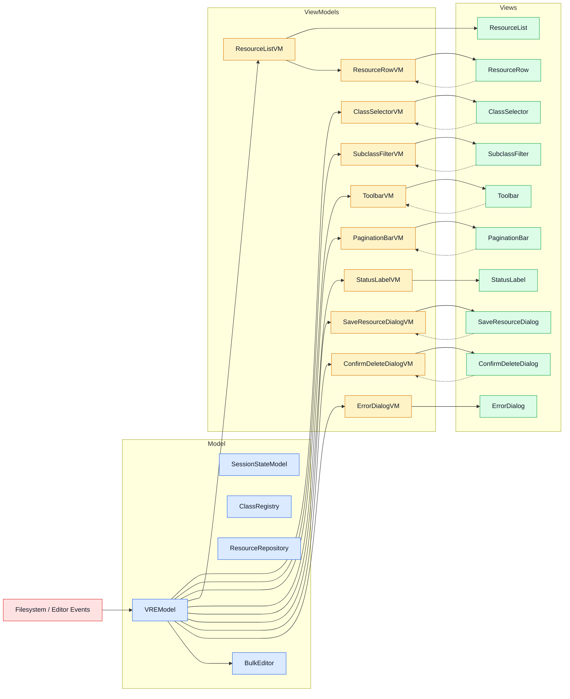

# Visual Resources Editor — Architecture

A Godot 4 `@tool` editor plugin for visually browsing, creating, bulk-editing, and deleting `.tres` resource files filtered by class type.

---

## Architecture Overview

The plugin follows an **MVVM (Model-View-ViewModel)** architecture. Views bind to
ViewModels; ViewModels read from and write to `VREModel` (the Model facade).
No View or ViewModel holds a reference to any other View or ViewModel.

```text
visual_resources_editor/
├── visual_resources_editor_plugin.gd   # EditorPlugin entry point (adds toolbar menu)
├── visual_resources_editor_toolbar.gd  # Toolbar menu: instantiates the editor window
├── core/                               # Model layer
│   ├── data_models/
│   │   ├── session_state_model.gd      # Shared session state (selected class, selection, page, filters)
│   │   ├── resource_property.gd        # Typed data model for a single property definition
│   │   └── class_definition.gd         # Typed data model for a class (name, path, properties)
│   ├── vre_model.gd                    # VREModel: facade / coordinator — single entry point for all VMs
│   ├── state_manager.gd                # VREStateManager: thin proxy kept for migration compatibility
│   ├── class_registry.gd              # Project class scanning and metadata
│   ├── resource_repository.gd         # .tres file loading, mtime diffing, saving
│   ├── selection_manager.gd           # Multi-select logic (single / ctrl / shift)
│   ├── pagination_manager.gd          # Page arithmetic and page-slice extraction
│   ├── editor_filesystem_listener.gd  # Filesystem change events (debounced)
│   ├── project_class_scanner.gd       # Static utility: scans project classes and .tres files
│   └── bulk_editor.gd                 # BulkEditor: inspector proxy creation and bulk property write-back
├── view_models/                        # ViewModel layer
│   ├── class_selector_vm.gd
│   ├── subclass_filter_vm.gd
│   ├── toolbar_vm.gd
│   ├── resource_list_vm.gd
│   ├── resource_row_vm.gd
│   ├── pagination_bar_vm.gd
│   ├── status_label_vm.gd
│   ├── save_resource_dialog_vm.gd
│   ├── confirm_delete_dialog_vm.gd
│   └── error_dialog_vm.gd
├── ui/                                 # View layer
│   ├── visual_resources_editor_window.gd/.tscn  # Main Window: creates VMs and injects them into Views
│   ├── class_selector/
│   │   └── class_selector.gd/.tscn     # Class dropdown selector
│   ├── subclass_filter/
│   │   └── subclass_filter.gd/.tscn    # "Include subclasses" checkbox + warning label
│   ├── toolbar/
│   │   └── toolbar.gd/.tscn            # VREToolbar: New / Delete Selected / Refresh buttons
│   ├── resource_list/
│   │   ├── resource_list.gd/.tscn      # Table container: header + scrollable rows
│   │   ├── header_row.gd/.tscn         # Column header labels
│   │   ├── resource_row.gd/.tscn       # One row per resource (binds to ResourceRowVM)
│   │   ├── resource_field_label.gd/.tscn  # Label for a single property cell
│   │   ├── header_field_label.tscn      # Label for a single header cell
│   │   └── field_separator.tscn         # VSeparator between columns
│   ├── pagination_bar/
│   │   └── pagination_bar.gd/.tscn     # Prev/Next page buttons + page label
│   ├── status_label.gd                 # Script-only Label: shows resource count or selection count
│   └── dialogs/
│       ├── dialogs.gd/.tscn            # Container: wires VMs into the three dialog nodes
│       ├── save_resource_dialog.gd      # EditorFileDialog for creating new resources
│       ├── confirm_delete_dialog.gd     # ConfirmationDialog for deleting resources (moves to OS trash)
│       └── error_dialog.gd             # AcceptDialog for error messages
└── plugin.cfg
```

## Data Flow

### Model layer

- **`SessionStateModel`** owns all shared session state: `selected_class`,
  `include_subclasses`, `selected_resources`, `current_page`. It emits typed
  signals when any property changes. This replaces VM-to-VM dependencies — VMs
  read session state from the Model, not from each other.

- **`VREModel`** is the single facade all ViewModels talk to. It instantiates
  and coordinates `ClassRegistry`, `ResourceRepository`, `SelectionManager`,
  `PaginationManager`, `EditorFileSystemListener`, and `SessionStateModel`.
  Internal coordination (e.g. class change → resource reload) happens inside
  `VREModel`, invisible to VMs.

- **`BulkEditor`** is a Model-layer service that drives Godot's
  `EditorInspector`. It connects directly to `VREModel` (no ViewModel) because
  it has no View that binds to it. See `architecture_analisys.md §J`.

### ViewModel layer

Each VM is a `RefCounted` created by `VisualResourcesEditorWindow` and injected
into its paired View. VMs expose clean, UI-ready properties/signals and delegate
all writes back to `VREModel`. VMs never hold references to other VMs.

### View layer

Views are `@tool` scenes/scripts. Each View has a typed `vm` property (setter
pattern with `is_node_ready()` guard). `VisualResourcesEditorWindow._ready()`
creates all VMs and assigns them:

```gdscript
%ClassSelector.vm    = ClassSelectorVM.new(_state.model)
%SubclassFilter.vm   = SubclassFilterVM.new(_state.model)
%Toolbar.vm          = ToolbarVM.new(_state.model)
%PaginationBar.vm    = PaginationBarVM.new(_state.model)
%StatusLabel.vm      = StatusLabelVM.new(_state.model)
%ResourceList.vm     = ResourceListVM.new(_state.model)
%BulkEditor.model    = _state.model          # direct — no VM needed
%Dialogs.save_dialog_vm    = SaveResourceDialogVM.new(_state.model)
%Dialogs.confirm_delete_vm = ConfirmDeleteDialogVM.new(_state.model)
%Dialogs.error_dialog_vm   = ErrorDialogVM.new(_state.model)
```

`ResourceListVM` creates one `ResourceRowVM` per resource; `ResourceRow` (View)
receives and binds to its row VM directly.

## Design Decisions

### SessionStateModel vs VM-to-VM dependencies
Five VMs originally depended on `ClassSelector VM → Selected Class` — a
horizontal coupling that violates MVVM. Extracting shared session state into
`SessionStateModel` (Model layer) eliminated all VM-to-VM arrows. See
`architecture_analisys.md §I`.

### BulkEditor connects directly to VREModel
`BulkEditor` is a non-visual service; a `BulkEditVM` wrapper would be pure
passthrough. See `architecture_analisys.md §J`.

### ResourceRowVM (per-row ViewModels)
`ResourceListVM` emits `Array[ResourceRowVM]`; each `ResourceRow` binds to
its own VM. Selection state is handled per-row via `is_selected_changed` —
no global selection sweep needed. See `architecture_analisys.md §K`.

### Scene Unique Nodes (`%NodeName`)
All child node references use `%UniqueNode` directly in code per CLAUDE.md.

### Delete Moves to OS Trash
`ConfirmDeleteDialog` uses `OS.move_to_trash()`. No undo/redo — version
control is the recovery path.

---

## Diagrams & Information Flow

### 1. High-Level MVVM Flow



### 2. Window Dependency Injection

`VisualResourcesEditorWindow._ready()` is the only place that knows about both
`VREStateManager` (which holds `VREModel`) and the child Views. It creates each
VM and passes `_state.model` into it, then assigns the VM to the View. After
`_ready()` finishes, no component holds a reference to any other component.

---

## Analysis

The detailed design-analysis material is in `architecture_analisys.md`.
Resolved implementation decisions are documented in sections I–L of that file.
