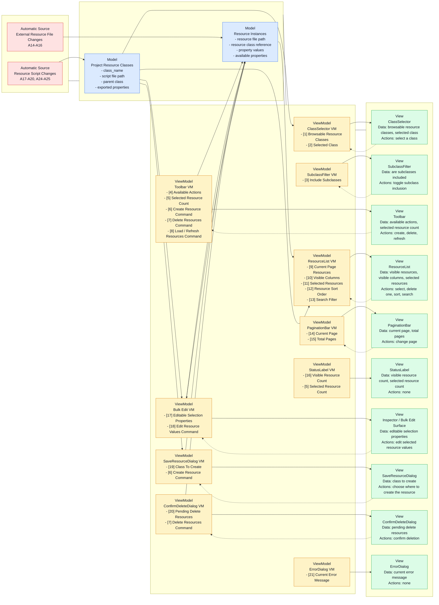

# Visual Resources Editor — Architecture Analysis

This document contains the design-analysis material that was previously
embedded in `ARCHITECTURE.md`. It keeps the abstract criteria and the
implementation-oriented VM analysis together in one place.

## Design Criteria

This section reframes the editor in product terms rather than current
`VREStateManager` calls and signals. If we move toward a real MVVM design,
these are the view-facing needs and change drivers the ViewModels
should satisfy.

### A. User and Environment Inputs

| # | Type | Input | Where / Source |
|---|---|-------|----------------|
| 1 | U | Open the plugin (F3 / menu) | VisualResourcesEditorToolbar menu |
| 2 | U | Close the plugin (Escape / ✕) | Window title bar or keyboard |
| 3 | U | Select a class | ClassSelector dropdown |
| 4 | U | Toggle "Include Subclasses" | SubclassFilter checkbox |
| 5 | U | Click a resource row — single select | ResourceRow button |
| 6 | U | Ctrl+click a resource row — toggle | ResourceRow button |
| 7 | U | Shift+click a resource row — range select | ResourceRow button |
| 8 | U | Click "Create New" | VREToolbar |
| 9 | U | Click "Delete Selected" | VREToolbar |
| 10 | U | Click a row's own Delete button | ResourceRow |
| 11 | U | Click "Refresh" | VREToolbar |
| 12 | U | Change page | PaginationBar |
| 13 | U | Edit a property in Godot Inspector (bulk edit) | Godot EditorInspector |
| 14a | A | Create a `.tres` of the viewed class externally | File system |
| 14b | A | Create a `.tres` of a different class externally | File system |
| 15a | A | Delete a `.tres` of the viewed class externally | File system |
| 15b | A | Delete a `.tres` of a different class externally | File system |
| 16a | A | Modify a `.tres` of the viewed class externally | File system |
| 16b | A | Modify a `.tres` of a different class externally | File system |
| 17 | A | Create a new `.gd` script with `class_name` extending Resource | File system |
| 18 | A | Delete a `.gd` script (remove class) | File system |
| 19 | A | Rename a class (`class_name` line changes) | File system |
| 20 | A | Add/remove/change `@export` properties in a `.gd` script | File system |
| 21 | U | Change resource ordering | Resource list controls |
| 22 | U | Change resource search filter | Resource list controls |
| 23 | U | Change page size | Window |
| 24 | A | Move a resource class `.gd` script | File system |
| 25 | A | Change what a resource class inherits from | File system |
| 26 | U | Choose where to create the new resource | SaveResourceDialog |
| 27 | U | Confirm deletion of pending resources | ConfirmDeleteDialog |

### B. Desired Outcomes

| # | Observable result |
|---|-------------------|
| 1 | Class names populate ClassSelector dropdown on plugin open |
| 2 | New class appears in ClassSelector dropdown |
| 3 | Class disappears from ClassSelector dropdown |
| 4 | ClassSelector follows a renamed class (selection updates to new name) |
| 5 | New row appears in ResourceList |
| 6 | Row disappears from ResourceList |
| 7 | Row values update in ResourceList |
| 8 | Columns update in ResourceList header and rows (schema change) |
| 9 | Selection highlights update in ResourceList |
| 10 | Selection is preserved after list refresh (same paths re-selected) |
| 11 | PaginationBar shows/hides based on page count |
| 12 | PaginationBar prev/next disabled correctly at boundaries |
| 13 | StatusLabel shows visible resource count |
| 14 | StatusLabel shows selection count while something is selected |
| 15 | Inspector shows bulk proxy when resources are selected |
| 16 | Inspector clears when selection is empty or cross-class |
| 17 | Error dialog appears on save/delete failures |
| 18 | View clears when current class is deleted and not renamed |

### C. View Data and Change Drivers

This list is intentionally phrased as "what the user sees" instead of
"which current code property feeds it".

- `ClassSelector`
  Data shown:
  - browsable resource classes
    - sources:
      - `(M)` `Project Resource Classes`
    - changes:
      - browsable resource classes are added (17) `A`
        - `(M)` Source: `Project Resource Classes` are added
      - browsable resource classes are removed (18) `A`
        - `(M)` Source: `Project Resource Classes` are removed
  - selected class
    - sources:
      - `(VM)` `Selected Class`
    - changes:
      - the selected class changes (3) `U`
        - `(VM)` Source: `Selected Class` is changed
      - the selected class is renamed (19) `A`
        - `(M)` Source: `Project Resource Classes` rename the `Selected Class`
      - the selected class becomes invalid (18) `A`
        - `(M)` Source: `Project Resource Classes` remove the `Selected Class`
  User Actions:
  - select a class from the dropdown (3) `U`
    - `(VM)` Source: `Selected Class` is changed

- `SubclassFilter`
  Data shown:
  - are subclasses included
    - sources:
      - `(VM)` `Include Subclasses`
    - changes:
      - subclass inclusion is toggled (4) `U`
        - `(VM)` Source: `Include Subclasses` is changed
  User Actions:
  - toggle subclass inclusion (4) `U`
    - `(VM)` Source: `Include Subclasses` is changed

- `Toolbar`
  Data shown:
  - available actions
    - sources:
      - `(VM)` `Available Actions`
    - changes:
      - the selected class changes in a way that affects which actions are available (3) `U`
        - `(VM)` Source: `Selected Class` is changed
  - selected count
    - sources:
      - `(VM)` `Selected Count`
    - changes:
      - the selection changes (5) `U`, (6) `U`, (7) `U`
        - `(VM)` Source: `Selected Resources` change
  User Actions:
  - request creation of a new resource (8) `U`
    - `(VM)` Source: `Create Resource Command` is requested
  - request deletion of the selected resources (9) `U`
    - `(VM)` Source: `Pending Delete Resources` are changed
  - request a refresh of the current resources (11) `U`
    - `(VM)` Source: `Load / Refresh Resources Command` is executed

- `ResourceList`
  Data shown:
  - visible resources
    - sources:
      - `(VM)` `Current Page Resources`
    - changes:
      - the selected class changes (3) `U`
        - `(VM)` Source: `Selected Class` is changed
      - subclass inclusion changes (4) `U`
        - `(VM)` Source: `Include Subclasses` is changed
      - `CurrentClass Resources` are created (8) `U`, (14a) `A`
        - `(M)` Source: `CurrentClass Resources` are created
      - `CurrentClass Resources` are deleted (9) `U`, (10) `U`, (15a) `A`
        - `(M)` Source: `CurrentClass Resources` are deleted
      - resource ordering changes (21) `U`
        - `(VM)` Source: `Resource Sort Order` is changed
      - resource search changes (22) `U`
        - `(VM)` Source: `Search Filter` is changed
      - the current page changes (12) `U`
        - `(VM)` Source: `Current Page` is changed
  - visible columns
    - sources:
      - `(VM)` `Visible Columns`
    - changes:
      - the selected class changes (3) `U`
        - `(VM)` Source: `Selected Class` is changed
      - subclass inclusion changes (4) `U`
        - `(VM)` Source: `Include Subclasses` is changed
      - class properties are added (20) `A`
        - `(M)` Source: `Class Properties` are added
      - class properties are removed (20) `A`
        - `(M)` Source: `Class Properties` are removed
      - class properties are changed (20) `A`
        - `(M)` Source: `Class Properties` are changed
  - row values
    - sources:
      - `(VM)` `Current Page Resources`
    - changes:
      - `CurrentClass Resources` are edited (13) `U`, (16a) `A`
        - `(M)` Source: `CurrentClass Resources` are edited
      - class properties are added (20) `A`
        - `(M)` Source: `Class Properties` are added
      - class properties are removed (20) `A`
        - `(M)` Source: `Class Properties` are removed
      - class properties are changed (20) `A`
        - `(M)` Source: `Class Properties` are changed
  - row selection state
    - sources:
      - `(VM)` `Selected Resources`
    - changes:
      - the selection changes (5) `U`, (6) `U`, (7) `U`
        - `(VM)` Source: `Selected Resources` change
  User Actions:
  - select one resource (5) `U`
    - `(VM)` Source: `Selected Resources` change
  - toggle one resource in the selection (6) `U`
    - `(VM)` Source: `Selected Resources` change
  - select a range of resources (7) `U`
    - `(VM)` Source: `Selected Resources` change
  - request deletion of one resource (10) `U`
    - `(VM)` Source: `Pending Delete Resources` are changed
  - change resource ordering (21) `U`
    - `(VM)` Source: `Resource Sort Order` is changed
  - change resource search filter (22) `U`
    - `(VM)` Source: `Search Filter` is changed

- `PaginationBar`
  Data shown:
  - current page
    - sources:
      - `(VM)` `Current Page`
    - changes:
      - the current page changes (12) `U`
        - `(VM)` Source: `Current Page` is changed
  - total pages
    - sources:
      - `(VM)` `Total Pages`
    - changes:
      - the selected class changes (3) `U`
        - `(VM)` Source: `Selected Class` is changed
      - subclass inclusion changes (4) `U`
        - `(VM)` Source: `Include Subclasses` is changed
      - the number of `CurrentClass Resources` changes (8) `U`, (9) `U`, (10) `U`, (14a) `A`, (15a) `A`, (22) `U`
        - `(M)` Source: `CurrentClass Resources` are created
        - `(M)` Source: `CurrentClass Resources` are deleted
      - the page size changes (23) `U`
        - `(VM)` Source: `Page Size` is changed
  User Actions:
  - change page (12) `U`
    - `(VM)` Source: `Current Page` is changed

- `StatusLabel`
  Data shown:
  - visible resource count
    - sources:
      - `(VM)` `Visible Resource Count`
    - changes:
      - the selected class changes (3) `U`
        - `(VM)` Source: `Selected Class` is changed
      - subclass inclusion changes (4) `U`
        - `(VM)` Source: `Include Subclasses` is changed
      - the current page changes (12) `U`
        - `(VM)` Source: `Current Page` is changed
      - the number of `CurrentClass Resources` changes (8) `U`, (9) `U`, (10) `U`, (14a) `A`, (15a) `A`, (22) `U`
        - `(M)` Source: `CurrentClass Resources` are created
        - `(M)` Source: `CurrentClass Resources` are deleted
  - selected resource count
    - sources:
      - `(VM)` `Selected Resource Count`
    - changes:
      - the selection changes (5) `U`, (6) `U`, (7) `U`
        - `(VM)` Source: `Selected Resources` change
  User Actions:
  - no direct user actions on this element

- `Inspector / Bulk Edit Surface`
  Data shown:
  - editable properties for the current selection
    - sources:
      - `(VM)` `Editable Selection Properties`
    - changes:
      - the selection changes (5) `U`, (6) `U`, (7) `U`
        - `(VM)` Source: `Selected Resources` change
      - the selected class changes and clears / replaces the current selection (3) `U`
        - `(VM)` Source: `Selected Class` is changed
      - class properties are added (20) `A`
        - `(M)` Source: `Class Properties` are added
      - class properties are removed (20) `A`
        - `(M)` Source: `Class Properties` are removed
      - class properties are changed (20) `A`
        - `(M)` Source: `Class Properties` are changed
  User Actions:
  - edit the properties of the current selection (13) `U`
    - `(VM)` Source: `Edit Resource Values Command` is executed

- `SaveResourceDialog`
  Data shown:
  - class to create
    - sources:
      - `(VM)` `Class To Create`
    - changes:
      - the selected class changes (3) `U`
        - `(VM)` Source: `Selected Class` is changed
  User Actions:
  - choose where to create the new resource (26) `U`
    - `(VM)` Source: `Create Resource Command` is executed

- `ConfirmDeleteDialog`
  Data shown:
  - resources pending deletion
    - sources:
      - `(VM)` `Pending Delete Resources`
    - changes:
      - pending resources change (9) `U`, (10) `U`
        - `(VM)` Source: `Pending Delete Resources` are changed
  User Actions:
  - confirm deletion of the pending resources (27) `U`
    - `(VM)` Source: `Delete Resources Command` is executed

- `ErrorDialog`
  Data shown:
  - the latest user-visible error message
    - sources:
      - `(VM)` `Current Error Message`
    - changes:
      - the current error state changes (8) `U`, (9) `U`, (10) `U`, (11) `U`, (13) `U`, (14a) `A`, (15a) `A`, (16a) `A`, (17) `A`, (18) `A`, (19) `A`, (20) `A`
        - `(M)` Source: `Create Operations` fail
        - `(M)` Source: `Save Operations` fail
        - `(M)` Source: `Delete Operations` fail
        - `(M)` Source: `Load Operations` fail
        - `(M)` Source: `Validation` rejects an action
  User Actions:
  - no direct user actions on this element

### D. Model Data and Change Drivers

This section mirrors the view-side list, but from the domain side.
These are the project/editor concepts that exist independently of how the
window chooses to present them.

- `Project Resource Classes`
  Internal data:
  - `class_name` of each script that inherits `Resource`
    - sources:
      - `(M)` `Resource Script Files`
    - changes:
      - a resource class is declared (17) `A`
        - `(M)` Source: `Resource Script Files` add a resource `class_name`
      - a resource class is removed (18) `A`
        - `(M)` Source: `Resource Script Files` remove a resource `class_name`
      - a resource class is renamed (19) `A`
        - `(M)` Source: `Resource Script Files` rename a resource `class_name`
  - script file path for each resource class
    - sources:
      - `(M)` `Resource Script Files`
    - changes:
      - a resource class script is moved (24) `A`
        - `(M)` Source: `Resource Script Files` change a script path
  - parent class for each resource class
    - sources:
      - `(M)` `Resource Script Files`
    - changes:
      - a resource class is reparented (25) `A`
        - `(M)` Source: `Resource Script Files` change the inherited parent class
  - exported properties for each resource class
    - sources:
      - `(M)` `Resource Script Files`
    - changes:
      - exported properties are added (20) `A`
        - `(M)` Source: `Resource Script Files` add exported properties
      - exported properties are removed (20) `A`
        - `(M)` Source: `Resource Script Files` remove exported properties
      - exported properties are changed (20) `A`
        - `(M)` Source: `Resource Script Files` change exported properties

- `Resource Instances`
  Internal data:
  - resource file path
    - sources:
      - `(M)` `Resource Files on Disk`
    - changes:
      - a resource instance is created from the editor (8) `U`
        - `(VM)` Source: `Create Resource Command` is executed
      - a resource instance is created externally (14a) `A`, (14b) `A`
        - `(M)` Source: `Resource Files on Disk` add a resource file
      - a resource instance is deleted from the editor (9) `U`, (10) `U`
        - `(VM)` Source: `Delete Resources Command` is executed
      - a resource instance is deleted externally (15a) `A`, (15b) `A`
        - `(M)` Source: `Resource Files on Disk` remove a resource file
  - resource class reference
    - sources:
      - `(M)` `Resource Files on Disk`
      - `(M)` `Project Resource Classes`
    - changes:
      - a resource file changes its class reference (16a) `A`, (16b) `A`
        - `(M)` Source: `Resource Files on Disk` change a resource class reference
      - project resource classes are renamed or removed (18) `A`, (19) `A`
        - `(M)` Source: `Project Resource Classes` change
  - property values
    - sources:
      - `(M)` `Resource Files on Disk`
    - changes:
      - a resource is edited from the editor (13) `U`
        - `(VM)` Source: `Edit Resource Values Command` is executed
      - resource files are modified externally (16a) `A`, (16b) `A`
        - `(M)` Source: `Resource Files on Disk` change property values
  - available properties for the resource instance
    - sources:
      - `(M)` `Project Resource Classes`
    - changes:
      - the resource class reference changes (16a) `A`, (16b) `A`
        - `(M)` Source: `Resource Files on Disk` change a resource class reference
      - class properties are added (20) `A`
        - `(M)` Source: `Project Resource Classes` add exported properties
      - class properties are removed (20) `A`
        - `(M)` Source: `Project Resource Classes` remove exported properties
      - class properties are changed (20) `A`
        - `(M)` Source: `Project Resource Classes` change exported properties

## Implementation Design

This section starts moving from abstract design criteria toward candidate
MVVM structure. Here, views are treated as directly connected to their own
ViewModel, models stay the same as above, and the new design work is to
define what each ViewModel must hold and what can change it.

### E. Direct View to ViewModel Connections

- `ClassSelector`
  Data:
  - browsable resource classes
    - sources:
      - `(VM)` `Browsable Resource Classes`
    - changes:
      - browsable resource classes change
        - `(VM)` Source: `Browsable Resource Classes` changes
  - selected class
    - sources:
      - `(VM)` `Selected Class`
    - changes:
      - selected class changes
        - `(VM)` Source: `Selected Class` changes
  User Actions:
  - select a class from the dropdown (3) `U`

- `SubclassFilter`
  Data:
  - are subclasses included
    - sources:
      - `(VM)` `Include Subclasses`
    - changes:
      - subclass inclusion changes
        - `(VM)` Source: `Include Subclasses` changes
  User Actions:
  - toggle subclass inclusion (4) `U`

- `Toolbar`
  Data:
  - available actions
    - sources:
      - `(VM)` `Available Actions`
    - changes:
      - available actions change
        - `(VM)` Source: `Available Actions` changes
  - selected count
    - sources:
      - `(VM)` `Selected Resource Count`
    - changes:
      - selected resource count changes
        - `(VM)` Source: `Selected Resource Count` changes
  User Actions:
  - request creation of a new resource (8) `U`
  - request deletion of the selected resources (9) `U`
  - request a refresh of the current resources (11) `U`

- `ResourceList`
  Data:
  - visible resources
    - sources:
      - `(VM)` `Current Page Resources`
    - changes:
      - current page resources change
        - `(VM)` Source: `Current Page Resources` changes
  - visible columns
    - sources:
      - `(VM)` `Visible Columns`
    - changes:
      - visible columns change
        - `(VM)` Source: `Visible Columns` changes
  - row selection state
    - sources:
      - `(VM)` `Selected Resources`
    - changes:
      - selected resources change
        - `(VM)` Source: `Selected Resources` changes
  User Actions:
  - select one resource (5) `U`
  - toggle one resource in the selection (6) `U`
  - select a range of resources (7) `U`
  - request deletion of one resource (10) `U`
  - change resource ordering (21) `U`
  - change resource search filter (22) `U`

- `PaginationBar`
  Data:
  - current page
    - sources:
      - `(VM)` `Current Page`
    - changes:
      - current page changes
        - `(VM)` Source: `Current Page` changes
  - total pages
    - sources:
      - `(VM)` `Total Pages`
    - changes:
      - total pages change
        - `(VM)` Source: `Total Pages` changes
  User Actions:
  - change page (12) `U`

- `StatusLabel`
  Data:
  - visible resource count
    - sources:
      - `(VM)` `Visible Resource Count`
    - changes:
      - visible resource count changes
        - `(VM)` Source: `Visible Resource Count` changes
  - selected resource count
    - sources:
      - `(VM)` `Selected Resource Count`
    - changes:
      - selected resource count changes
        - `(VM)` Source: `Selected Resource Count` changes
  User Actions:
  - no direct user actions on this element

- `Inspector / Bulk Edit Surface`
  Data:
  - editable properties for the current selection
    - sources:
      - `(VM)` `Editable Selection Properties`
    - changes:
      - editable selection properties change
        - `(VM)` Source: `Editable Selection Properties` changes
  User Actions:
  - edit the properties of the current selection (13) `U`

- `SaveResourceDialog`
  Data:
  - class to create
    - sources:
      - `(VM)` `Class To Create`
    - changes:
      - class to create changes
        - `(VM)` Source: `Class To Create` changes
  User Actions:
  - choose where to create the new resource (26) `U`
    - `(M)` `Resource Instances` will be created

- `ConfirmDeleteDialog`
  Data:
  - resources pending deletion
    - sources:
      - `(VM)` `Pending Delete Resources`
    - changes:
      - pending delete resources change
        - `(VM)` Source: `Pending Delete Resources` changes
  User Actions:
  - confirm deletion of the pending resources (27) `U`
    - `(M)` `Resource Instances` will be deleted

- `ErrorDialog`
  Data:
  - the latest user-visible error message
    - sources:
      - `(VM)` `Current Error Message`
    - changes:
      - current error message changes
        - `(VM)` Source: `Current Error Message` changes
  User Actions:
  - no direct user actions on this element

### F. ViewModel Components and Change Drivers

- `ClassSelector VM`
  Data:
  - `Browsable Resource Classes`
    - changes:
      - project resource classes change
        - `(M)` Source: `Project Resource Classes` change
  - `Selected Class`
    - changes:
      - linked view selects a class
        - `(V)` Source: `ClassSelector` changes `Selected Class`
      - selected class is renamed or removed
        - `(M)` Source: `Project Resource Classes` change

- `SubclassFilter VM`
  Data:
  - `Include Subclasses`
    - changes:
      - linked view toggles subclass inclusion
        - `(V)` Source: `SubclassFilter` changes `Include Subclasses`

- `Toolbar VM`
  Data:
  - `Available Actions`
    - changes:
      - selected class changes
        - `(VM)` Source: `ClassSelector VM` changes `Selected Class`
  - `Selected Resource Count`
    - changes:
      - selected resources change
        - `(VM)` Source: `ResourceList VM` changes `Selected Resources`
  Commands:
  - `Create Resource Command`
    - changes:
      - linked view requests resource creation
        - `(V)` Source: `Toolbar` requests `Create Resource Command`
  - `Delete Resources Command`
    - changes:
      - linked view requests deletion
        - `(V)` Source: `Toolbar` requests `Delete Resources Command`
  - `Load / Refresh Resources Command`
    - changes:
      - linked view requests refresh
        - `(V)` Source: `Toolbar` executes `Load / Refresh Resources Command`

- `ResourceList VM`
  Data:
  - `Current Page Resources`
    - changes:
      - project resources for the current class change
        - `(M)` Source: `Resource Instances` change
      - selected class changes
        - `(VM)` Source: `ClassSelector VM` changes `Selected Class`
      - subclass inclusion changes
        - `(VM)` Source: `SubclassFilter VM` changes `Include Subclasses`
      - resource ordering changes
        - `(V)` Source: `ResourceList` changes `Resource Sort Order`
      - search filter changes
        - `(V)` Source: `ResourceList` changes `Search Filter`
      - current page changes
        - `(VM)` Source: `PaginationBar VM` changes `Current Page`
  - `Visible Columns`
    - changes:
      - project resource class schema changes
        - `(M)` Source: `Project Resource Classes` change
      - selected class changes
        - `(VM)` Source: `ClassSelector VM` changes `Selected Class`
      - subclass inclusion changes
        - `(VM)` Source: `SubclassFilter VM` changes `Include Subclasses`
  - `Selected Resources`
    - changes:
      - linked view changes selection
        - `(V)` Source: `ResourceList` changes `Selected Resources`
  - `Resource Sort Order`
    - changes:
      - linked view changes resource ordering
        - `(V)` Source: `ResourceList` changes `Resource Sort Order`
  - `Search Filter`
    - changes:
      - linked view changes search filter
        - `(V)` Source: `ResourceList` changes `Search Filter`

- `PaginationBar VM`
  Data:
  - `Current Page`
    - changes:
      - linked view changes page
        - `(V)` Source: `PaginationBar` changes `Current Page`
  - `Total Pages`
    - changes:
      - current page resources population changes
        - `(VM)` Source: `ResourceList VM` changes `Current Page Resources`
      - selected class changes
        - `(VM)` Source: `ClassSelector VM` changes `Selected Class`
      - subclass inclusion changes
        - `(VM)` Source: `SubclassFilter VM` changes `Include Subclasses`

- `StatusLabel VM`
  Data:
  - `Visible Resource Count`
    - changes:
      - current page resources change
        - `(VM)` Source: `ResourceList VM` changes `Current Page Resources`
  - `Selected Resource Count`
    - changes:
      - selected resources change
        - `(VM)` Source: `ResourceList VM` changes `Selected Resources`

- `Bulk Edit VM`
  Data:
  - `Editable Selection Properties`
    - changes:
      - selected resources change
        - `(VM)` Source: `ResourceList VM` changes `Selected Resources`
      - selected class changes
        - `(VM)` Source: `ClassSelector VM` changes `Selected Class`
      - project resource class schema changes
        - `(M)` Source: `Project Resource Classes` change
      - resource instances change
        - `(M)` Source: `Resource Instances` change
  Commands:
  - `Edit Resource Values Command`
    - changes:
      - linked view edits selected resource values
        - `(V)` Source: `Inspector / Bulk Edit Surface` executes `Edit Resource Values Command`

- `SaveResourceDialog VM`
  Data:
  - `Class To Create`
    - changes:
      - selected class changes
        - `(VM)` Source: `ClassSelector VM` changes `Selected Class`
  Commands:
  - `Create Resource Command`
    - changes:
      - linked view chooses where to create the new resource
        - `(V)` Source: `SaveResourceDialog` executes `Create Resource Command`

- `ConfirmDeleteDialog VM`
  Data:
  - `Pending Delete Resources`
    - changes:
      - toolbar requests deletion
        - `(VM)` Source: `Toolbar VM` requests `Delete Resources Command`
      - resource list requests deletion of one resource
        - `(V)` Source: `ResourceList` changes `Pending Delete Resources`
  Commands:
  - `Delete Resources Command`
    - changes:
      - linked view confirms deletion
        - `(V)` Source: `ConfirmDeleteDialog` executes `Delete Resources Command`

- `ErrorDialog VM`
  Data:
  - `Current Error Message`
    - changes:
      - create, delete, edit, or refresh operations fail
        - `(M)` Source: operation failure updates `Current Error Message`

### G. VM-VM dependencies

- `ClassSelector` VM depends on:
  - _(no VM-to-VM dependencies)_

- `SubclassFilter` VM depends on:
  - _(no VM-to-VM dependencies)_

- `Toolbar` VM depends on:
  - `ClassSelector` VM → `Selected Class` (for Available Actions)
  - `ResourceList` VM → `Selected Resources` (for Selected Resource Count)

- `ResourceList` VM depends on:
  - `ClassSelector` VM → `Selected Class` (for Current Page Resources and Visible Columns)
  - `SubclassFilter` VM → `Include Subclasses` (for Current Page Resources and Visible Columns)
  - `PaginationBar` VM → `Current Page` (for Current Page Resources)

- `PaginationBar` VM depends on:
  - `ResourceList` VM → `Current Page Resources` (for Total Pages)
  - `ClassSelector` VM → `Selected Class` (for Total Pages)
  - `SubclassFilter` VM → `Include Subclasses` (for Total Pages)

- `StatusLabel` VM depends on:
  - `ResourceList` VM → `Current Page Resources` (for Visible Resource Count)
  - `ResourceList` VM → `Selected Resources` (for Selected Resource Count)

- `Bulk Edit` VM depends on:
  - `ResourceList` VM → `Selected Resources` (for Editable Selection Properties)
  - `ClassSelector` VM → `Selected Class` (for Editable Properties)

- `SaveResourceDialog` VM depends on:
  - `ClassSelector` VM → `Selected Class` (for determine what class to create).

- `ConfirmDeleteDialog` VM depends on:
  - `ResourceList` VM → `Selected Resources`.

- `ErrorDialog` VM depends on:
  - _(no VM-to-VM dependencies)_

### H. VM Property Index

1. `Browsable Resource Classes` | ClassSelector VM
2. `Selected Class` | ClassSelector VM
3. `Include Subclasses` | SubclassFilter VM
4. `Available Actions` | Toolbar VM
5. `Selected Resource Count` | Toolbar VM, StatusLabel VM
6. `Create Resource Command` | Toolbar VM, SaveResourceDialog VM
7. `Delete Resources Command` | Toolbar VM, ConfirmDeleteDialog VM
8. `Load / Refresh Resources Command` | Toolbar VM
9. `Current Page Resources` | ResourceList VM
10. `Visible Columns` | ResourceList VM
11. `Selected Resources` | ResourceList VM
12. `Resource Sort Order` | ResourceList VM
13. `Search Filter` | ResourceList VM
14. `Current Page` | PaginationBar VM
15. `Total Pages` | PaginationBar VM
16. `Visible Resource Count` | StatusLabel VM
17. `Editable Selection Properties` | Bulk Edit VM
18. `Edit Resource Values Command` | Bulk Edit VM
19. `Class To Create` | SaveResourceDialog VM
20. `Pending Delete Resources` | ConfirmDeleteDialog VM
21. `Current Error Message` | ErrorDialog VM

