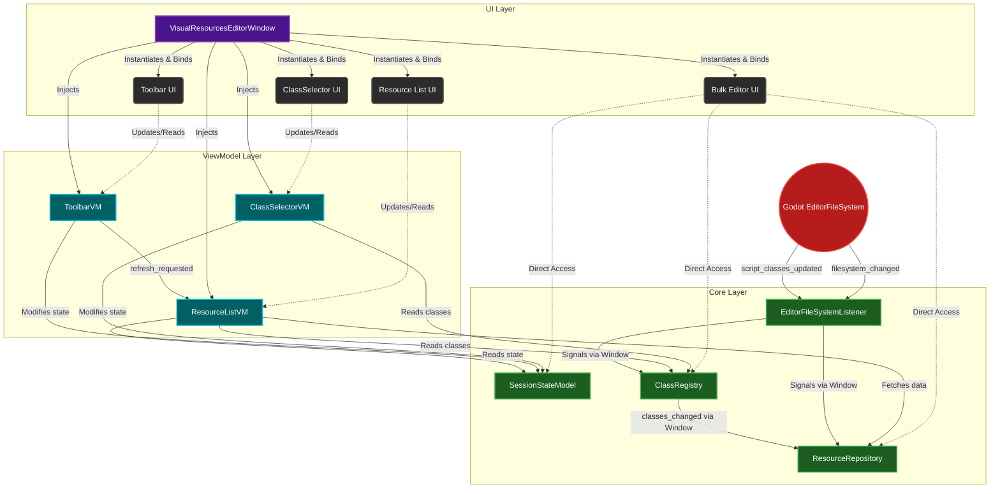
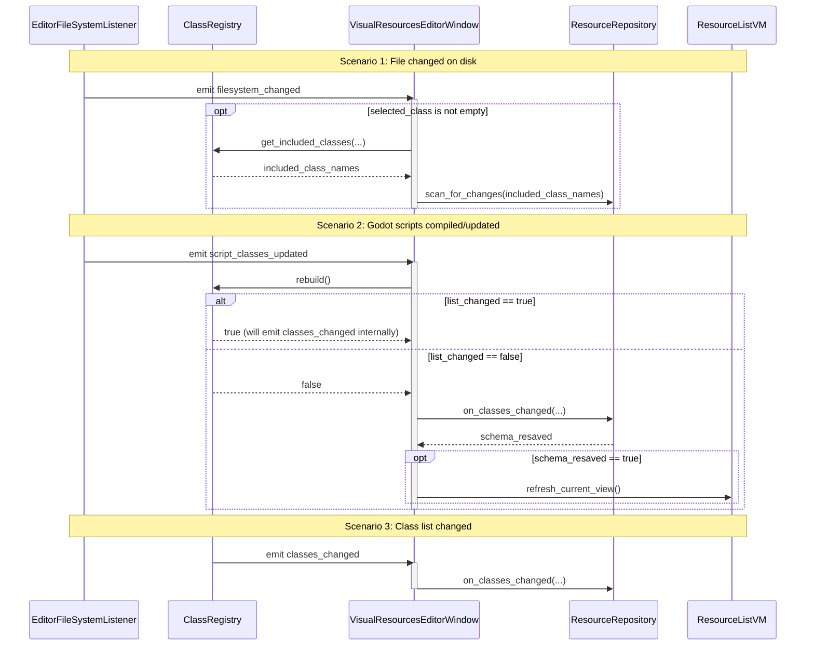

# Visual Resources Editor - Architecture Breakdown

Based on a review of the actual code in `addons/diablohumastudio/visual_resources_editor`, the system follows a structured **MVVM (Model-View-ViewModel)** architecture tailored for the Godot Engine.

## 1. Architectural Layers

The editor is separated into three distinct layers to keep data, logic, and presentation decoupled.

### Core Layer (Models & Services)
Located in `core/` and `core/data_models/`, this layer handles the business logic, state, and interaction with the Godot Engine's filesystem.
*   **`SessionStateModel` (`core/data_models/session_state_model.gd`)**: Acts as the central hub for the editor's reactive state. It stores the currently selected class, active filters, and pagination state.
*   **`ResourceRepository` (`core/resource_repository.gd`)**: Manages the lifecycle of Godot Resources. It is responsible for scanning the filesystem, loading resources into memory, and saving them.
*   **`ClassRegistry` (`core/class_registry.gd`)**: Scans the project for script-defined classes to populate the editor's class selection options.
*   **`EditorFileSystemListener` (`core/editor_filesystem_listener.gd`)**: Hooks into Godot's `EditorFileSystem` signals to ensure the editor stays in sync with external file changes (e.g., if a file is modified outside the editor).

### ViewModel Layer
Located in the `view_models/` directory, these classes bridge the Core logic and the UI.
*   ViewModels (like `ResourceListVM`, `ToolbarVM`, `ClassSelectorVM`) encapsulate the presentation logic.
*   They subscribe to changes in the `SessionStateModel` and core services, fetch the necessary data, and expose properties and signals that the UI can consume.

### UI Layer (Views)
Located in the `ui/` directory, these are standard Godot Scenes (`.tscn`) and their attached scripts.
*   They handle the visual representation and capture user input.
*   **`visual_resources_editor_window.gd`**: The main orchestrator that initializes the core services (Model) and the ViewModels, establishing the connections between them.
*   The UI components bind to their respective ViewModels, keeping the UI logic thin and completely decoupled from the underlying data management.

## 2. Interaction Breakdown (The Orchestrator)

The `VisualResourcesEditorWindow` acts as the primary **Composition Root**. Its main responsibility in the `_ready()` function is to instantiate the Core Services (Model) and the ViewModels, and then wire them together.

1. **Instantiation:** It creates exactly one instance of `SessionStateModel`, `ClassRegistry`, `ResourceRepository`, and `EditorFileSystemListener`.
2. **ViewModel Injection:** It passes these core instances into the ViewModels via Dependency Injection (e.g., `ResourceListVM` receives the session, repository, and registry).
3. **UI Binding:** It assigns the instantiated ViewModels directly to the child UI nodes (e.g., `%ClassSelector.vm = ...`).
4. **Core Signal Routing:** It listens to external system events (from `EditorFileSystemListener` and `ClassRegistry`) and triggers the appropriate responses in `ResourceRepository` to keep the data layer in sync before the ViewModels even notice.

## 3. Interaction Diagram

The following diagram illustrates these dependencies and data flows:

### Key Takeaways from the Diagram:
*   **The UI Knows Nothing About the Models:** With the exception of `BulkEditor` (which might be a refactoring target based on this architecture), the UI components (`%ClassSelector`, `%Toolbar`, etc.) only talk to their assigned ViewModels.
*   **ViewModels act as Adapters:** They take the raw state from `SessionStateModel` and the raw data from `ResourceRepository`/`ClassRegistry` and format it for the UI.
*   **Top-Down Control Flow, Bottom-Up Reactivity:** `VisualResourcesEditorWindow` pushes dependencies down. Changes in the filesystem bubble up via signals to the `Window`, which then coordinates the `ResourceRepository` to update itself, which in turn causes the ViewModels to fetch new data and tell the UI to redraw.

## 4. Core Model Internal Communication (Sequence)

The `VisualResourcesEditorWindow` acts as a mediator for the core model layer, listening to internal signals and routing data accordingly. This avoids tight coupling between models like the `EditorFileSystemListener`, `ClassRegistry`, and `ResourceRepository`.

Specifically, lines 20-22 connect signals, which are handled in lines 57-77:

### Why Models Communicate Like This
*   **Decoupled Models:** The `EditorFileSystemListener` doesn't need to know that a `ClassRegistry` or `ResourceRepository` exists. It just broadcasts that Godot's filesystem changed.
*   **Orchestrated Updates:** The `Window` intercepts these generic Godot events, queries the `SessionStateModel` and `ClassRegistry` for the exact context (e.g., "what classes are we currently looking at?"), and then commands the `ResourceRepository` to do the heavy lifting of scanning or updating schemas.
*   **Preventing Redundant Work:** In `_on_script_classes_updated`, the `Window` first asks the registry to `rebuild()`. If the registry signals that the list *did* change, the Window returns early because it knows the `classes_changed` signal will be fired anyway. It only proceeds to manually update schemas if the classes merely recompiled without adding/removing types.

## 5. Architectural Refactoring Proposals (Coordinator Logic)

The current implementation in `VisualResourcesEditorWindow` acts as a mediator for the core models (`EditorFileSystemListener`, `ClassRegistry`, `ResourceRepository`, and `SessionStateModel`). While this keeps the models decoupled from each other, it leaks business orchestration into the UI layer. 

Here is an analysis of the current pain points and potential architectural alternatives to address them.

### Current Pain Points
1.  **Leaky Abstraction:** `_fs_listener` signals are caught by the `Window` when they ideally represent pure data-layer events.
2.  **Ambiguous Naming & Public Methods:** `_resource_repo.on_classes_changed` implies an internal event handler but is being called publicly by the `Window`. It also handles multiple responsibilities (resaving orphaned and all resources).
3.  **Complex Execution Flow:** `_class_registry.rebuild()` is called manually, returning a boolean (`list_changed`). As noted, tracking if the total count changed isn't enough; tracking if the `global_class_map` changed (e.g., catching reparented classes) is more robust.
4.  **UI God Object:** The `Window` is taking on too much responsibility orchestrating the exact sequence of data rebuilds instead of focusing purely on ViewModels and UI instantiation.

### Proposal 1: Direct Event Wiring (Decentralized Model)
In this approach, the core models are injected into each other and handle their own reactivity.
*   **How it works:** 
    *   `EditorFileSystemListener` is passed into `ClassRegistry` and `ResourceRepository`.
    *   `ClassRegistry` listens to FSL internally. When scripts update, it rebuilds and emits `class_map_changed` (instead of `list_changed`).
    *   `ResourceRepository` listens to `ClassRegistry` directly. It handles its own internal `_on_classes_changed` logic and emits `schema_changed`.
    *   ViewModels (like `ResourceListVM`) listen to `schema_changed` directly, eliminating the need for a coordinator to trigger a refresh.
*   **Pros:** Highly reactive. The `Window` script becomes extremely thin, functioning purely as a composition root.
*   **Cons:** Increased coupling between models. `ResourceRepository` would require a reference to `SessionStateModel` (or its properties like `selected_class` and `include_subclasses`) to know what exact resources to scan/resave, breaking its pure data-layer isolation. Signal cascade flows can become difficult to trace and debug.

### Proposal 2: Central Model Coordinator (`VRECoreFacade` or `VREModel`)
In this approach, a new pure-logic class is created to encapsulate the four core models and their interactions.
*   **How it works:**
    *   Create a new script (e.g., `VREModelCoordinator.gd`).
    *   It instantiates and owns `SessionStateModel`, `ClassRegistry`, `ResourceRepository`, and `EditorFileSystemListener`.
    *   It handles the signal connections and orchestration logic entirely within itself.
    *   The `Window` instantiates this single Coordinator and asks it for the models needed to inject into the ViewModels.
*   **Pros:** Keeps the UI Layer (`Window`) 100% clean of business logic. Maintains the exact decoupling of the core models we have today (they remain unaware of each other). It is also straightforward to write unit tests for the entire core orchestration without needing to spin up a UI.
*   **Cons:** Creates a slight "God Object" or Facade that aggregates all core models. However, if restricted purely to routing events and executing initialization flow, it remains manageable.

### Proposal 3: Event Bus (Pub/Sub)
*   **How it works:** Create a global or injected `EventBus` specific to the plugin. `EditorFileSystemListener` emits `FileEvents.SCRIPT_UPDATED`. `ClassRegistry` listens to the bus, rebuilds, and emits `RegistryEvents.MAP_CHANGED`. `ResourceRepository` listens to the bus, does its work, and emits `RepoEvents.SCHEMA_UPDATED`.
*   **Pros:** True zero coupling between models. Each model only relies on the bus.
*   **Cons:** Harder to track synchronous execution flow. `ResourceRepository` still needs access to `SessionStateModel` state when an event triggers, meaning state needs to be passed inside event payloads or injected into the repository.

### Summary
**Proposal 2 (Central Model Coordinator)** is often the safest and cleanest path when refactoring orchestration out of a View/Window. It maintains the current decoupled nature of the models while properly isolating business logic from UI code. If a strictly reactive architecture is desired, **Proposal 1** is an excellent alternative, provided we intentionally inject `SessionStateModel` into the `ResourceRepository` to provide the required context.

## 6. ViewModel Orchestration Proposals (ViewModel Routing)

Currently, the `VisualResourcesEditorWindow` explicitly wires ViewModels to each other (e.g., connecting `_toolbar_vm` signals directly to `_resource_list_vm`, and binding `confirm_delete_vm` to both). While this avoids "ViewModel-to-ViewModel" reference hell in the child classes, it makes the `Window` act as a ViewModel Coordinator.

Here are potential alternatives to handle this inter-ViewModel communication:

### Current Implementation: Window as Composition Root
*   **How it works:** The `Window` creates all VMs and wires their signals together manually.
*   **Pros:** Very explicit. The ViewModels themselves remain completely unaware of each other (e.g., ToolbarVM doesn't know ResourceListVM exists). This is a standard and highly regarded pattern (Composition Root).
*   **Cons:** UI `_ready()` function becomes bloated as the application grows. The `Window` script knows a bit too much about the inter-dependencies of user actions.

### Proposal 1: Dedicated VM Coordinator
*   **How it works:** Create a dedicated script (e.g., `VREViewModelCoordinator.gd`) that receives the `ToolbarVM`, `ResourceListVM`, and `ConfirmDeleteDialogVM` and sets up the signal connections.
*   **Pros:** Moves the signal wiring out of the UI view script.
*   **Cons:** Potential over-engineering. This coordinator would essentially be doing exactly what the Window does right now, just in a different file. It doesn't actually resolve the structural dependency.

### Proposal 2: Structural/Hierarchy Instantiation
*   **How it works:** Match the VM creation to the logical UI hierarchy. If the Toolbar is logically a part of the Resource List, the `ResourceListVM` instantiates the `ToolbarVM` itself. The `ToolbarVM` instantiates the `ConfirmDeleteDialogVM`.
*   **Pros:** Clean encapsulation. `Window` only instantiates the top-level VMs. Inter-VM communication is handled purely parent-to-child.
*   **Cons:** Reduces reusability. If you want a `ToolbarVM` without a `ResourceListVM` later, you can't easily separate them. It also complicates Dependency Injection; the child VMs would need the Core Models (like `SessionStateModel` or `ResourceRepository`) passed down through the parent VMs, leading to "prop drilling".

### Proposal 3: State/Session-Driven Action Signals
*   **How it works:** Move action signals like `refresh_requested` or `delete_requested` to the `SessionStateModel` (or a dedicated `ActionIntentModel`). The `ToolbarVM` simply calls `session.request_refresh()`, which emits a signal globally. The `ResourceListVM` listens to `session.refresh_requested`.
*   **Pros:** True decoupling. The `SessionStateModel` acts as a central message bus for user intents. Neither the `Window` nor the ViewModels need to be directly wired to each other.
*   **Cons:** Pollutes the `SessionStateModel`. The session model is traditionally meant to hold *state* (like selected class, filters), not necessarily ephemeral *actions* or *events* (like "click refresh").

### Proposal 4: Central Model Coordinator Handles Intents
*   **How it works:** The central `VREModelCoordinator` (proposed in Section 5) handles not just Core Model routing, but also high-level UI intents. The `ToolbarVM` tells the Coordinator to refresh. The Coordinator updates the `ResourceRepository`, and then the `ResourceListVM` reacts to the repository update (or the Coordinator explicitly calls refresh on the VM).
*   **Pros:** Unifies data orchestration and intent orchestration in one logical controller.
*   **Cons:** Quickly turns the Coordinator into a "God Object" that knows about every button click and every data update in the application.

### Summary
The **Current Implementation** is actually a very sound pattern. Keeping ViewModels completely ignorant of each other by wiring them in a Composition Root (the Window) is highly scalable and prevents spaghetti dependencies. 

If the goal is strictly to clean up the `Window` script, **Proposal 3 (State/Session-Driven Action Signals)** is the most elegant architectural shift. By moving commands like `refresh` into the centralized `SessionStateModel` (or a sibling `ActionBusModel`), you achieve full ViewModel decoupling. `ToolbarVM` broadcasts an intent, and `ResourceListVM` reacts to it, meaning zero direct connections in the `Window` are required.

## 7. Class-Dependent Resource Repository Proposal (Stateful Repo)

A deeper look at the `ResourceRepository` reveals that it is fundamentally **class-dependent**. Conceptually, a repository in this plugin does not represent "all resources globally," but rather "resources matching the current filter constraints" (the active class and whether to include subclasses).

Recognizing this leads to a powerful restructuring opportunity that can significantly simplify the architecture.

### The Flaw in the Current Setup
Currently, `ResourceRepository` acts mostly as a stateless service. The `Window` fetches state from the `SessionStateModel` (`current_class`, `include_subclasses`) and passes it into the repository methods ad-hoc. This creates a scattered source of truth and forces an external coordinator to repeatedly synchronize the repository with the current state.

### Proposed Architecture: The "Stateful" Resource Repository

If we elevate the `ResourceRepository` to be the true owner of its own context, the system simplifies drastically:

**1. Merge `ClassRegistry` into `ResourceRepository`:**
*   Since the repository's data completely depends on what classes exist, the repository should own the `ClassRegistry` (or the logic within it).
*   The repository listens to `EditorFileSystemListener` directly. When script changes occur, it rebuilds its internal registry and invalidates its resource cache autonomously.

**2. Make the Repository Stateful:**
*   Move `current_class` and `include_subclasses` out of the `SessionStateModel` and directly into the `ResourceRepository` (or pass them via a strictly bound config object).
*   The repository maintains an internal array (`cached_resources: Array[Resource]`). When `current_class` changes, the repository internally handles scanning the disk, updating its cache, and emitting a single `repository_updated` signal.

**3. Move Toolbar and BulkEditor into the List Domain:**
*   Neither the `Toolbar` nor the `BulkEditor` operate globally; they operate strictly on the resources displayed in the list (the selection bounds).
*   Therefore, they should not be direct children of the Main Window. They belong conceptually *inside* the `ResourceList` domain. By making them children of the List View (and their ViewModels children of the `ResourceListVM`), they natively inherit the current scope without requiring the Window to pass references around.

**4. Eliminating the `SessionStateModel`:**
*   By making the `ResourceRepository` responsible for data bounds (`current_class`, `include_subclasses`) and making the `ResourceListVM` responsible for selection bounds (`selected_paths`, `search_filter`, `pagination`), the concept of a global `SessionStateModel` becomes obsolete.
*   **Data ownership becomes strictly domain-driven:**
    *   **Repository Domain:** "What resources currently exist matching the active class criteria?"
    *   **List Domain:** "Of those resources, which ones are visible, filtered, and selected?"

### Pros and Cons of this Approach

**Pros:**
*   **High Cohesion:** The `ResourceRepository` finally encapsulates both the data and the rules defining that data. It becomes a fully autonomous module.
*   **Eliminates the Middleman:** The `Window` script shrinks to almost nothing. No more passing state down to trigger manual repository rebuilds.
*   **Removes Global State:** Deleting `SessionStateModel` prevents unrelated components from accidentally coupling to global variables.
*   **Logical UI Grouping:** Nesting `Toolbar` and `BulkEditor` inside the List view aligns the visual hierarchy with the data hierarchy.

**Cons:**
*   **Larger Classes:** `ResourceRepository` and `ResourceListVM` will naturally absorb more code and responsibility. If not carefully structured (perhaps via inner classes or distinct child nodes), they could become bloated.
*   **Refactoring Cost:** This represents a significant deviation from the current MVVM flow and would require touching almost every file in the Core and ViewModel layers.
