# Visual Resources Editor - Use Cases & Sequence Diagrams

---

## 1. Lifecycle

- **Case 1.1:** Plugin is installed — toolbar menu becomes visible in the Godot editor.
- **Case 1.2:** User opens the editor window from the toolbar menu.
- **Case 1.3:** User tries to open the editor while the window is already open.
- **Case 1.4:** User closes the editor with the window close button.
- **Case 1.5:** User closes the editor with `Esc`.

---

## 2. Initial Window State

- **Case 2.1:** User opens the window — no Resource classes exist in the project, the dropdown is empty.

---

## 3. Class Selection & Filtering

- **Case 3.1:** User selects a class for the first time.
- **Case 3.2:** User changes from one selected class to another.
- **Case 3.3:** User toggles `Include Subclasses` on.
- **Case 3.4:** User toggles `Include Subclasses` off.
- **Case 3.5:** User presses `Refresh` with a class selected.
- **Case 3.6:** User changes class while some rows are selected.
- **Case 3.7:** User changes class while viewing a page other than the first.
- **Case 3.8:** User changes class while a sort column is active.
- **Case 3.9:** User selects a class that has zero resources.

---

## 4. Sorting & Pagination

- **Case 4.1:** User clicks the `File` column header to sort by file name.
- **Case 4.2:** User clicks the same column header again to reverse sort direction.
- **Case 4.3:** User clicks a property column header to sort by that property.
- **Case 4.4:** User clicks a different column header while another sort is active.
- **Case 4.5:** User clicks `Next Page`.
- **Case 4.6:** User clicks `Previous Page`.
- **Case 4.7:** User clicks `Next Page` and reaches the last page.

---

## 5. Row Selection

- **Case 5.1:** User single-clicks a row when nothing is selected — resource appears in the Inspector.
- **Case 5.2:** User single-clicks a different row when one row was already selected.
- **Case 5.3:** User `Ctrl`/`Cmd`-clicks an unselected row — it is added to the selection and the Inspector updates.
- **Case 5.4:** User `Ctrl`/`Cmd`-clicks a selected row to remove it from the selection.
- **Case 5.5:** User `Shift`-clicks a row after another row was clicked (range select).
- **Case 5.6:** User `Shift`-clicks a row with no prior selection anchor.
- **Case 5.7:** User deselects all rows — Inspector panel clears.

---

## 6. Inspector & Bulk Edit

- **Case 6.1:** User edits a property in the Inspector with one resource selected.
- **Case 6.2:** User edits a property in the Inspector with multiple same-class resources selected.
- **Case 6.3:** User edits a property in the Inspector while resources of different subclasses are selected.
- **Case 6.4:** User edits a property and a save error occurs — error dialog appears.

---

## 7. Create Resource

- **Case 7.1:** User clicks `Create New` — save dialog opens.
- **Case 7.2:** User selects a save path and confirms — resource is created and appears in the list.
- **Case 7.3:** User attempts to create a resource but saving fails — error dialog appears.
- **Case 7.4:** User saves to a path where a file already exists.
- **Case 7.5:** User cancels the save dialog.

---

## 8. Delete Resource

- **Case 8.1:** User clicks `Delete Selected` from the toolbar — confirmation dialog appears.
- **Case 8.2:** User clicks the inline delete button on a row — confirmation dialog appears.
- **Case 8.3:** User confirms deletion — all selected resources are removed from the list.
- **Case 8.4:** User confirms deletion and some files cannot be deleted — error dialog appears.
- **Case 8.5:** User cancels the confirmation dialog — nothing is deleted.

---

## 9. Resource Filesystem Changes While Window Is Open

- **Case 9.1:** A resource of the currently selected class is created externally — a new row appears in the list.
- **Case 9.2:** A resource of a descendant class is created externally while `Include Subclasses` is on — a new row appears.
- **Case 9.3:** A resource of a non-selected class is created externally — the list is unaffected.
- **Case 9.4:** A resource visible on the current page is modified externally — the row updates.
- **Case 9.5:** A resource of the selected class is modified externally while not visible on the current page.
- **Case 9.6:** A resource visible on the current page is deleted externally — the row disappears.
- **Case 9.7:** A resource that is currently selected is deleted externally.
- **Case 9.8:** All resources of the currently selected class are deleted externally — the list goes empty.
- **Case 9.9:** A list reload occurs and all previously selected resources are still present — selection is restored.
- **Case 9.10:** A list reload occurs and some previously selected resources no longer exist — partial selection remains.

---

## 10. Script Class Changes While Window Is Open

- **Case 10.1:** A new Resource class is added to the project — it appears in the class dropdown.
- **Case 10.2:** A non-selected class is removed from the project.
- **Case 10.3:** The currently selected class is deleted — the list clears and the class is removed from the dropdown.
- **Case 10.4:** The currently selected class is renamed — the dropdown and list update to the new name.
- **Case 10.5:** A non-selected class is renamed.
- **Case 10.6:** The currently selected class gains a new exported property — a new column appears in the list.
- **Case 10.7:** The currently selected class loses an exported property — the column is removed from the list.
- **Case 10.8:** The currently selected class changes a property type — the column reflects the new type.
- **Case 10.9:** A descendant included class changes its exported properties while `Include Subclasses` is on.
- **Case 10.10:** A non-included class changes its exported properties — the current view is unaffected.
- **Case 10.11:** A class gains inheritance from the currently selected class while `Include Subclasses` is on — its resources appear in the list.
- **Case 10.12:** A class loses inheritance from the currently selected class while `Include Subclasses` is on — its resources disappear from the list.
- **Case 10.13:** A class is deleted while resource files of that class still exist.
- **Case 10.14:** The property being used as the active sort column is removed from the class — sort resets to file name.

---

## 11. UI Feedback

- **Case 11.1:** User makes or changes a selection — status label updates to reflect the selected count.
- **Case 11.2:** User changes selection — toolbar buttons enable or disable accordingly.
- **Case 11.3:** User changes the selected class — toolbar buttons enable or disable accordingly.
- **Case 11.4:** Total resources fit on one page — pagination bar hides. Resources exceed one page — pagination bar appears.

---

## Actors

- `User`
- `Godot Editor`
- `ClassSelectorView` — dropdown + Include Subclasses checkbox
- `ResourceListView` — toolbar + header row + resource rows + pagination bar + status label
- `ViewModel Layer`
- `Model Layer`
- `Filesystem`

---

## Diagrams

One sequence diagram per case. Diagrams use the actor set above and stay implementation-agnostic.

### Section 1 — Lifecycle

#### Case 1.1 — Plugin is installed, toolbar menu becomes visible

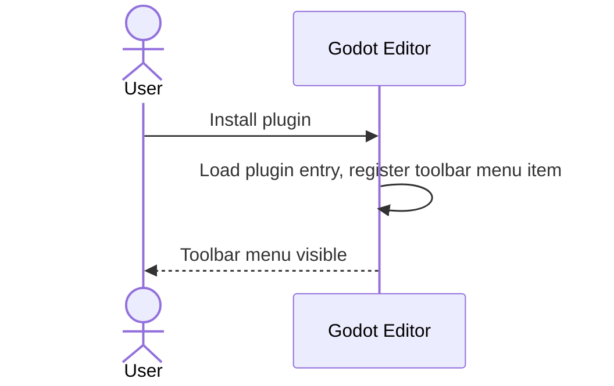

#### Case 1.2 — User opens the editor window

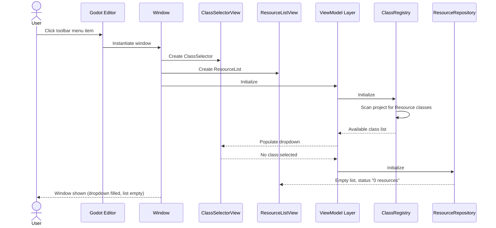

#### Case 1.3 — User opens the editor while window is already open

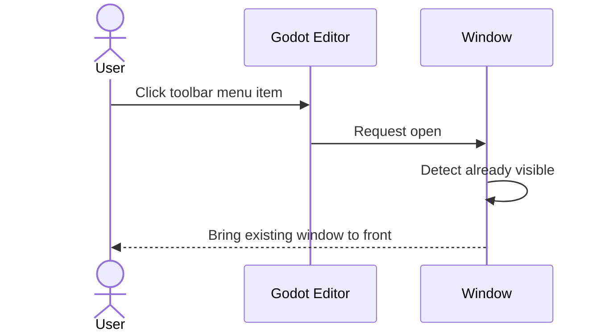

#### Case 1.4 — User closes the editor with the window close button

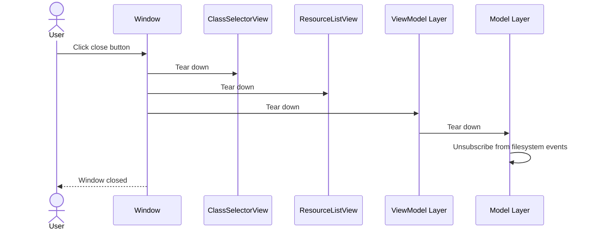

#### Case 1.5 — User closes the editor with Esc

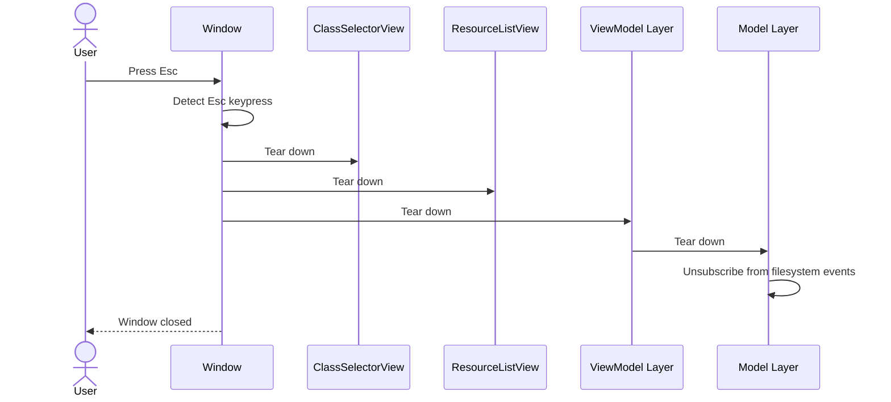

---

### Section 2 — Initial Window State

#### Case 2.1 — User opens window, no Resource classes exist in the project

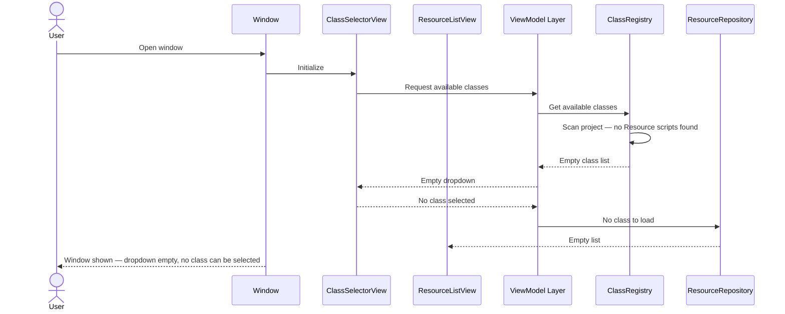

---

### Section 3 — Class Selection & Filtering

#### Case 3.1 — User selects a class for the first time

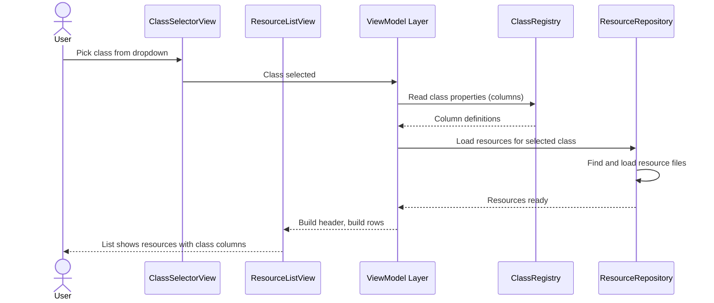

#### Case 3.2 — User changes from one selected class to another

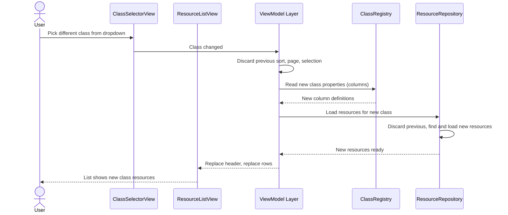

#### Case 3.3 — User toggles Include Subclasses ON

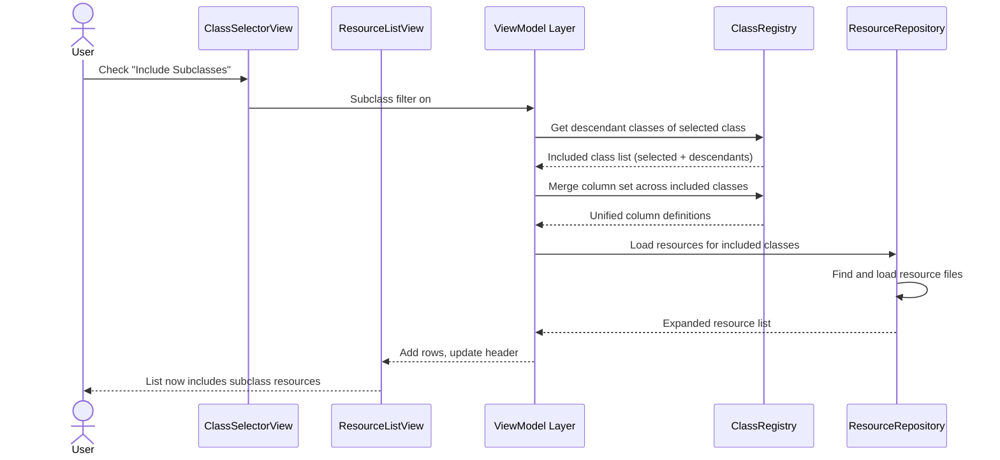

#### Case 3.4 — User toggles Include Subclasses OFF

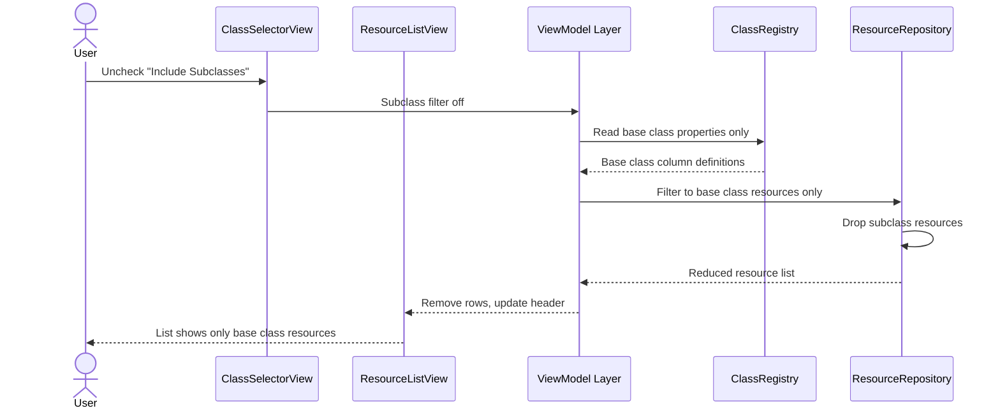

#### Case 3.5 — User presses Refresh with a class selected

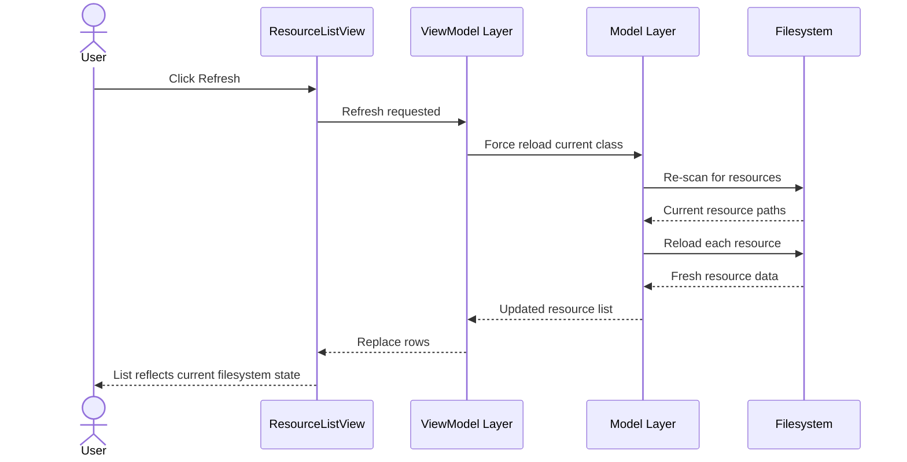

#### Case 3.6 — User changes class while some rows are selected

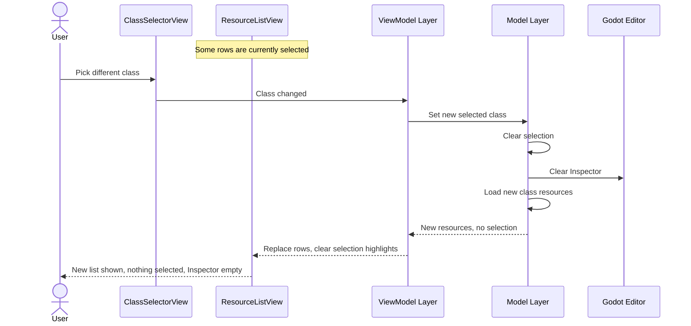

#### Case 3.7 — User changes class while viewing a page other than the first

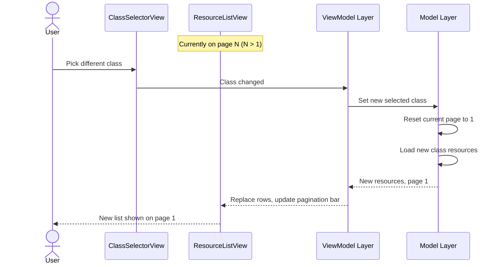

#### Case 3.8 — User changes class while a sort column is active

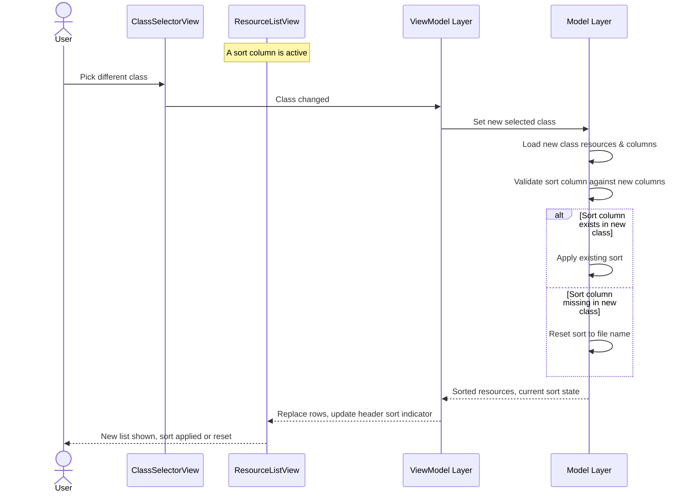

#### Case 3.9 — User selects a class that has zero resources

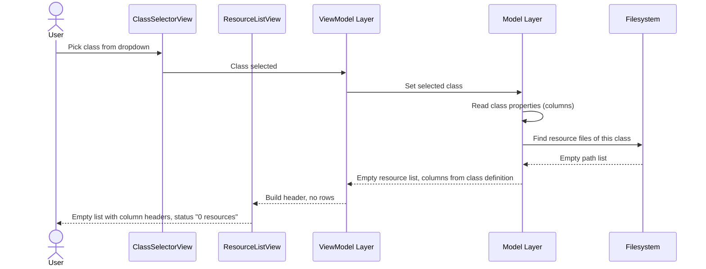

---

### Section 4 — Sorting & Pagination

#### Case 4.1 — User clicks the File column header to sort by file name

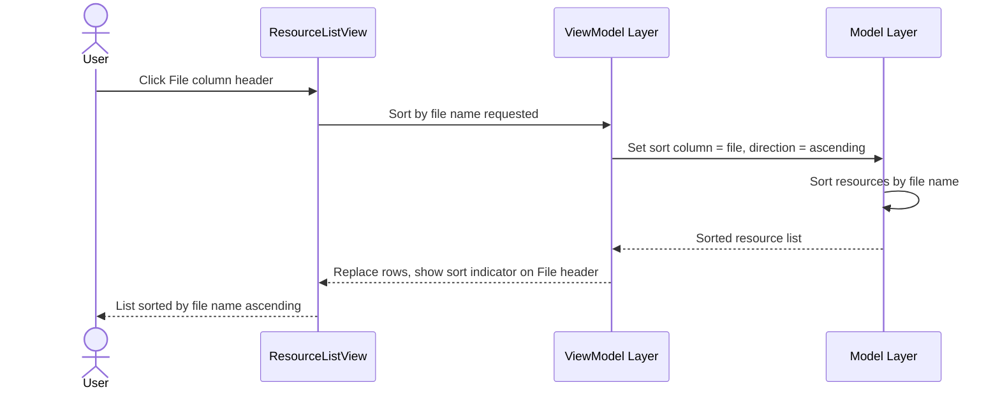

#### Case 4.2 — User clicks the same column header again to reverse sort direction

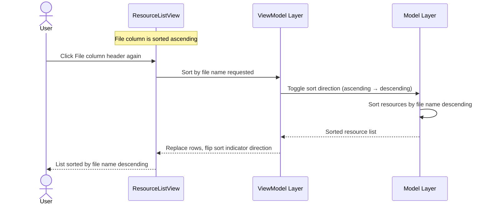

#### Case 4.3 — User clicks a property column header to sort by that property

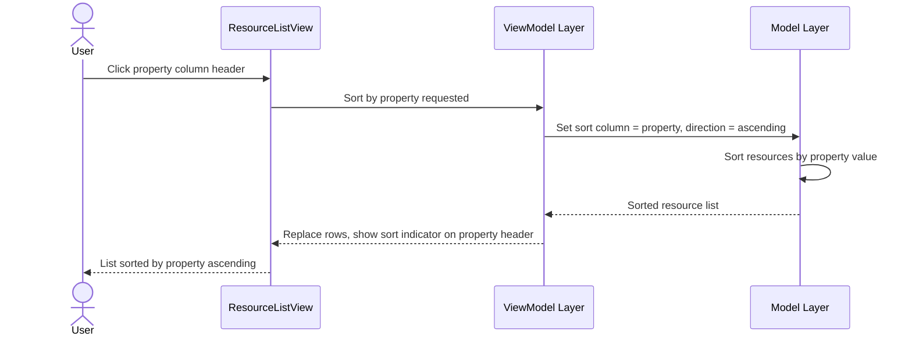

#### Case 4.4 — User clicks a different column header while another sort is active

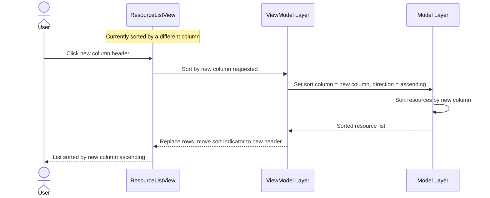

#### Case 4.5 — User clicks Next Page

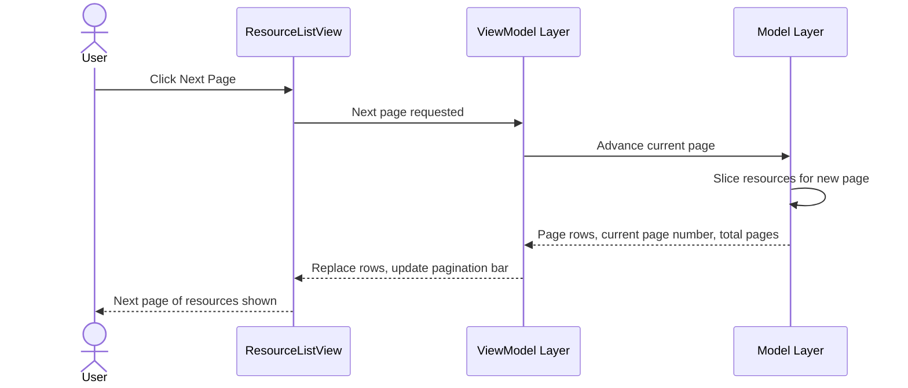

#### Case 4.6 — User clicks Previous Page

```mermaid
sequenceDiagram
    actor User
    participant RL as ResourceListView
    participant VM as ViewModel Layer
    participant Model as Model Layer
    User->>RL: Click Previous Page
    RL->>VM: Previous page requested
    VM->>Model: Go back one page
    Model->>Model: Slice resources for previous page
    Model-->>VM: Page rows, current page number, total pages
    VM-->>RL: Replace rows, update pagination bar
    RL-->>User: Previous page of resources shown
```

#### Case 4.7 — User clicks Next Page and reaches the last page

```mermaid
sequenceDiagram
    actor User
    participant RL as ResourceListView
    participant VM as ViewModel Layer
    participant Model as Model Layer
    User->>RL: Click Next Page
    RL->>VM: Next page requested
    VM->>Model: Advance current page
    Model->>Model: Slice resources for last page
    Model-->>VM: Page rows, current page = last page
    VM-->>RL: Replace rows, disable Next Page button
    RL-->>User: Last page shown, Next Page disabled
```

---

### Section 5 — Row Selection

#### Case 5.1 — User single-clicks a row when nothing is selected

```mermaid
sequenceDiagram
    actor User
    participant RL as ResourceListView
    participant VM as ViewModel Layer
    participant Model as Model Layer
    participant Godot as Godot Editor
    User->>RL: Click row
    RL->>VM: Row clicked (single select)
    VM->>Model: Set selection = [clicked resource]
    Model-->>VM: Selection updated
    VM->>Godot: Show resource in Inspector
    VM-->>RL: Highlight clicked row
    RL-->>User: Row highlighted, resource visible in Inspector
```

#### Case 5.2 — User single-clicks a different row when one row was already selected

```mermaid
sequenceDiagram
    actor User
    participant RL as ResourceListView
    participant VM as ViewModel Layer
    participant Model as Model Layer
    participant Godot as Godot Editor
    Note over RL: One row is currently selected
    User->>RL: Click different row
    RL->>VM: Row clicked (single select)
    VM->>Model: Set selection = [new resource]
    Model-->>VM: Selection updated
    VM->>Godot: Show new resource in Inspector
    VM-->>RL: Move highlight to new row
    RL-->>User: New row highlighted, Inspector updated
```

#### Case 5.3 — User Ctrl/Cmd-clicks an unselected row

```mermaid
sequenceDiagram
    actor User
    participant RL as ResourceListView
    participant VM as ViewModel Layer
    participant Model as Model Layer
    participant Godot as Godot Editor
    Note over RL: One or more rows already selected
    User->>RL: Ctrl-click unselected row
    RL->>VM: Row ctrl-clicked (toggle)
    VM->>Model: Add resource to selection
    Model-->>VM: Selection updated
    VM->>Godot: Update Inspector for multi-selection
    VM-->>RL: Add highlight to clicked row
    RL-->>User: Multiple rows highlighted, Inspector shows shared properties
```

#### Case 5.4 — User Ctrl/Cmd-clicks a selected row to remove it from selection

```mermaid
sequenceDiagram
    actor User
    participant RL as ResourceListView
    participant VM as ViewModel Layer
    participant Model as Model Layer
    participant Godot as Godot Editor
    Note over RL: Multiple rows selected
    User->>RL: Ctrl-click selected row
    RL->>VM: Row ctrl-clicked (toggle)
    VM->>Model: Remove resource from selection
    Model-->>VM: Selection updated
    VM->>Godot: Update Inspector for remaining selection
    VM-->>RL: Remove highlight from clicked row
    RL-->>User: Row deselected, Inspector updated
```

#### Case 5.5 — User Shift-clicks a row after another row was clicked (range select)

```mermaid
sequenceDiagram
    actor User
    participant RL as ResourceListView
    participant VM as ViewModel Layer
    participant Model as Model Layer
    participant Godot as Godot Editor
    Note over RL: A row was previously clicked (anchor)
    User->>RL: Shift-click another row
    RL->>VM: Row shift-clicked (range)
    VM->>Model: Set selection = range from anchor to clicked row
    Model-->>VM: Selection updated
    VM->>Godot: Update Inspector for range selection
    VM-->>RL: Highlight all rows in range
    RL-->>User: Range of rows highlighted, Inspector shows shared properties
```

#### Case 5.6 — User Shift-clicks a row with no prior selection anchor

```mermaid
sequenceDiagram
    actor User
    participant RL as ResourceListView
    participant VM as ViewModel Layer
    participant Model as Model Layer
    participant Godot as Godot Editor
    User->>RL: Shift-click row (no prior anchor)
    RL->>VM: Row shift-clicked (no anchor)
    VM->>Model: Set selection = [clicked resource]
    Model-->>VM: Selection updated
    VM->>Godot: Show resource in Inspector
    VM-->>RL: Highlight clicked row
    RL-->>User: Row highlighted, resource visible in Inspector
```

#### Case 5.7 — User deselects all rows

```mermaid
sequenceDiagram
    actor User
    participant RL as ResourceListView
    participant VM as ViewModel Layer
    participant Model as Model Layer
    participant Godot as Godot Editor
    Note over RL: One or more rows selected
    User->>RL: Click empty area / deselect action
    RL->>VM: Deselect all
    VM->>Model: Clear selection
    Model-->>VM: Selection empty
    VM->>Godot: Clear Inspector
    VM-->>RL: Remove all highlights
    RL-->>User: No rows highlighted, Inspector empty
```

---

### Section 6 — Inspector & Bulk Edit

#### Case 6.1 — User edits a property in the Inspector with one resource selected

```mermaid
sequenceDiagram
    actor User
    participant Godot as Godot Editor
    participant VM as ViewModel Layer
    participant Model as Model Layer
    participant FS as Filesystem
    participant RL as ResourceListView
    User->>Godot: Edit property in Inspector
    Godot->>VM: Property changed on resource
    VM->>Model: Save resource
    Model->>FS: Write resource to disk
    FS-->>Model: Save confirmed
    Model-->>VM: Resource updated
    VM-->>RL: Update row with new value
    RL-->>User: Row reflects edited property
```

#### Case 6.2 — User edits a property in the Inspector with multiple same-class resources selected

```mermaid
sequenceDiagram
    actor User
    participant Godot as Godot Editor
    participant VM as ViewModel Layer
    participant Model as Model Layer
    participant FS as Filesystem
    participant RL as ResourceListView
    Note over Godot: Multiple same-class resources selected
    User->>Godot: Edit property in Inspector
    Godot->>VM: Property changed (bulk)
    VM->>Model: Apply change to all selected resources
    loop Each selected resource
        Model->>FS: Write resource to disk
        FS-->>Model: Save confirmed
    end
    Model-->>VM: All resources updated
    VM-->>RL: Update affected rows
    RL-->>User: All selected rows reflect new value
```

#### Case 6.3 — User edits a property in the Inspector while resources of different subclasses are selected

```mermaid
sequenceDiagram
    actor User
    participant Godot as Godot Editor
    participant VM as ViewModel Layer
    participant Model as Model Layer
    participant FS as Filesystem
    participant RL as ResourceListView
    Note over Godot: Resources of different subclasses selected
    User->>Godot: Edit property in Inspector
    Godot->>VM: Property changed (bulk, mixed classes)
    VM->>Model: Apply change only to resources that have this property
    loop Each resource with matching property
        Model->>FS: Write resource to disk
        FS-->>Model: Save confirmed
    end
    Model-->>VM: Matching resources updated
    VM-->>RL: Update affected rows (non-matching rows unchanged)
    RL-->>User: Matching rows reflect new value, others unchanged
```

#### Case 6.4 — User edits a property and a save error occurs

```mermaid
sequenceDiagram
    actor User
    participant Godot as Godot Editor
    participant VM as ViewModel Layer
    participant Model as Model Layer
    participant FS as Filesystem
    participant RL as ResourceListView
    User->>Godot: Edit property in Inspector
    Godot->>VM: Property changed on resource
    VM->>Model: Save resource
    Model->>FS: Write resource to disk
    FS-->>Model: Save failed (error)
    Model-->>VM: Save error
    VM-->>RL: Show error dialog
    RL-->>User: Error dialog appears
```