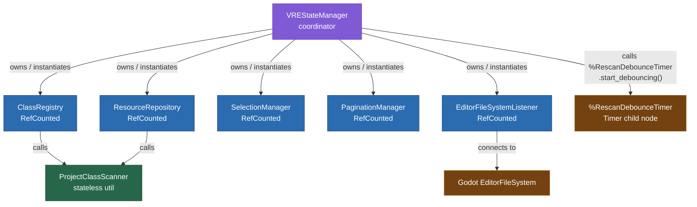
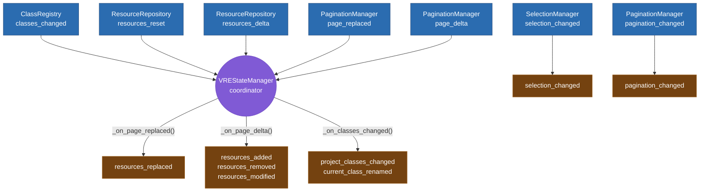
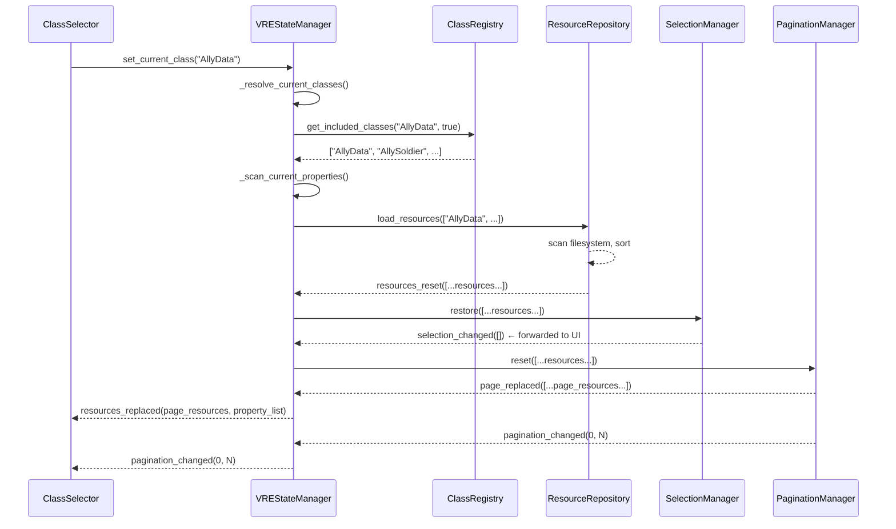
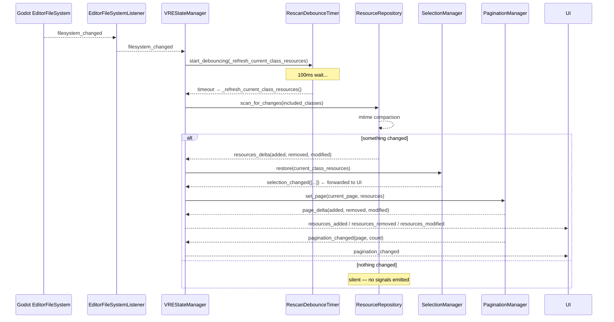
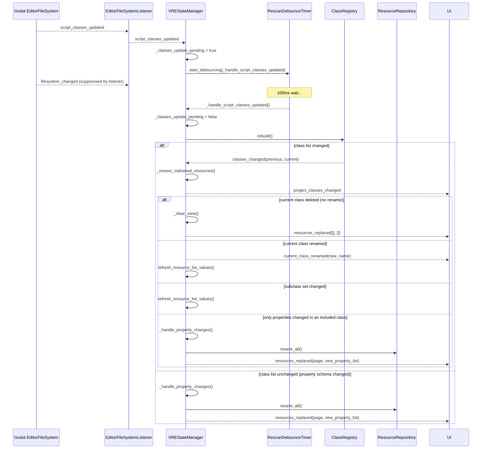

# VRE Architecture Design — StateManager Split

Detailed implementation plan for decomposing `VREStateManager` into focused, independently testable pieces.

---

## Goal

The current `VREStateManager` (472 lines) owns class maps, resource scanning, mtime caching, pagination, multi-select logic, filesystem event routing, class rename detection, orphaned resource resaving, property change detection, and 12 outbound signals. The goal is to split each responsibility into its own class while keeping the public API identical so no UI component needs to change.

---

## Approach: Coordinator Pattern

The new `VREStateManager` becomes a thin **coordinator** (~130 lines). It holds four `RefCounted` sub-managers and wires their signals together. UI components still get the same `state_manager` property and call the same methods — they cannot tell anything changed.

```
VREStateManager (coordinator, Node with .tscn)
  ├─ ClassRegistry     (RefCounted) — class maps, renames, descendants, property lists
  ├─ ResourceRepository (RefCounted) — loading, mtime tracking, change detection, resaving
  ├─ SelectionManager  (RefCounted) — shift/ctrl/none logic, selected_resources, restore
  └─ PaginationManager (RefCounted) — page slicing, page-level diffs

  Also uses:
  └─ EditorFileSystemListener (RefCounted, already exists) — filesystem signal routing
```

Sub-managers are `RefCounted`, not `Node`, so no `.tscn` files needed for them. The `state_manager.tscn` stays as-is (coordinator Node + `%RescanDebounceTimer` child).

---

## Files

| File | Action | Notes |
|------|--------|-------|
| `core/class_registry.gd` | **Create** | New |
| `core/resource_repository.gd` | **Create** | New |
| `core/selection_manager.gd` | **Create** | New |
| `core/pagination_manager.gd` | **Create** | New |
| `core/state_manager.gd` | **Rewrite** | Becomes coordinator |
| `core/state_manager.tscn` | **No change** | Same Node + DebounceTimer child |
| `core/editor_filesystem_listener.gd` | **No change** | Already correct |
| All UI `.gd` files | **No change** | Same `state_manager` property/API |

After creating `.gd` files run headless import to generate UIDs before referencing from `.tscn`:
```
/Volumes/.../Godot_v4.6.1-stable_macos.universal.app/Contents/MacOS/Godot --headless --path . --quit
```

---

## 1. ClassRegistry

Owns all class maps. Knows how to rebuild them from ProjectSettings, resolve descendant class sets, detect renames, and return per-class script paths and property lists.

```gdscript
# core/class_registry.gd
@tool
class_name ClassRegistry
extends RefCounted

## Emitted when the project resource class list changes (names added or removed).
## Not emitted if the list is identical after a rebuild.
signal classes_changed(previous: Array[String], current: Array[String])

var global_class_map: Array[Dictionary] = []
var global_class_to_path_map: Dictionary[String, String] = {}
var global_class_to_parent_map: Dictionary[String, String] = {}
var global_class_name_list: Array[String] = []


## Rebuilds all maps from ProjectSettings.
## Returns true if the class name list changed, false if identical.
## Emits classes_changed only when the list changes.
func rebuild() -> bool:
	var previous: Array[String] = global_class_name_list.duplicate()
	global_class_map = ProjectClassScanner.build_global_classes_map()
	global_class_to_parent_map = ProjectClassScanner.build_project_classes_parent_map(global_class_map)
	global_class_to_path_map = ProjectClassScanner.build_class_to_path_map(global_class_map)
	global_class_name_list = ProjectClassScanner.get_project_resource_classes(global_class_map)
	var changed: bool = previous != global_class_name_list
	if changed:
		classes_changed.emit(previous, global_class_name_list)
	return changed


## Returns the set of class names to load for a given base class.
## If include_subclasses is true, includes all descendant classes.
func get_included_classes(class_name_str: String, include_subclasses: bool) -> Array[String]:
	if class_name_str.is_empty():
		return []
	if include_subclasses:
		return ProjectClassScanner.get_descendant_classes(class_name_str, global_class_to_parent_map)
	return [class_name_str]


## Checks whether the currently-included class set intersects with the class change.
## Used by the coordinator to decide whether to refresh resources.
func has_class_set_changed(previous_classes: Array[String], included_classes: Array[String]) -> bool:
	for cls: String in included_classes:
		if not previous_classes.has(cls) or not global_class_name_list.has(cls):
			return true
	return false


## Checks whether any class in the current list maps to old_script_path.
## Returns the new class name (rename detected) or "" (class was deleted).
func detect_rename(old_script_path: String) -> String:
	if old_script_path.is_empty():
		return ""
	for cls: String in global_class_to_path_map:
		if global_class_to_path_map[cls] == old_script_path:
			return cls
	return ""


func get_script_path(class_name_str: String) -> String:
	return global_class_to_path_map.get(class_name_str, "")


func get_class_script(class_name_str: String) -> GDScript:
	var path: String = get_script_path(class_name_str)
	if path.is_empty():
		return null
	return load(path)


## Returns the editor-visible property list for a single class, or [] if not found.
func get_properties(class_name_str: String) -> Array[ResourceProperty]:
	var path: String = get_script_path(class_name_str)
	if path.is_empty():
		var empty: Array[ResourceProperty] = []
		return empty
	return ProjectClassScanner.get_properties_from_script_path(path)
```

---

## 2. ResourceRepository

Owns the loaded resource array and its mtime cache. Performs full loads and incremental change detection. Also handles resaving (for schema migrations and orphaned class cleanup).

```gdscript
# core/resource_repository.gd
@tool
class_name ResourceRepository
extends RefCounted

## Emitted after a full reload (class change, subclass toggle, refresh).
## UI should rebuild entirely on this.
signal resources_reset(resources: Array[Resource])

## Emitted after an incremental filesystem scan finds changes.
## UI should add/remove/update only the affected rows.
signal resources_delta(
	added: Array[Resource],
	removed: Array[Resource],
	modified: Array[Resource]
)

var current_class_resources: Array[Resource] = []
var _mtimes: Dictionary[String, int] = {}


## Full reload for the given class names. Sorts by path.
## Always emits resources_reset.
func load_resources(class_names: Array[String]) -> void:
	current_class_resources = ProjectClassScanner.load_classed_resources_from_dir(class_names)
	current_class_resources.sort_custom(
		func(a: Resource, b: Resource) -> bool: return a.resource_path < b.resource_path)
	_rebuild_mtimes()
	resources_reset.emit(current_class_resources.duplicate())


## Incremental scan: compares current filesystem state against cached mtimes.
## Emits resources_delta only if something changed; silent otherwise.
func scan_for_changes(class_names: Array[String]) -> void:
	var updated: Array[Resource] = current_class_resources.duplicate()
	var current_paths: Array[String] = ProjectClassScanner.scan_folder_for_classed_tres_paths(class_names)
	var added: Array[Resource] = []
	var removed: Array[Resource] = []
	var modified: Array[Resource] = []

	# Detect new and modified resources
	for path: String in current_paths:
		var mtime: int = FileAccess.get_modified_time(path)
		if not _mtimes.has(path):
			var res: Resource = ResourceLoader.load(path, "", ResourceLoader.CACHE_MODE_REPLACE)
			if res:
				updated.append(res)
				added.append(res)
		elif mtime != _mtimes[path]:
			var res: Resource = ResourceLoader.load(path, "", ResourceLoader.CACHE_MODE_REPLACE)
			if res:
				for i: int in updated.size():
					if updated[i].resource_path == path:
						updated[i] = res
						break
				modified.append(res)

	# Detect deleted resources
	var known_paths: Array = _mtimes.keys()
	for path: String in known_paths:
		if not current_paths.has(path):
			for i: int in updated.size():
				if updated[i].resource_path == path:
					removed.append(updated[i])
					updated.remove_at(i)
					break

	if added.is_empty() and removed.is_empty() and modified.is_empty():
		return

	current_class_resources = updated
	current_class_resources.sort_custom(
		func(a: Resource, b: Resource) -> bool: return a.resource_path < b.resource_path)
	_rebuild_mtimes()
	resources_delta.emit(added, removed, modified)


## Resaves all current resources (used on property schema change).
func resave_all() -> void:
	for res: Resource in current_class_resources:
		ResourceSaver.save(res, res.resource_path)


## Resaves a specific subset (used for orphaned class cleanup).
func resave_resources(resources: Array[Resource]) -> void:
	for res: Resource in resources:
		ResourceSaver.save(res, res.resource_path)


## Returns the resource path for each currently loaded resource.
func get_paths() -> Array[String]:
	var paths: Array[String] = []
	for res: Resource in current_class_resources:
		paths.append(res.resource_path)
	return paths


func clear() -> void:
	current_class_resources.clear()
	_mtimes.clear()


func _rebuild_mtimes() -> void:
	_mtimes.clear()
	for res: Resource in current_class_resources:
		_mtimes[res.resource_path] = FileAccess.get_modified_time(res.resource_path)
```

---

## 3. SelectionManager

Owns the selected resource array and the anchor index for range selection. Provides the three click modes (single, toggle, range) and a path-based restore for use after resource list reloads.

```gdscript
# core/selection_manager.gd
@tool
class_name SelectionManager
extends RefCounted

signal selection_changed(resources: Array[Resource])

var selected_resources: Array[Resource] = []
var _last_index: int = -1


## Main entry point — routes to the correct select mode based on held keys.
## all_resources: the full ordered list used to resolve shift-range indices.
func set_selected(
	resource: Resource, ctrl_held: bool, shift_held: bool,
	all_resources: Array[Resource]
) -> void:
	var current_idx: int = all_resources.find(resource)
	if shift_held and _last_index != -1 and current_idx != -1:
		_select_range(current_idx, all_resources)
	elif ctrl_held:
		_toggle(resource, current_idx)
	else:
		_select_single(resource, current_idx)
	selection_changed.emit(selected_resources.duplicate())


## Re-matches previously selected paths against a new resource list.
## Call this after any load or scan that changes the resource array identity.
func restore(all_resources: Array[Resource]) -> void:
	var prev_paths: Array[String] = get_paths()
	selected_resources.clear()
	for res: Resource in all_resources:
		if prev_paths.has(res.resource_path):
			selected_resources.append(res)
	_last_index = (
		all_resources.find(selected_resources.back())
		if not selected_resources.is_empty()
		else -1
	)
	selection_changed.emit(selected_resources.duplicate())


func clear() -> void:
	selected_resources.clear()
	_last_index = -1
	selection_changed.emit(selected_resources.duplicate())


## Returns the resource_path of every currently selected resource.
func get_paths() -> Array[String]:
	var paths: Array[String] = []
	for res: Resource in selected_resources:
		paths.append(res.resource_path)
	return paths


func _select_range(current_idx: int, all_resources: Array[Resource]) -> void:
	selected_resources.clear()
	var from: int = mini(_last_index, current_idx)
	var to: int = maxi(_last_index, current_idx)
	for i: int in (to - from + 1):
		selected_resources.append(all_resources[from + i])
	# Anchor stays unchanged on shift+click


func _toggle(resource: Resource, current_idx: int) -> void:
	if selected_resources.has(resource):
		selected_resources.erase(resource)
	else:
		selected_resources.append(resource)
	_last_index = current_idx


func _select_single(resource: Resource, current_idx: int) -> void:
	selected_resources.clear()
	selected_resources.append(resource)
	_last_index = current_idx
```

---

## 4. PaginationManager

Owns the current page index, the page resource slice, and per-page mtime cache. Provides full resets (class change), page navigation, and a silent refresh (for schema changes where only column layout changes, not the resource set).

```gdscript
# core/pagination_manager.gd
@tool
class_name PaginationManager
extends RefCounted

## Emitted when the class/filter changes and the page must fully rebuild.
signal page_replaced(resources: Array[Resource])

## Emitted when page navigation causes rows to appear or disappear.
signal page_delta(
	added: Array[Resource],
	removed: Array[Resource],
	modified: Array[Resource]
)

signal pagination_changed(page: int, page_count: int)

const PAGE_SIZE: int = 50

var current_page_resources: Array[Resource] = []
var _page: int = 0
var _page_mtimes: Dictionary[String, int] = {}


## Hard reset to page 0. Emits page_replaced + pagination_changed.
## Call after load_resources() in ResourceRepository.
func reset(all_resources: Array[Resource]) -> void:
	_page = 0
	current_page_resources = _slice(all_resources)
	_rebuild_page_mtimes()
	page_replaced.emit(current_page_resources.duplicate())
	pagination_changed.emit(_page, _page_count(all_resources.size()))


## Navigate to a specific page. Emits page_delta + pagination_changed.
func set_page(page: int, all_resources: Array[Resource]) -> void:
	var previous_resources: Array[Resource] = current_page_resources.duplicate()
	var previous_mtimes: Dictionary[String, int] = _page_mtimes.duplicate()
	_page = clampi(page, 0, _page_count(all_resources.size()) - 1)
	current_page_resources = _slice(all_resources)
	_rebuild_page_mtimes()
	_emit_delta(previous_resources, previous_mtimes)
	pagination_changed.emit(_page, _page_count(all_resources.size()))


func next(all_resources: Array[Resource]) -> void:
	if _page < _page_count(all_resources.size()) - 1:
		set_page(_page + 1, all_resources)


func prev(all_resources: Array[Resource]) -> void:
	if _page > 0:
		set_page(_page - 1, all_resources)


## Re-slices the current page without emitting any delta signals.
## Used when property schema changes require a full resources_replaced
## but the page index should not change.
func refresh_silent(all_resources: Array[Resource]) -> void:
	current_page_resources = _slice(all_resources)
	_rebuild_page_mtimes()


func current_page() -> int:
	return _page


func page_count(total: int) -> int:
	return _page_count(total)


func _slice(all_resources: Array[Resource]) -> Array[Resource]:
	var start: int = _page * PAGE_SIZE
	var end: int = mini(start + PAGE_SIZE, all_resources.size())
	return all_resources.slice(start, end)


func _page_count(total: int) -> int:
	if total == 0:
		return 1
	return ceili(float(total) / float(PAGE_SIZE))


func _rebuild_page_mtimes() -> void:
	_page_mtimes.clear()
	for res: Resource in current_page_resources:
		_page_mtimes[res.resource_path] = FileAccess.get_modified_time(res.resource_path)


func _emit_delta(
	previous_resources: Array[Resource],
	previous_mtimes: Dictionary[String, int]
) -> void:
	var prev_map: Dictionary[String, Resource] = {}
	for res: Resource in previous_resources:
		prev_map[res.resource_path] = res

	var curr_map: Dictionary[String, Resource] = {}
	for res: Resource in current_page_resources:
		curr_map[res.resource_path] = res

	var removed: Array[Resource] = []
	for path: String in prev_map:
		if not curr_map.has(path):
			removed.append(prev_map[path])

	var added: Array[Resource] = []
	for path: String in curr_map:
		if not prev_map.has(path):
			added.append(curr_map[path])

	var modified: Array[Resource] = []
	for path: String in curr_map:
		if not prev_map.has(path):
			continue
		if previous_mtimes.get(path, -1) != _page_mtimes.get(path, -1):
			modified.append(curr_map[path])

	if not added.is_empty() or not removed.is_empty() or not modified.is_empty():
		page_delta.emit(added, removed, modified)
```

---

## 5. VREStateManager (Coordinator)

The coordinator is now ~130 lines. It:
- Instantiates the four sub-managers in `_ready()`
- Wires their signals to its own handlers
- Exposes the same public API to UI (same method names, same signals)
- Holds only the state that doesn't belong in any sub-manager: current class name, include-subclasses flag, and the derived property lists that BulkEditor reads

```gdscript
# core/state_manager.gd
@tool
class_name VREStateManager
extends Node

# ── Signals (public API — unchanged) ──────────────────────────────────────────
signal resources_replaced(resources: Array[Resource], current_shared_property_list: Array[ResourceProperty])
signal resources_added(resources: Array[Resource])
signal resources_modified(resources: Array[Resource])
signal resources_removed(resources: Array[Resource])
signal project_classes_changed(classes: Array[String])
signal selection_changed(resources: Array[Resource])
signal pagination_changed(page: int, page_count: int)
signal current_class_renamed(new_name: String)
signal resources_edited(resources: Array[Resource])
signal error_occurred(message: String)
signal delete_selected_requested(selected_resources_paths: Array[String])
signal create_new_resource_requested()

# ── Sub-managers ───────────────────────────────────────────────────────────────
var _class_registry: ClassRegistry
var _resource_repo: ResourceRepository
var _selection: SelectionManager
var _pagination: PaginationManager
var _fs_listener: EditorFileSystemListener

# ── Coordinator-only state ────────────────────────────────────────────────────
var _current_class_name: String = ""
var _include_subclasses: bool = true
var _current_included_class_names: Array[String] = []
var _classes_update_pending: bool = false

# Properties read by BulkEditor — still owned here since they span ClassRegistry
# and the current selection context.
var current_class_script: GDScript = null
var current_class_property_list: Array[ResourceProperty] = []
var current_included_class_property_lists: Dictionary = {}
var current_shared_property_list: Array[ResourceProperty] = []

# ── Public read-only accessors (same API as before) ───────────────────────────
var current_class_name: String:
	get: return _current_class_name

var selected_resources: Array[Resource]:
	get: return _selection.selected_resources

var _selected_paths: Array[String]:
	get: return _selection.get_paths()

var global_class_map: Array[Dictionary]:
	get: return _class_registry.global_class_map

var global_class_name_list: Array[String]:
	get: return _class_registry.global_class_name_list

var global_class_to_path_map: Dictionary[String, String]:
	get: return _class_registry.global_class_to_path_map

var current_class_resources: Array[Resource]:
	get: return _resource_repo.current_class_resources


func _ready() -> void:
	if not Engine.is_editor_hint(): return

	_class_registry = ClassRegistry.new()
	_resource_repo = ResourceRepository.new()
	_selection = SelectionManager.new()
	_pagination = PaginationManager.new()
	_fs_listener = EditorFileSystemListener.new()

	_class_registry.classes_changed.connect(_on_classes_changed)
	_resource_repo.resources_reset.connect(_on_resources_reset)
	_resource_repo.resources_delta.connect(_on_resources_delta)
	_selection.selection_changed.connect(selection_changed.emit)
	_pagination.page_replaced.connect(_on_page_replaced)
	_pagination.page_delta.connect(_on_page_delta)
	_pagination.pagination_changed.connect(pagination_changed.emit)
	_fs_listener.filesystem_changed.connect(_on_filesystem_changed)
	_fs_listener.script_classes_updated.connect(_on_script_classes_updated)

	_fs_listener.start()
	_class_registry.rebuild()
	project_classes_changed.emit(_class_registry.global_class_name_list)


func _exit_tree() -> void:
	if not Engine.is_editor_hint(): return
	_fs_listener.stop()


# ── Public API (unchanged) ─────────────────────────────────────────────────────

func set_current_class(class_name_str: String) -> void:
	_current_class_name = class_name_str
	refresh_resource_list_values()


func set_include_subclasses(value: bool) -> void:
	_include_subclasses = value
	refresh_resource_list_values()


func notify_resources_edited(resources: Array[Resource]) -> void:
	resources_edited.emit(resources)


func request_delete_selected_resources(resource_paths: Array[String]) -> void:
	delete_selected_requested.emit(resource_paths)


func request_create_new_resouce() -> void:
	create_new_resource_requested.emit()


func report_error(message: String) -> void:
	error_occurred.emit(message)


func set_selected_resources(resource: Resource, ctrl_held: bool, shift_held: bool) -> void:
	_selection.set_selected(resource, ctrl_held, shift_held, _resource_repo.current_class_resources)


func next_page() -> void:
	_pagination.next(_resource_repo.current_class_resources)


func prev_page() -> void:
	_pagination.prev(_resource_repo.current_class_resources)


func refresh_resource_list_values() -> void:
	if _current_class_name.is_empty():
		return
	_resolve_current_classes()
	_scan_current_properties()
	_resource_repo.load_resources(_current_included_class_names)
	# resources_reset fires → _on_resources_reset → selection.restore + pagination.reset


# ── Private coordinator logic ──────────────────────────────────────────────────

func _resolve_current_classes() -> void:
	_current_included_class_names = _class_registry.get_included_classes(
		_current_class_name, _include_subclasses)
	current_class_script = _class_registry.get_class_script(_current_class_name)


func _scan_current_properties() -> void:
	current_included_class_property_lists = ProjectClassScanner.get_properties_from_script_names(
		_current_included_class_names, _class_registry.global_class_to_path_map)
	var empty_props: Array[ResourceProperty] = []
	current_class_property_list = current_included_class_property_lists.get(
		_current_class_name, empty_props)
	current_shared_property_list = ProjectClassScanner.unite_classes_properties(
		_current_included_class_names, _class_registry.global_class_to_path_map)


# ResourceRepository signals ───────────────────────────────────────────────────

func _on_resources_reset(resources: Array[Resource]) -> void:
	_selection.restore(resources)
	_pagination.reset(resources)
	# pagination.reset emits page_replaced → _on_page_replaced → resources_replaced


func _on_resources_delta(
	added: Array[Resource], removed: Array[Resource], modified: Array[Resource]
) -> void:
	_selection.restore(_resource_repo.current_class_resources)
	# Re-slice the current page; pagination emits page_delta → _on_page_delta → granular signals
	_pagination.set_page(_pagination.current_page(), _resource_repo.current_class_resources)


# PaginationManager signals ────────────────────────────────────────────────────

func _on_page_replaced(resources: Array[Resource]) -> void:
	resources_replaced.emit(resources, current_shared_property_list)


func _on_page_delta(
	added: Array[Resource], removed: Array[Resource], modified: Array[Resource]
) -> void:
	if not removed.is_empty(): resources_removed.emit(removed)
	if not added.is_empty(): resources_added.emit(added)
	if not modified.is_empty(): resources_modified.emit(modified)


# ClassRegistry signals ────────────────────────────────────────────────────────

func _on_classes_changed(previous: Array[String], current: Array[String]) -> void:
	_resave_orphaned_resources(previous, current)
	project_classes_changed.emit(current)

	if _current_class_name.is_empty():
		return

	if not current.has(_current_class_name):
		var old_path: String = current_class_script.resource_path if current_class_script else ""
		var new_name: String = _class_registry.detect_rename(old_path)
		if new_name.is_empty():
			_clear_view()
		else:
			_current_class_name = new_name
			current_class_renamed.emit(new_name)
			refresh_resource_list_values()
		return

	if _class_registry.has_class_set_changed(previous, _current_included_class_names):
		refresh_resource_list_values()
		return

	_handle_property_changes()


# Filesystem / script class event handlers ─────────────────────────────────────

func _on_script_classes_updated() -> void:
	_classes_update_pending = true
	%RescanDebounceTimer.start_debouncing(_handle_script_classes_updated)


func _handle_script_classes_updated() -> void:
	_classes_update_pending = false
	var list_changed: bool = _class_registry.rebuild()
	if not list_changed:
		# Class list unchanged — check for property schema changes only
		_handle_property_changes()
	# If list changed, _on_classes_changed fires automatically via ClassRegistry signal


func _on_filesystem_changed() -> void:
	if _classes_update_pending:
		return
	%RescanDebounceTimer.start_debouncing(_refresh_current_class_resources)


func _refresh_current_class_resources() -> void:
	if _current_class_name.is_empty():
		return
	_resource_repo.scan_for_changes(_current_included_class_names)
	# resources_delta fires → _on_resources_delta


# Internal state helpers ───────────────────────────────────────────────────────

func _resave_orphaned_resources(previous: Array[String], current: Array[String]) -> void:
	var removed_classes: Array[String] = []
	for cls: String in previous:
		if not current.has(cls):
			removed_classes.append(cls)
	if removed_classes.is_empty():
		return
	var orphaned: Array[Resource] = ProjectClassScanner.load_classed_resources_from_dir(removed_classes)
	_resource_repo.resave_resources(orphaned)


func _handle_property_changes() -> void:
	if _current_class_name.is_empty():
		return
	var new_props: Array[ResourceProperty] = _class_registry.get_properties(_current_class_name)
	if ResourceProperty.arrays_equal(new_props, current_class_property_list):
		return
	_scan_current_properties()
	_resource_repo.resave_all()
	_selection.restore(_resource_repo.current_class_resources)
	# Re-slice silently — schema changed, we want a full resources_replaced not a delta
	_pagination.refresh_silent(_resource_repo.current_class_resources)
	resources_replaced.emit(_pagination.current_page_resources, current_shared_property_list)
	pagination_changed.emit(
		_pagination.current_page(),
		_pagination.page_count(_resource_repo.current_class_resources.size())
	)


func _clear_view() -> void:
	_current_class_name = ""
	_current_included_class_names.clear()
	current_class_script = null
	current_class_property_list = []
	current_included_class_property_lists.clear()
	current_shared_property_list.clear()
	_resource_repo.clear()
	_selection.clear()
	var empty_resources: Array[Resource] = []
	var empty_props: Array[ResourceProperty] = []
	resources_replaced.emit(empty_resources, empty_props)
	pagination_changed.emit(0, 1)
```

---

## Migration Steps

Do these in order. Each step leaves the plugin in a working state so you can test between them.

### Step 1 — Create the four new files

Create the four `.gd` files above in `core/`. Run headless import to generate UIDs. No `.tscn` needed for these (they are RefCounted, not Node).

### Step 2 — Rewrite state_manager.gd

Replace with the coordinator code above. The `state_manager.tscn` does not change (it only references `state_manager.gd` and `debounce_timer.gd`, both of which keep the same path and class name).

### Step 3 — Verify public API

Open the editor and check that the plugin works end-to-end:
- Class dropdown populates
- Selecting a class loads rows
- Row click / Ctrl+click / Shift+click work
- Create New / Delete Selected work
- Next/Prev page work
- Editing in Inspector bulk-edits correctly
- File added/removed/modified externally triggers update
- Script class renamed → dropdown follows

### Step 4 — Remove dead code from state_manager.gd

After verifying, delete any leftover private helpers that were fully moved to sub-managers (e.g. `handle_select_shift`, `handle_select_ctrl`, `handle_select_no_key`, `set_current_class_resources`, `set_current_page_resources`, `_scan_page_resources_for_changes`, `_page_count`, `_emit_page_data`, `_emit_page_data_preserving_page`, `_rebuild_current_class_resource_mtimes`, `_rebuild_current_page_resource_mtimes`).

---

## Diagrams

### Internal Coordination — Static Structure



### Signal Flow — Internal (sub-managers → coordinator → UI signals)



### Sequence: Select a Class



### Sequence: Filesystem Change (file added/removed/modified externally)



### Sequence: Script Class Updated (rename / schema change)



---

## Key Design Decisions

**Why RefCounted and not Node for sub-managers?**
They have no child nodes and no scene-tree lifecycle requirements. Using RefCounted avoids the overhead of scene tree registration and keeps `state_manager.tscn` unchanged (only coordinator + DebounceTimer).

**Why does the coordinator still own property lists?**
`current_class_property_list`, `current_included_class_property_lists`, and `current_shared_property_list` span both ClassRegistry data and the current UI selection context. BulkEditor reads them directly from `state_manager`. Moving them into ClassRegistry would make ClassRegistry aware of "what's currently selected in the UI", which is the wrong coupling. They stay in the coordinator as derived/cached values.

**Why does rebuild() return a bool instead of always emitting?**
`_handle_script_classes_updated()` needs to know whether the class list changed so it can decide between calling `_handle_property_changes()` (list unchanged, schema may have changed) or letting the `classes_changed` signal drive everything (list changed). A return value is cleaner than a second "unchanged" signal.

**Why keep `_classes_update_pending` in the coordinator?**
`EditorFileSystemListener` suppresses only ONE `filesystem_changed` call after `script_classes_updated`. If multiple filesystem events fire during the 100ms debounce window, subsequent ones would pass through. The `_classes_update_pending` flag in the coordinator suppresses all of them until the debounce fires.

**Why does `_handle_property_changes` use `refresh_silent` + explicit `resources_replaced`?**
Property schema changes require a full column rebuild in the UI (new `shared_property_list`). Emitting `resources_replaced` does this. Using `set_page` instead would emit `page_delta` (granular add/remove), which would not trigger a column layout rebuild. `refresh_silent` re-slices the page without emitting delta signals, then the coordinator emits `resources_replaced` directly.
