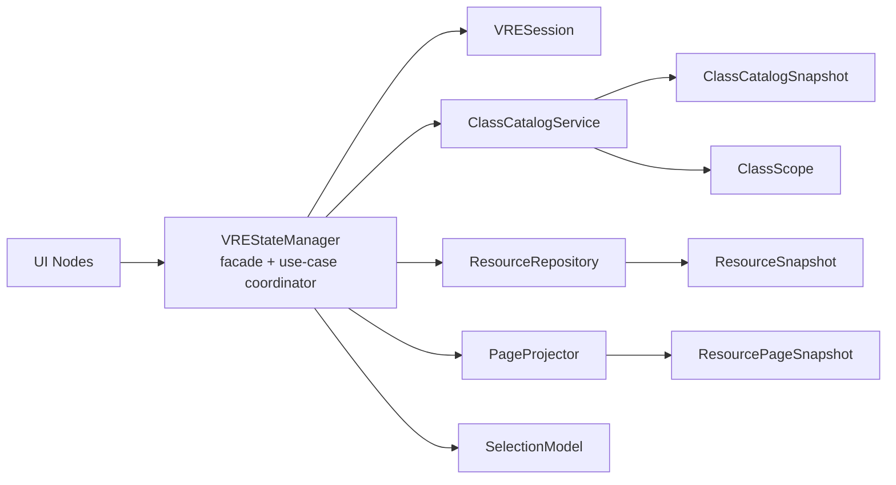
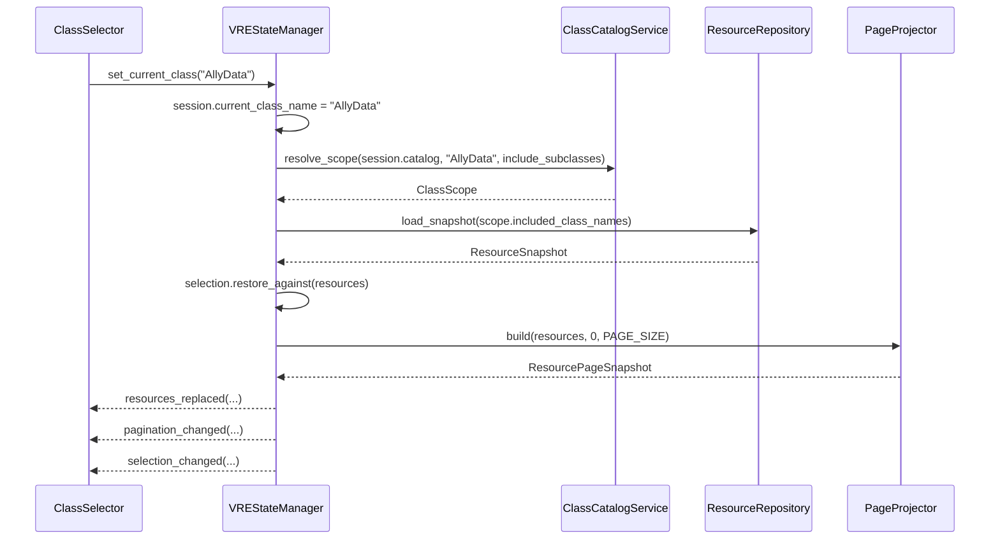
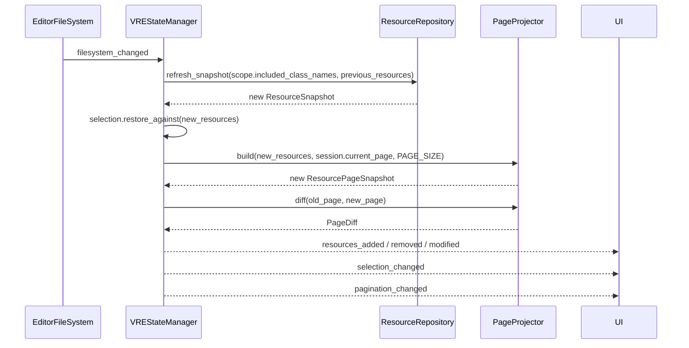
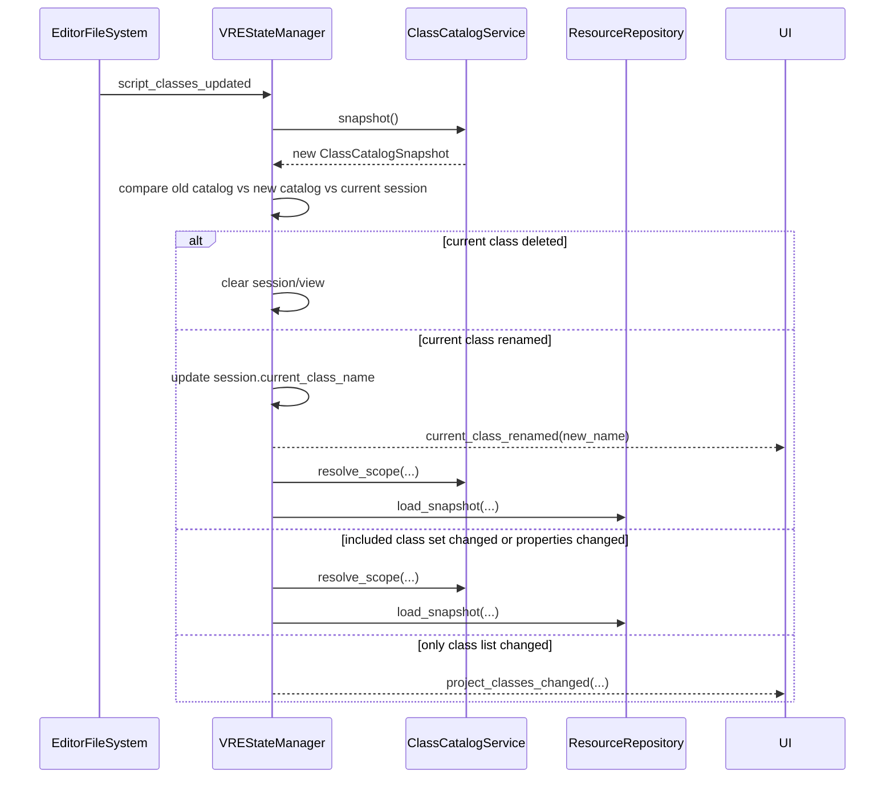

# VSE Architecture Analysis (Codex)

Review scope: `addons/diablohumastudio/visual_resources_editor` only. I did not run the plugin; this is a code-and-structure review.

## Short verdict

This architecture is not awful, but it is absolutely not as clean as the docs pretend.

The folder structure is decent. The scene split is decent. The plugin is still small enough to rescue cheaply.

The real architecture is:

- one large mutable god-object (`VREStateManager`)
- one large static utility junk drawer (`ProjectClassScanner`)
- several "UI" nodes that are not actually UI because they perform domain and infrastructure work directly
- a fragile manual initialization sequence that only works because the caller remembers to do extra steps in the right order

That is a workable "tool script architecture", not a clean MVVM/coordinator architecture.

The harsh version: the docs are selling a cleaner system than the code actually implements.

## What is actually good

- The feature is split into small scenes instead of one 1000-line editor window. That is already better than a lot of Godot tooling code.
- There is one obvious place to look for state (`core/state_manager.gd`), which is ugly but at least discoverable.
- Pagination is a pragmatic choice. You did not waste time on virtualization theater for a 50-row page size.
- `ResourceProperty` is a real improvement over passing raw property dictionaries everywhere.
- The window itself is thin. That is good. The problem is that the thinness was paid for by pushing complexity sideways into other nodes, not by actually simplifying the system.

## The biggest architectural problems

### 1. `VREStateManager` is a god object

`core/state_manager.gd` owns:

- project class maps and class discovery (`18-33`, `315-319`)
- current class selection (`71-78`, `152-165`)
- current resources and file mtimes (`35-44`, `180-240`)
- pagination (`130-147`, `243-312`)
- selection model (`38-40`, `89-127`, `168-177`)
- filesystem event wiring (`48-68`, `322-325`, `450-461`)
- schema migration-ish behavior (`366-377`, `392-402`)
- error relaying and edited-resource relaying (`81-86`)

That is not "state management". That is state, repository, controller, filesystem listener, migration runner, selection model, pagination model, and event bus welded together.

The cost is obvious:

- every new feature will be tempted to "just add one more method" to `VREStateManager`
- the class is already too broad to reason about safely
- hidden side effects are everywhere because reads and writes live in the same object

If this keeps growing in the current style, it will become the plugin's permanent pain point.

### 2. `ProjectClassScanner` is a static junk drawer, not a coherent service

`core/project_class_scanner.gd` does all of this:

- builds class maps (`4-44`)
- walks inheritance (`47-74`)
- crawls the project tree (`77-102`)
- parses `.tres` headers (`105-115`)
- loads scripts and extracts properties (`117-159`)
- merges property lists (`162-175`)
- loads actual resources (`178-193`)

This is too many jobs for one static helper.

It also means there is no clean boundary between:

- "query metadata"
- "scan filesystem"
- "load full resources"
- "understand class inheritance"

So the rest of the codebase cannot depend on a stable abstraction. It depends on a bag of static functions and shared conventions.

### 3. The UI layer is not really a UI layer

The README and diagrams talk about coordinator/MVVM ideas, but the actual code is mostly "smart widgets talking straight to the manager and editor APIs."

Examples:

- `ui/resource_list/resource_row.gd:82-106` changes selection and deletes files directly.
- `ui/toolbar/toolbar.gd:17-52` directly calls refresh, gathers selected resource paths, and forwards dialog errors into global state.
- `core/bulk_editor.gd:69-92` directly mutates resources, saves them, reports UI errors, and kicks the filesystem scan.
- `ui/subclass_filter/subclass_filter.gd` calls `state_manager.set_include_subclasses()` directly.
- `ui/pagination_bar/pagination_bar.gd` wires buttons directly into state transitions.

This is not a coordinator architecture. It is shared mutable state plus active controls.

That is not automatically bad for a tiny tool, but it means:

- behavior is distributed across many nodes
- side effects are easy to hide
- "where should this logic go?" has no clean answer anymore

### 4. Initialization is fragile and non-local

`visual_resources_editor_toolbar.gd:22-37` instantiates the window and then must call:

- `create_and_add_dialogs()`
- `connect_components()`

And `ui/visual_resources_editor_window.gd:8-26` depends on that external dance to become valid.

That is a smell. Any object that requires "instantiate me, then remember to call two more setup methods in the right order" is brittle by construction.

It is even worse because several child components connect to state in setters and `_ready()` without robust idempotence guards:

- `ui/resource_list/resource_list.gd:7-31`
- `ui/toolbar/toolbar.gd:5-22`
- `core/bulk_editor.gd:7-26`
- `ui/class_selector/class_selector.gd`

This works because the current setup path is narrow, not because the lifecycle is solid.

### 5. Hidden mass-write behavior lives inside refresh logic

Two especially bad examples:

- `core/state_manager.gd:366-377` resaves orphaned resources when classes change.
- `core/state_manager.gd:392-402` resaves every resource of the current class when properties change.

That is architecture debt, not just implementation detail.

You have refresh/event-handling code doing silent persistence and schema repair. That makes the system harder to trust because "observe change" and "rewrite files on disk" are mixed together.

If something goes wrong here, the blast radius is not a wrong label in the UI. It is project files being rewritten.

### 6. Delete flow is duplicated and inconsistent

Bulk delete and row delete are not two entry points to the same operation. They are two separate implementations.

- Bulk delete: `ui/dialogs/confirm_delete_dialog.gd:23-40`
- Single-row delete: `ui/resource_list/resource_row.gd:88-106`

Problems:

- different error behavior
- different ownership
- duplicated filesystem update logic
- destructive behavior sitting inside a row widget

This is exactly the kind of duplication that starts small and becomes annoying every time you change the behavior.

### 7. Property filtering rules are duplicated

The same "editor-visible property" filtering logic appears in:

- `core/project_class_scanner.gd:135-159`
- `ui/resource_list/resource_row.gd:28-40`

That means the definition of "what properties count" is not centralized. Sooner or later one side will drift and the UI will disagree with the scanner.

This is a small code smell with big maintenance consequences.

### 8. The docs are drifting away from reality

The codebase contains a lot of architecture narration, but the narration is not stable.

Examples:

- `README.md:96-100` says children wire themselves directly to state.
- `diagrams.md:75-115` describes a coordinator flow where the window routes interactions between UI and state.
- `README.md:115-118` claims `ClassDefinition` is part of the actual model story, but `core/data_models/class_definition.gd` is effectively unused.
- `README.md:133-137` documents UI signals like `row_clicked` and `resource_row_selected`, but the current implementation calls `state_manager` directly instead.

Harsh truth: some of the architecture documentation reads like design fiction.

That matters because misleading docs are worse than missing docs. They waste future debugging time by teaching the wrong mental model.

### 9. There are abandoned abstractions in the tree

Two obvious examples:

- `core/data_models/class_definition.gd`
- `core/editor_filesystem_listener.gd`

These are classic "maybe we were moving toward a cleaner architecture" artifacts.

Dead abstractions are not neutral. They raise the mental cost of the codebase because readers have to figure out whether they are important, obsolete, or half-migrated.

## What is worth changing now

These are the highest-ROI changes. I would do these before adding many more features.

### 1. Split responsibilities, but do it behind the current facade

Do not do a heroic rewrite. Keep `VREStateManager` as the public facade for now, but move responsibilities out of it.

Suggested split:

- `ClassCatalog` or `ClassIndex`
  - class map
  - parent map
  - descendant lookup
  - property lookup
- `ResourceRepository`
  - scan matching resource paths
  - load resources
  - compare snapshots / mtimes
- `SelectionModel`
  - selected paths
  - shift/ctrl logic
  - anchor index
- `PageModel`
  - page size
  - current page
  - visible slice

Then let `VREStateManager` orchestrate those pieces instead of being all of them.

This is the single best architectural improvement you can make without detonating the plugin.

### 2. Create one application service for write operations

Create something like `ResourceCommands` or `VREActions` that owns:

- create resource
- delete resource(s)
- bulk-apply property change
- resave/migrate resources if you really want that behavior

Then both row delete and bulk delete call the same command.

That gives you:

- one place for destructive behavior
- one place for error formatting
- one place for filesystem refresh policy
- one place to add undo/redo later if you want it

### 3. Make initialization explicit and idempotent

Replace the current "call these two methods after instantiate" setup with one safe entry point, for example:

- `window.initialize(context)`

or even better, make the window able to fully initialize itself in `_ready()` once dependencies are assigned.

Also make every connect path safe to call more than once.

Right now too much of the plugin depends on lifecycle luck.

### 4. Centralize editor API access

Right now `EditorInterface`, `EditorFileSystem`, `OS.move_to_trash`, and `ResourceSaver` are touched from too many places.

Wrap them in a thin adapter/service layer. Not for purity theater. For predictability.

The UI should not know when to call `update_file()`, `scan_sources()`, or `move_to_trash()`.

### 5. Delete dead abstractions or finish them

Pick one:

- remove `ClassDefinition` and `EditorFileSystemListener`
- or actually use them

Same for the docs. Either update them to describe the current direct-to-state architecture, or refactor the code to match the coordinator story. Right now you are paying for both stories at once.

### 6. Centralize property visibility rules

Have exactly one place that decides:

- which properties are editor-visible
- which properties belong to a given class
- which columns should be shown

Then the row UI consumes that result instead of re-implementing the filter.

This is a small refactor with good long-term payoff.

## Good changes, but probably too much work right now

### 1. A full MVVM / event-driven rewrite

You do not need a full architecture cosplay rewrite yet.

Yes, a cleaner unidirectional flow would be nicer. No, I would not spend the next week rebuilding a 1.5k-line editor tool into a framework-shaped system.

Do the service split first. If the plugin keeps growing, then revisit the bigger pattern shift.

### 2. Proper undo/redo command architecture

This would be genuinely good, especially for bulk edits and deletes.

But it is not a cheap change because once you do it correctly, it wants to infect:

- bulk editing
- delete flows
- create flow
- schema repair/resave behavior

It is worth it if this tool becomes core workflow infrastructure. Otherwise it is a second-phase improvement.

### 3. Background indexing / async scan pipeline

If the project gets large enough, rescanning the tree and reparsing resource headers will eventually become the next bottleneck.

But I would not build a full indexer yet unless you already feel pain on real projects.

### 4. Strongly typed view models for rows and columns

Passing raw `Resource` objects through the UI is convenient but leaky.

A cleaner version would pass immutable-ish row data:

- path
- display name
- column values
- selection state
- supported actions

That would make the UI much dumber and easier to test, but it is a larger sweep.

## What I would not spend time on yet

- list virtualization
- generic plugin framework abstraction
- dependency injection ceremony
- trying to make this "enterprise clean"

That would be solving the wrong problem.

Your problem is not that the plugin is too small for its architecture.
Your problem is that the boundaries are blurry and the docs oversell the cleanliness.

## If I had to summarize the architecture in one sentence

The plugin is a decent small tool built on a messy-but-recoverable shared-state architecture, and the smartest next move is not a rewrite, it is carving real boundaries around scanning, selection, paging, and destructive actions before `VREStateManager` becomes untouchable.

---

## Detailed expansion of Item 1: split responsibilities behind the current facade

This is the part that matters most if you actually want to implement the split without breaking behavior.

### First: your concern is correct

If you split this into only:

- `ClassesRepository`
- `ResourcesRepository`

you will still feel stuck, because a lot of the current logic is not "class storage" or "resource storage".

It is session logic:

- what class is currently selected
- whether subclasses are included
- what the currently resolved class scope is
- what page the user is on
- what resources are selected
- whether the current class still exists after a class-list refresh
- whether a class rename should be followed
- whether a class/property change requires reloading resources

That logic has to live somewhere.

If it does not get its own home, one of two bad things happens:

1. `ClassesRepository` starts calling `ResourcesRepository`.
2. `ResourcesRepository` starts knowing about current class, page, selection, and class renames.

Both are just the same god-object problem with new filenames.

So the real split is not "two repositories". The real split is:

- metadata / class catalog
- resource loading / scanning
- selection and page state
- a coordinator that combines them for each use case

That coordinator can still be `VREStateManager` for now.

### The key rule

Repositories should answer data questions.

The coordinator should answer workflow questions.

Examples:

- "What are all resource classes in the project?" -> class catalog
- "What are the descendants of `AllyData`?" -> class catalog
- "Load all resources whose class is in this set of names" -> resource repository
- "Given the current class, include-subclasses toggle, previous class snapshot, and new class snapshot, should I reload resources or clear the view?" -> coordinator

That last one is the important part. It is not repository work.

### What the current code is really doing

Right now `VREStateManager` mixes four different layers:

1. Catalog layer
   - `global_class_map`
   - `global_class_to_path_map`
   - `global_class_to_parent_map`
   - `global_class_name_list`

2. Current class scope layer
   - `_current_class_name`
   - `_current_included_class_names`
   - `current_class_script`
   - `current_class_property_list`
   - `current_included_class_property_lists`
   - `current_shared_propery_list`

3. Resource/session layer
   - `current_class_resources`
   - `_current_class_resources_mtimes`
   - `_current_page`
   - `_current_page_resources`
   - `current_page_resources_mtimes`

4. Selection/UI state layer
   - `selected_resources`
   - `_selected_paths`
   - `_selected_resources_last_index`

That is why it feels hard to split. You are not splitting one thing. You are splitting four things that were previously stored in one file.

### The split I would actually implement

Keep `VREStateManager` as the single UI-facing facade for now, but move the internal state into smaller objects.

Recommended internal objects:

| Current responsibility | New home | Why |
| --- | --- | --- |
| global class maps and resource class list | `ClassCatalogSnapshot` | Stable metadata snapshot from the project |
| descendant resolution and property lists for the currently viewed class | `ClassScope` | This is not global catalog data; it is derived from the current selection |
| current resources and class-level mtimes | `ResourceSnapshot` | This is the loaded result for one class scope |
| current page and visible slice | `ResourcePageSnapshot` + `PageProjector` | Paging is a projection over resources, not part of storage |
| selected paths and shift-anchor | `SelectionModel` | Pure interaction state |
| orchestration of refreshes, class updates, page updates, signal emission | `VREStateManager` | Keep it as the coordinator/facade for now |

The biggest mindset shift is this:

- `ClassCatalogSnapshot` is "what exists in the project"
- `ClassScope` is "what the user is currently looking at"

Those are not the same thing.

### Runtime architecture after the split



Important detail:

- the UI still only knows `VREStateManager`
- the coordinator still emits the same signals
- the coordinator still exposes compatibility getters while you migrate

So this is a safe internal refactor, not a mandatory UI rewrite.

### The missing piece: `VRESession`

If you only create repositories, you still need a place to hold "current browsing state".

That place should be a small in-memory object.

For example:

```gdscript
@tool
class_name VRESession
extends RefCounted

var current_class_name: String = ""
var include_subclasses: bool = true
var current_page: int = 0

var catalog: ClassCatalogSnapshot = null
var scope: ClassScope = null
var resources: ResourceSnapshot = null
var page: ResourcePageSnapshot = null
var selection: SelectionModel = SelectionModel.new()
```

This object is the answer to your concern.

`current_class_name` should not live in `ResourcesRepository`.
It should live in session state, and the coordinator should use it to ask the catalog for a `ClassScope`.

Then that `ClassScope` becomes the input to the resource repository.

### The crucial object: `ClassScope`

This is the object your current code is missing as a named concept.

Today `_resolve_current_classes()` and `_scan_current_properties()` build a scope implicitly.
Make it explicit.

```gdscript
@tool
class_name ClassScope
extends RefCounted

var base_class_name: String = ""
var included_class_names: Array[String] = []
var base_script: GDScript = null
var base_properties: Array[ResourceProperty] = []
var included_property_lists: Dictionary[String, Array[ResourceProperty]] = {}
var shared_properties: Array[ResourceProperty] = []
```

This object answers all of these at once:

- what class the user picked
- what classes are currently included
- what properties are valid for the base class
- what properties are valid for included subclasses
- what columns should be shown

Once you have `ClassScope`, the resource repository does not need to know about `current_class_name` directly. It only needs:

- `scope.included_class_names`

That is the seam.

### How the current flows map into the new design

#### 1. Select class

Current code:

- `ClassSelector` -> `state_manager.set_current_class()`
- `VREStateManager.refresh_resource_list_values()`
- resolve included classes
- scan properties
- load resources
- restore selection
- build page
- emit signals

After split:



The important part:

- current class is session state
- included class names come from `ClassScope`
- resource loading depends on `ClassScope`, not on a repository reaching into another repository

#### 2. Toggle include subclasses

This is almost the same as "select class", except:

- `session.current_class_name` stays the same
- `session.include_subclasses` changes
- `ClassScope` is resolved again
- resources reload against the new scope

That means the repository interfaces do not change at all.
Only the coordinator logic changes its query.

#### 3. Filesystem changed

Current code:

- debounce
- scan current class resources using `_current_included_class_names`
- rebuild full class resource array
- rebuild page slice
- diff page slice
- emit add/remove/modify

After split:



Here again, the resource repository only needs:

- included class names
- previous resource snapshot

It does not need to know why those class names were chosen.

#### 4. Script classes updated

This is the case you called out, and it is exactly where the coordinator earns its keep.

Current code does this in `_handle_global_classes_updated()`:

- rebuild class maps
- compare previous class list vs new class list
- maybe resave orphaned resources
- maybe emit dropdown changes
- maybe detect current-class rename
- maybe clear view
- maybe refresh resources
- maybe rescan properties

This is not repository logic. It is use-case logic.

After split:



The reason this works is that you compare snapshots at the coordinator level:

- old catalog snapshot
- new catalog snapshot
- previous `ClassScope`
- current `session.current_class_name`

Then the coordinator decides whether resources must be reloaded.

That is the correct place for the "both repositories are needed" logic.

### Do not make repositories call each other

This is worth saying very directly.

Bad:

- `ResourcesRepository` asks `ClassesRepository` what the current class is.
- `ClassesRepository` calls `ResourcesRepository` when classes change.

Good:

- `VREStateManager` or `VRECoordinator` asks `ClassCatalogService` for a scope.
- `VREStateManager` passes the resulting class names into `ResourceRepository`.
- `VREStateManager` compares old and new catalog snapshots and decides whether to call `ResourceRepository`.

That one rule will save you from recreating the same mess with slightly fancier names.

### Concrete object split

Here is the split I would actually code.

#### `ClassCatalogService`

Responsibilities:

- build project class snapshot
- resolve descendants
- resolve script path by class
- resolve property lists
- build `ClassScope`
- help compare old/new catalog state

Possible API:

```gdscript
@tool
class_name ClassCatalogService
extends RefCounted

func snapshot() -> ClassCatalogSnapshot:
    pass

func resolve_scope(
    catalog: ClassCatalogSnapshot,
    current_class_name: String,
    include_subclasses: bool
) -> ClassScope:
    pass

func detect_rename(
    previous_scope: ClassScope,
    new_catalog: ClassCatalogSnapshot
) -> String:
    pass

func current_scope_changed(
    previous_scope: ClassScope,
    new_scope: ClassScope
) -> bool:
    pass
```

#### `ResourceRepository`

Responsibilities:

- scan resource paths for a given set of class names
- load resources for a query
- refresh previous resource snapshot against disk changes

Possible API:

```gdscript
@tool
class_name ResourceRepository
extends RefCounted

func load_snapshot(included_class_names: Array[String]) -> ResourceSnapshot:
    pass

func refresh_snapshot(
    included_class_names: Array[String],
    previous: ResourceSnapshot
) -> ResourceSnapshot:
    pass
```

#### `SelectionModel`

Responsibilities:

- selected paths
- anchor path for shift-selection
- restore selection after refresh
- materialize selected `Resource` objects from the current resource snapshot

This is one place where I would slightly improve the current implementation.

Right now the selection anchor is `_selected_resources_last_index`.
I would store `anchor_path` instead.

That survives resource reloads more safely.

Possible API:

```gdscript
@tool
class_name SelectionModel
extends RefCounted

var selected_paths: Array[String] = []
var anchor_path: String = ""

func apply_click(
    clicked_path: String,
    ordered_paths: Array[String],
    ctrl_held: bool,
    shift_held: bool
) -> void:
    pass

func restore_against(existing_paths: Array[String]) -> void:
    pass

func to_resources(snapshot: ResourceSnapshot) -> Array[Resource]:
    pass
```

#### `PageProjector`

Responsibilities:

- compute page count
- build a visible page snapshot from a full resource snapshot
- diff old/new page snapshots

Possible API:

```gdscript
@tool
class_name PageProjector
extends RefCounted

func build(
    resource_snapshot: ResourceSnapshot,
    page: int,
    page_size: int
) -> ResourcePageSnapshot:
    pass

func diff(
    previous_page: ResourcePageSnapshot,
    current_page: ResourcePageSnapshot
) -> ResourcePageDiff:
    pass
```

### The minimum compatibility strategy

This is how you make the split safe.

Do not change the UI first.

Keep these public methods on `VREStateManager`:

- `set_current_class()`
- `set_include_subclasses()`
- `set_selected_resources()`
- `next_page()`
- `prev_page()`
- `refresh_resource_list_values()`
- `report_error()`
- `notify_resources_edited()`

Keep these signals:

- `resources_replaced`
- `resources_added`
- `resources_removed`
- `resources_modified`
- `project_classes_changed`
- `selection_changed`
- `pagination_changed`
- `current_class_renamed`
- `resources_edited`
- `error_occurred`

And keep compatibility getters for the fields the rest of the code still reads:

```gdscript
var current_class_name: String:
    get: return _session.current_class_name

var current_class_script: GDScript:
    get: return _session.scope.base_script if _session.scope else null

var current_class_property_list: Array[ResourceProperty]:
    get: return _session.scope.base_properties if _session.scope else []

var current_included_class_property_lists: Dictionary:
    get: return _session.scope.included_property_lists if _session.scope else {}

var current_shared_propery_list: Array[ResourceProperty]:
    get: return _session.scope.shared_properties if _session.scope else []

var global_class_map: Array[Dictionary]:
    get: return _session.catalog.global_class_map if _session.catalog else []

var global_class_name_list: Array[String]:
    get: return _session.catalog.resource_class_names if _session.catalog else []

var selected_resources: Array[Resource]:
    get:
        if _session.resources == null:
            return []
        return _session.selection.to_resources(_session.resources)
```

That means:

- `BulkEditor` still works
- `Toolbar` still works
- `ClassSelector` still works
- `ResourceList` still works

while you move internals out one piece at a time.

### What `VREStateManager` looks like after the split

This is the shape I would target:

```gdscript
@tool
class_name VREStateManager
extends Node

const PAGE_SIZE: int = 50

var _session: VRESession = VRESession.new()
var _catalog_service: ClassCatalogService = ClassCatalogService.new()
var _resource_repo: ResourceRepository = ResourceRepository.new()
var _page_projector: PageProjector = PageProjector.new()

func _ready() -> void:
    _session.catalog = _catalog_service.snapshot()
    _connect_editor_filesystem()

func set_current_class(class_name_str: String) -> void:
    _session.current_class_name = class_name_str
    _reload_scope_and_resources(true, true)

func set_include_subclasses(value: bool) -> void:
    _session.include_subclasses = value
    _reload_scope_and_resources(true, true)

func refresh_resource_list_values() -> void:
    if _session.current_class_name.is_empty():
        return
    _reload_scope_and_resources(true, true)

func set_selected_resources(resource: Resource, ctrl_held: bool, shift_held: bool) -> void:
    if _session.resources == null:
        return
    _session.selection.apply_click(
        resource.resource_path,
        _session.resources.ordered_paths(),
        ctrl_held,
        shift_held
    )
    selection_changed.emit(selected_resources)

func next_page() -> void:
    _set_page(_session.current_page + 1)

func prev_page() -> void:
    _set_page(_session.current_page - 1)

func _reload_scope_and_resources(reset_page: bool, full_replace: bool) -> void:
    if _session.current_class_name.is_empty():
        return

    _session.scope = _catalog_service.resolve_scope(
        _session.catalog,
        _session.current_class_name,
        _session.include_subclasses
    )

    _session.resources = _resource_repo.load_snapshot(
        _session.scope.included_class_names
    )

    _session.selection.restore_against(_session.resources.ordered_paths())

    if reset_page:
        _session.current_page = 0

    _session.page = _page_projector.build(
        _session.resources,
        _session.current_page,
        PAGE_SIZE
    )

    if full_replace:
        resources_replaced.emit(
            _session.page.resources,
            _session.scope.shared_properties
        )
        pagination_changed.emit(_session.page.page, _session.page.page_count)
        selection_changed.emit(selected_resources)
```

That is still the same plugin behavior from the UI's point of view.
The difference is that the internals are finally named and separated.

### Where each current method migrates

This is the simplest mapping from today to tomorrow.

| Current method | New home |
| --- | --- |
| `_set_maps()` | `ClassCatalogService.snapshot()` |
| `_resolve_current_classes()` | `ClassCatalogService.resolve_scope()` |
| `_scan_current_properties()` | `ClassCatalogService.resolve_scope()` |
| `set_current_class_resources(true)` | `ResourceRepository.load_snapshot()` |
| `_scan_class_resources_for_changes()` | `ResourceRepository.refresh_snapshot()` |
| `_scan_page_resources_for_changes()` | `PageProjector.diff()` |
| `_restore_selection()` | `SelectionModel.restore_against()` |
| `handle_select_shift/ctrl/no_key()` | `SelectionModel.apply_click()` |
| `_page_count()` | `PageProjector.build()` or `ResourcePageSnapshot.page_count` |

### The one refactor I would not skip

Do not skip extracting `ClassScope`.

If you do not create that object, you will keep having this problem:

- current class name lives in one place
- included class names in another
- current class properties in another
- shared properties in another
- current class script in another

And every use case will keep reassembling that concept from loose fields.

`ClassScope` is the object that makes the split actually practical.

### Migration order that should work

This is the safest order in this codebase.

1. Introduce `VRESession`, `ClassCatalogSnapshot`, `ClassScope`, `ResourceSnapshot`, `ResourcePageSnapshot`, `SelectionModel`, and `PageProjector`.
2. Keep `VREStateManager` API unchanged, but back its fields with the new objects via getters.
3. Move `_set_maps()`, `_resolve_current_classes()`, and `_scan_current_properties()` into `ClassCatalogService`.
4. Move `set_current_class_resources(true)` and `_scan_class_resources_for_changes()` into `ResourceRepository`.
5. Move page slicing and diffing into `PageProjector`.
6. Move selection logic into `SelectionModel`.
7. Only after all that, decide whether the UI should become dumber.

If you follow that order, you get architecture improvement without having to stop feature work for a rewrite month.

### Bottom line

Your instinct is right: classes and resources do depend on each other in some flows.

But the answer is not "let the repositories know each other."

The answer is:

- keep a session/coordinator layer
- make the coordinator resolve a `ClassScope`
- make the coordinator pass that scope into the resource repository
- make the coordinator compare old/new class snapshots when class updates happen

That is the split that preserves the current behavior and actually reduces complexity instead of redistributing it.
