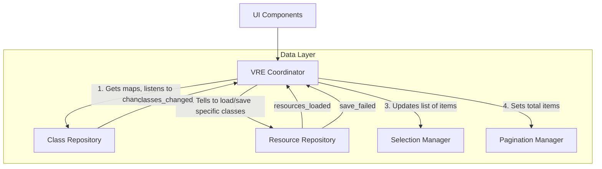
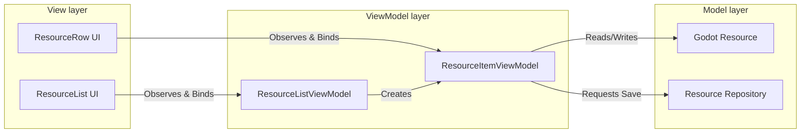

# Visual Resources Editor - Architecture Analysis

Here is a blunt, uncompromising review of the `visual_resources_editor` architecture based on its current implementation.

## The Verdict: The "God Object" Anti-Pattern

The architecture is currently suffering from a massive **God Object** anti-pattern centered around `VREStateManager`. While the folder structure implies a clean separation of concerns (`core/`, `ui/`, `data_models/`), the actual implementation tells a different story. The state manager is a dumping ground for disparate logic, making the plugin tightly coupled, hard to test, and prone to regressions.

---

## 🚨 What MUST Change Immediately (Critical Flaws)

### 1. `VREStateManager` is a God Class
It knows too much and does too much. It handles:
- **Global caching and reflection:** (Class maps, script scanning).
- **Pagination logic:** (`_current_page`, `_current_page_resources`, `PAGE_SIZE`).
- **Complex UI Selection logic:** (`handle_select_shift`, `handle_select_ctrl`, anchor tracking).
- **Filesystem listening:** Directly hooking into `EditorFileSystem` signals.
- **Data Mutation & Saving:** Resaving orphaned resources and handling property changes directly.

**Why it's bad:** Every time you touch anything in the plugin, you risk breaking `VREStateManager`. It violates the Single Responsibility Principle (SRP). 
**Fix:** Split this immediately. You need a separate `SelectionManager` for handling clicks/shifts, and a `PaginationManager`. *(See "Deep Dive" section below for exactly how to untangle this without breaking interconnected logic).*

### 2. Scattered Resource Saving and Data Mutation
Saving logic is duplicated. `VREStateManager` calls `ResourceSaver.save()` directly when handling property changes or orphaned resources. Meanwhile, `BulkEditor` has its own loop calling `ResourceSaver.save()`, maintaining its own failure list, and directly reporting errors. 
**Why it's bad:** If you ever need to change how resources are saved (e.g., adding a confirmation, logging, or deferring saves), you have to hunt down multiple places.
**Fix:** Create a centralized `ResourceRepository` or `StorageManager` that handles all disk writes, error handling, and post-save filesystem scanning.

### 3. Editor Stuttering & File System Abuse
In `BulkEditor`, you call `EditorInterface.get_resource_filesystem().scan_sources()` inside `_on_inspector_property_edited` after saving. If the user edits a property on 50 resources, it saves them synchronously and then forces a filesystem scan on the main thread.
**Why it's bad:** This will freeze the Godot editor, creating a terrible user experience.
**Fix:** `scan_sources()` should be deferred or debounced, and saves should ideally be batched.

### 4. Brittle Resource Parsing
In `ProjectClassScanner.get_class_from_tres_file`, you open the file as a raw text string and do substring matching (`first_line.find("script_class=\"")`).
**Why it's bad:** This is incredibly fragile. A single formatting change by Godot, an extra space, or a slightly different `.tres` header will completely break your class detection silently.

---

## 🛠️ What is Worth Changing (High ROI)

### 1. Actual Use of the Filesystem Listener
You have a file named `core/editor_filesystem_listener.gd`, yet `VREStateManager` connects directly to `EditorInterface.get_resource_filesystem()` in its `_ready` function. 
**Action:** Decouple `VREStateManager` from the Godot Editor interface. Make the filesystem listener a dedicated class that simply emits generic `file_changed` or `files_deleted` signals, and let your data layer subscribe to those.

### 2. Refactoring the Dependency Injection
Injecting `state_manager` into every single UI component (`ClassSelector`, `SubclassFilter`, `ResourceList`, `PaginationBar`) makes the UI highly dependent on the Godot object. 
**Action:** Pass only the specific sub-managers the UI needs. `PaginationBar` only needs a `PaginationManager`. `ResourceList` only needs the resource data and `SelectionManager`.

### 3. Remove Hardcoded Paths
`ProjectClassScanner` hardcodes `"res://addons/"` as an exclusion path. What if a user wants to use this tool on resources provided by a different addon they are actively developing? This should be a configurable setting, not a hardcoded string.

---

## 🔮 Too Much Work, But Would Be Ideal (Long-term Architecture)

### 1. Asynchronous/Background Resource Loading
Currently, `ProjectClassScanner.load_classed_resources_from_dir` and the change-scanning logic block the main thread. If a project has 5,000 resources, switching classes will freeze the editor.
**The Dream:** Move directory scanning and resource caching to a background `WorkerThreadPool`. This is hard to implement cleanly in GDScript due to thread safety with `ResourceLoader` and UI updates, but it is the hallmark of a truly professional editor plugin.

### 2. Strict MVVM (Model-View-ViewModel) Pattern
Right now, UI components bind directly to domain logic via `state_manager`. 
**The Dream:** Implement clear ViewModels. `ResourceRow` shouldn't know what a `Resource` is; it should just get a struct/dictionary of strings to render. This completely decouples Godot's UI from your domain logic and makes the UI completely stateless and testable.

### 3. Command Pattern for Undo/Redo
Bulk editing and property modifying bypass the editor's Undo/Redo history. If a user bulk edits 100 items by mistake, they are screwed. 
**The Dream:** Implement an `EditorUndoRedoManager` wrapper. Every change should generate an undoable action via `EditorPlugin.get_undo_redo()`. This requires significant refactoring of how data flows but is critical for preventing catastrophic user errors.

---
---

# Deep Dive: Dismantling the God Object (Critical Flaw #1)

You noted a very valid concern: *"I try to divide in resources repository and classes repository and this two things happens among many: we need to know the current class to load the resources; we when we compare previous classes for seeing if necesary other changes in resources we need both."*

This is the classic dependency trap. You have Domain A (Classes) and Domain B (Resources). Domain B depends on the data from Domain A. If they both exist inside `VREStateManager`, it feels easy because everything can touch everything. But it creates a tangled mess.

### The Solution: The Coordinator Pattern (or Facade)

To fix this, **neither repository should know the other exists.** Instead, you introduce a **Coordinator** (or Context) whose *only* job is to listen to Domain A, and pass the required data to Domain B.

- **`ClassRepository`**: Only knows about parsing scripts, building the global class map, and figuring out parent-child relationships. It emits a signal: `classes_changed(new_classes, deleted_classes, renamed_classes)`.
- **`ResourceRepository`**: Only knows how to scan the filesystem for `.tres` files matching a provided `Array[String]` of class names, and how to save them. It has a method: `load_resources_for_classes(class_names: Array[String])`. It has NO IDEA what the "current UI selection" is.
- **`VRECoordinator` (The New State Manager)**: This is the glue. It holds references to both repositories. When it hears that classes changed from `ClassRepository`, it calculates what to do, and passes the updated class list to `ResourceRepository`.

### Architectural Diagram



### Detailed Code Implementation

Here is how you structure this in code to guarantee it works.

#### 1. The Class Repository (Isolated)
```gdscript
class_name ClassRepository extends RefCounted

signal classes_updated(previous_classes: Array[String], new_classes: Array[String])

var class_map: Dictionary = {}
var class_names: Array[String] = []

func refresh_classes() -> void:
    var previous = class_names.duplicate()
    # Execute ProjectClassScanner logic here...
    class_map = ProjectClassScanner.build_global_classes_map()
    class_names = ProjectClassScanner.get_project_resource_classes(class_map)
    
    if previous != class_names:
        classes_updated.emit(previous, class_names)

func get_descendants(class_name: String) -> Array[String]:
    return ProjectClassScanner.get_descendant_classes(class_name)
    
func detect_rename(old_script_path: String) -> String:
    # Logic to find if a class name changed but the path remained the same
    pass
```

#### 2. The Resource Repository (Isolated)
```gdscript
class_name ResourceRepository extends RefCounted

signal resources_loaded(resources: Array[Resource])
signal resource_saved(resource: Resource)
signal save_failed(paths: Array[String])

var current_resources: Array[Resource] = []

# Notice how it takes target_classes as an argument. It doesn't rely on global state.
func load_for_classes(target_classes: Array[String]) -> void:
    current_resources = ProjectClassScanner.load_classed_resources_from_dir(target_classes)
    resources_loaded.emit(current_resources)

func save_resources(resources: Array[Resource]) -> void:
    var failed = []
    for res in resources:
        var err = ResourceSaver.save(res, res.resource_path)
        if err != OK:
            failed.append(res.resource_path)
        else:
            resource_saved.emit(res)
    
    if not failed.is_empty():
        save_failed.emit(failed)
        
func handle_orphaned_classes(removed_classes: Array[String]) -> void:
    var orphaned = ProjectClassScanner.load_classed_resources_from_dir(removed_classes)
    save_resources(orphaned)
```

#### 3. The Coordinator (The Glue)
This replaces your `VREStateManager`. Notice how it simply connects the pipes. It has NO complex array sorting, no UI logic, no filesystem scanning logic.

```gdscript
@tool
class_name VRECoordinator extends Node

# Sub-managers instantiated as pure data objects (RefCounted/Object), not Nodes.
var class_repo: ClassRepository = ClassRepository.new()
var resource_repo: ResourceRepository = ResourceRepository.new()
var selection: SelectionManager = SelectionManager.new()
var pagination: PaginationManager = PaginationManager.new()

# State specific to the UI
var current_class_name: String = ""
var include_subclasses: bool = true

func _ready() -> void:
    # 1. Wire up the domain events
    class_repo.classes_updated.connect(_on_classes_updated)
    resource_repo.resources_loaded.connect(_on_resources_loaded)
    
    # 2. Trigger initial load
    class_repo.refresh_classes()

func set_current_class(class_name: String) -> void:
    current_class_name = class_name
    _refresh_resources_for_current_class()

func _refresh_resources_for_current_class() -> void:
    if current_class_name.is_empty():
        return
        
    var target_classes: Array[String] = [current_class_name]
    if include_subclasses:
        target_classes = class_repo.get_descendants(current_class_name)
        
    # TELL the resource repo what to load. It doesn't need to guess.
    resource_repo.load_for_classes(target_classes)

# This solves your specific question: "How do we compare previous classes for seeing if necessary other changes in resources?"
func _on_classes_updated(previous_classes: Array[String], new_classes: Array[String]) -> void:
    # 1. Find removed classes to save orphaned resources
    var removed_classes = []
    for cls in previous_classes:
        if not new_classes.has(cls):
            removed_classes.append(cls)
            
    if not removed_classes.is_empty():
        resource_repo.handle_orphaned_classes(removed_classes)

    # 2. Handle the currently selected class in the UI
    if not current_class_name.is_empty() and not new_classes.has(current_class_name):
        var renamed_to = class_repo.detect_rename(...)
        if renamed_to:
            set_current_class(renamed_to)
        else:
            set_current_class("") # Class was fully deleted
            return
            
    # 3. Always refresh resources just in case inheritance changed
    _refresh_resources_for_current_class()

func _on_resources_loaded(resources: Array[Resource]) -> void:
    # Pass the fresh resources down the pipe to the UI managers
    pagination.set_items(resources)
    selection.validate_against_new_list(resources)
```

#### 4. The Selection Manager (Isolated UI Logic)
You abstract away the messy `Shift+Click` and `Ctrl+Click` logic into a pure data class.

```gdscript
class_name SelectionManager extends RefCounted

signal selection_changed(selected_items: Array)

var selected_items: Array = []
var _last_anchor_index: int = -1

func select_item(item: Variant, items_list: Array, shift_held: bool, ctrl_held: bool) -> void:
    var current_idx = items_list.find(item)
    
    if shift_held and _last_anchor_index != -1:
        # Shift logic (range select)
        selected_items.clear()
        var from = mini(_last_anchor_index, current_idx)
        var to = maxi(_last_anchor_index, current_idx)
        for i in range(from, to + 1):
            selected_items.append(items_list[i])
    elif ctrl_held:
        # Ctrl logic (toggle)
        if selected_items.has(item):
            selected_items.erase(item)
        else:
            selected_items.append(item)
        _last_anchor_index = current_idx
    else:
        # Normal click
        selected_items = [item]
        _last_anchor_index = current_idx
        
    selection_changed.emit(selected_items)

# When resources reload, clean up dangling selection references
func validate_against_new_list(new_items: Array) -> void:
    var valid_items = []
    for item in selected_items:
        if new_items.has(item):
            valid_items.append(item)
    selected_items = valid_items
    selection_changed.emit(selected_items)
```

### Why this works so much better:
1. **Testability:** You can now test `SelectionManager` without opening a Godot Editor or creating a `.tres` file. You just pass it arrays of strings/ints.
2. **Safety:** If Godot's filesystem API changes, you only update `ResourceRepository`. If Godot's reflection API changes, you only update `ClassRepository`. 
3. **Clarity:** `VRECoordinator` reads like a plain English story. "When classes update -> handle orphans -> check if current class died -> refresh resources." It no longer contains confusing `for` loops or file modification time checks.

---
---

# Deep Dive: Strict MVVM (Long-term Ideal #2)

You asked how a strict MVVM (Model-View-ViewModel) pattern would look in this context. Currently, your UI components (`ResourceList`, `ResourceRow`) are tightly coupled to Godot's Domain objects (`Resource`, `ResourceProperty`) and your global state (`VREStateManager`). 

If you want to render a property, your UI is directly asking the state manager what properties exist, reading from the resource, and updating the resource directly.

### The Solution: The ViewModel Wrapper

The core rule of MVVM is: **The View (UI) should never know about the Model (Database/Resource).**

Instead, you create a **ViewModel**. A ViewModel is a pure data object that takes the messy domain data and translates it into exactly what the View needs to display. 

### Architectural Diagram



### Detailed Code Implementation

Here is how you separate Godot's UI nodes from Godot's data resources.

#### 1. The ViewModel (The Translator)
This script holds the data for exactly ONE row in your UI. It is NOT a Control node. It is pure data.

```gdscript
class_name ResourceItemViewModel extends RefCounted

signal property_updated(property_name: String, new_value: Variant)
signal save_requested(resource: Resource)

var _resource: Resource
var _properties_to_display: Array[String] = []

# The UI only knows about this view model, not the underlying resource
var display_name: String:
    get: return _resource.resource_path.get_file()

func _init(resource: Resource, properties: Array[String]) -> void:
    self._resource = resource
    self._properties_to_display = properties

# The UI calls this to populate its columns
func get_display_properties() -> Array[String]:
    return _properties_to_display

func get_property_value(prop_name: String) -> Variant:
    if prop_name in _resource:
        return _resource.get(prop_name)
    return null

# The UI calls this when a user types in a LineEdit
func update_property(prop_name: String, new_value: Variant) -> void:
    if _resource.get(prop_name) == new_value:
        return
        
    _resource.set(prop_name, new_value)
    property_updated.emit(prop_name, new_value)
    
    # Notify the repository that this resource needs saving
    save_requested.emit(_resource)
```

#### 2. The View (The UI Node)
This replaces `ResourceRow.gd`. Notice how it has **no idea** what a Godot `Resource` is. It only takes a `ResourceItemViewModel`. It has no reference to `VREStateManager`.

```gdscript
@tool
class_name ResourceRowView extends HBoxContainer

# The View only knows about the ViewModel
var view_model: ResourceItemViewModel:
    set = set_view_model

func set_view_model(vm: ResourceItemViewModel) -> void:
    if view_model:
        view_model.property_updated.disconnect(_on_vm_property_updated)
        
    view_model = vm
    view_model.property_updated.connect(_on_vm_property_updated)
    
    _build_ui()

func _build_ui() -> void:
    # Clear old children...
    
    # 1. Setup the label
    var title = Label.new()
    title.text = view_model.display_name
    add_child(title)
    
    # 2. Setup the columns based entirely on the ViewModel
    for prop_name in view_model.get_display_properties():
        var val = view_model.get_property_value(prop_name)
        
        var input = LineEdit.new()
        input.text = str(val)
        
        # When user types, tell the ViewModel
        input.text_submitted.connect(func(new_text):
            view_model.update_property(prop_name, new_text)
        )
        add_child(input)

# When the ViewModel updates (maybe from a Bulk Edit!), the UI updates automatically
func _on_vm_property_updated(prop_name: String, new_value: Variant) -> void:
    # Find the corresponding LineEdit and update its text
    pass
```

### Why this is the "Dream" state:
1. **Total Decoupling:** If you decide to change how your plugin saves files, or how it scans for properties, `ResourceRow.gd` doesn't change a single line of code. It only cares about `ResourceItemViewModel`.
2. **Bulk Editing is Trivial:** If your `BulkEditor` modifies 50 `Resource` objects, the `ResourceItemViewModel` for each of those resources can detect the change and emit `property_updated`. The `ResourceRowView` will instantly update on screen, without you needing to manually refresh the whole `ResourceList`.
3. **Mocking UI:** You can instantiate `ResourceRowView` and pass it a fake `ResourceItemViewModel` that doesn't even have a real `.tres` file attached to it, making UI testing instantly possible without touching the file system.