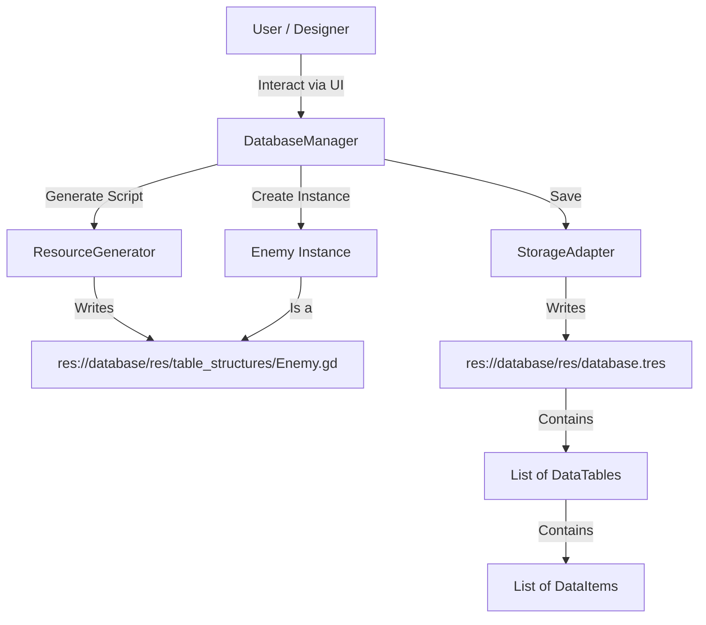
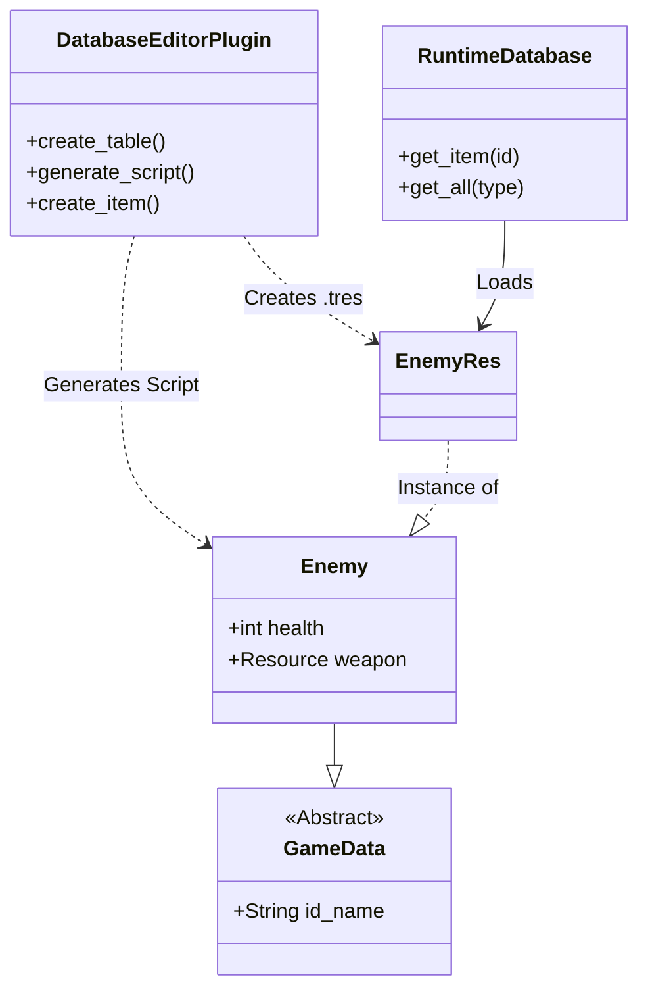

# Data System Analysis & Redesign

## 1. Current System Analysis

The `DatabaseManager` is a custom Godot editor plugin designed to manage game data. It uses a "Code Generation + Resource" approach, where defining a table in the editor generates a corresponding GDScript class (extending `DataItem`) and stores instances of that class in a central `Database` resource.

### Architecture Overview

The system consists of three main layers:
1.  **Editor / Orchestration**: `DatabaseManager` (Autoload) handles the logic for creating tables, fields, and managing the lifecycle of data.
2.  **Data Model**: Generated GDScript files (`table_structures/*.gd`) define the schema using strongly-typed `@export` variables.
3.  **Storage**: A monolithic `database.tres` file holds the `Database` resource, which contains a list of `DataTable` resources, which in turn hold lists of `DataItem` instances.

### Key Components

*   **`DatabaseManager`**: The brain of the operation. It uses `ResourceGenerator` to write `.gd` files to disk. It uses reflection to read properties back from those scripts to populate the editor UI.
*   **`ResourceGenerator`**: A utility that writes GDScript source code strings for `DataItem` subclasses and Enum ID files.
*   **`DataItem`**: The base class for all data. It has a `name` and a stable `id`.
*   **`DataTable`**: A wrapper resource that groups `DataItem` instances of a specific type.

### Logic Flow



## 2. Critique

### Strengths
*   **Strong Typing**: Because it generates actual GDScript classes, you get code completion and type safety in your game code (e.g., `item is Enemy`).
*   **Godot Integration**: Uses `Resource` and `@export`, so the Inspector and standard Godot editing tools work natively with the data.
*   **Stable IDs**: The auto-generated `*_ids.gd` enum files allow you to reference data by constant (e.g., `EnemyIds.Id.GOBLIN`) rather than magic strings, which is excellent for refactoring.

### Weaknesses & Risks

#### 1. Monolithic Storage (Critical)
The entire database (all tables, all instances) is saved in **one single file**: `database.tres`.
*   **VCS Conflicts**: If two designers change different items, they will likely get a merge conflict in `database.tres`.
*   **Performance**: As the game grows to thousands of items, saving/loading this single file will become slow.
*   **Granularity**: You cannot load just "Items" without loading "Enemies" and "Levels".

#### 2. Fragile Reflection
The system relies on loading the generated script to understand the schema (`get_script_property_list`). If a generated script has a syntax error (e.g., user manual edit), the whole DB manager might crash or fail to load that table.

#### 3. Runtime/Editor Coupling
The `DatabaseManager` is an editor tool (`@tool`), but it is also intended to be an autoload for runtime. This mixes concerns. The runtime code shouldn't need the logic to *generate* scripts or *save* data, only to *read* it.

#### 4. Circular Dependency Risk
The system attempts to handle inheritance, but complex dependencies between generated scripts (Table A references Table B, Table B references Table A) can cause Godot's cyclic dependency errors, especially since they are all loaded by the same orchestrator.

## 3. Redesign Recommendations

The goal is to keep the "Generated Class" benefit (typing) but fix the storage and architecture issues.

### Phase 1: Split Storage (Granularity)

Instead of `database.tres` holding everything, use the file system as the database structure.

*   **Structure**:
    ```text
    res://database/
    ├── definitions/          # The Schema
    │   ├── enemy.gd          # Generated class
    │   └── item.gd
    ├── data/                 # The Instances
    │   ├── enemy/
    │   │   ├── goblin.tres   # Single Resource instance
    │   │   └── orc.tres
    │   └── item/
    │       ├── sword.tres
    │       └── potion.tres
    └── singletons/
        └── database.gd       # Runtime loader
    ```
*   **Benefit**: git friendly. 1 item = 1 file. easier to review changes.
*   **Implementation**: `DataTable` should no longer hold an array of instances. Instead, it (or the Manager) should just scan the `res://database/data/tablename/` folder for `.tres` files.

### Phase 2: Architecture Decoupling

Separation of concerns:
1.  **Editor Plugin**: Handles Schema editing, Generation, and CRUD of `.tres` files.
2.  **Runtime Loader**: A lightweight static class or autoload that simply indexes the files.

**New Runtime Flow**:
```gdscript
# No massive pre-load. Load on demand or preload specific tables.
var goblin = DB.get_enemy(EnemyIds.Id.GOBLIN) 
```

### Phase 3: Resource-Based References

Currently, foreign keys seem to be stored as `IDs` (ints).
*   **Change**: Use actual `Resource` references in the generated properties.
    *   Instead of `@export var weapon_id: int`, use `@export var weapon: Weapon`.
*   **Why**: Godot handles dependencies automatically. If you rename a resource file, Godot updates the reference. You get "Go to definition" for free.
*   **Hybrid**: Keep the Enum IDs for code lookup, but use Resource references for data inter-connectivity.

## Proposed New Architecture Diagram



## Summary of Tasks for Redesign

1.  **Modify `StorageAdapter`**: Change it to save individual `.tres` files per instance instead of one big file.
2.  **Update `DatabaseManager`**: Remove the `instances` array from `DataTable`. Make it scan directories to find instances.
3.  **Refactor `ResourceGenerator`**: Ensure generated scripts are self-contained.
4.  **Create Runtime Loader**: Make a small `Database` class that is *not* a tool script, purely for efficient runtime lookup.
