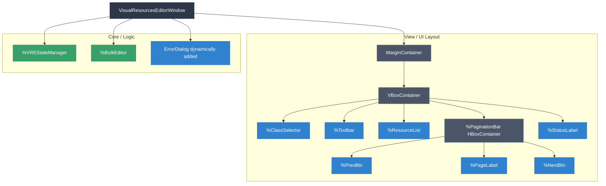
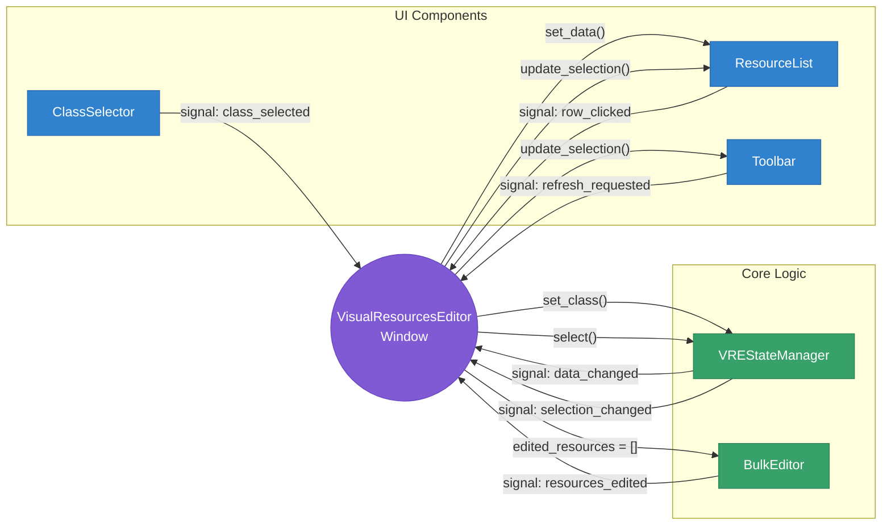
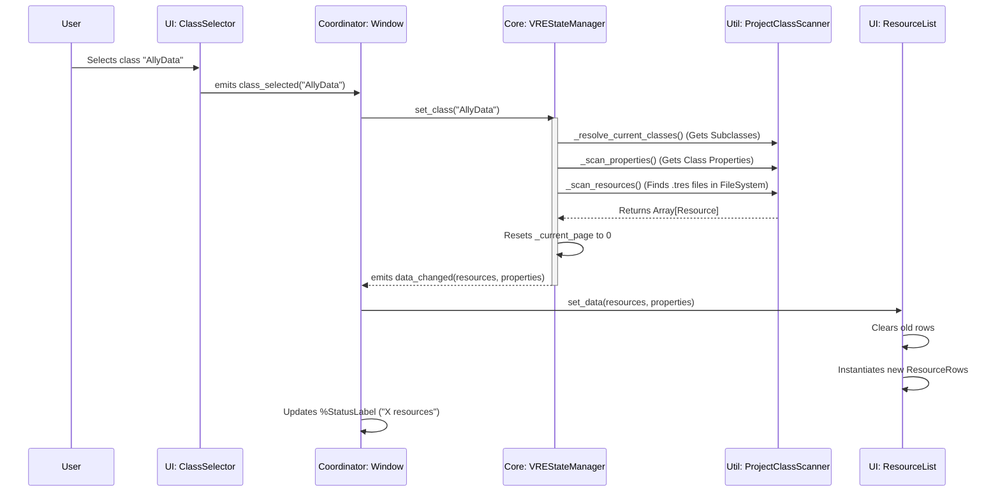
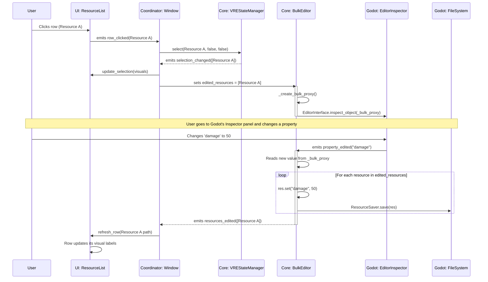
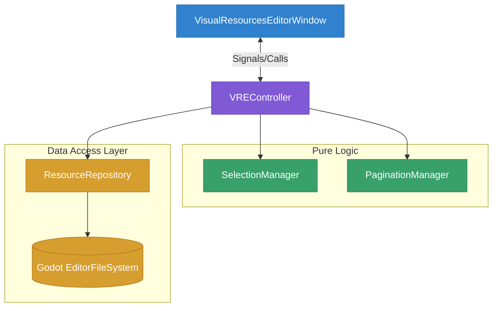

# Visual Resources Editor - Architecture & Information Flow

## Previous State

Based on the code analysis of the `addons/diablohumastudio/visual_resources_editor` directory, the plugin is structured using a very clean, modular **MVVM-like (Model-View-ViewModel) or Coordinator pattern**. 

The main entry point is the `VisualResourcesEditorWindow`, which acts as the central coordinator connecting pure UI components (Views) with the core logic managers (Models/State).

Here is a detailed breakdown and diagrams explaining the subdivision and the information flow.

---

### 1. Window Subdivision (Component Hierarchy)

The `VisualResourcesEditorWindow.tscn` is divided into a clear visual layer (the layout) and a logic layer (State and Editor nodes attached directly to the window).



**Subdivision Breakdown:**
*   **Top Bar (`%ClassSelector`)**: A dropdown to select which `Resource` class to inspect, along with a toggle to include its subclasses.
*   **Actions (`%Toolbar`)**: Contains global actions like "Create New", "Delete Selected", and "Refresh".
*   **Main Content (`%ResourceList`)**: A scrollable table/list showing the resource instances and their properties.
*   **Bottom Bar (`%PaginationBar` & `%StatusLabel`)**: Handles navigation for large sets of resources and displays the current selection/visible count.
*   **Invisible Logic Nodes**: `%VREStateManager` (holds all data and file tracking) and `%BulkEditor` (intercepts Godot Editor inspector changes to apply them to multiple resources).

---

### 2. High-Level Information Flow Architecture

The `VisualResourcesEditorWindow` script acts strictly as a **Coordinator**. UI components never talk directly to the State Manager or Bulk Editor. Instead, UI components emit signals (`class_selected`, `row_clicked`), the Window listens to them, calls methods on the State Manager, and the State Manager emits signals back (`data_changed`, `selection_changed`) which the Window uses to update the UI.



---

### 3. Detailed Data Flow: Selecting a Class & Loading Data

When the user selects a class from the dropdown, a complex chain of data processing happens inside the `VREStateManager` before it reaches the UI.



---

### 4. Detailed Data Flow: Multi-Selection & Bulk Editing

The `BulkEditor` is a very clever node. It tracks selection changes, creates a dummy "proxy" object to show in the native Godot Inspector, and when the user changes a value in the inspector, it applies that value to *all* selected resources.



### 5. File System Tracking (The Background Loop)
The `VREStateManager` stays in sync with Godot's native filesystem.

1. It connects to Godot's `EditorFileSystem.filesystem_changed` and `script_classes_updated`.
2. When a file changes externally, Godot triggers the signal.
3. `VREStateManager` waits briefly using a Debounce Timer to prevent spam.
4. It then runs `_rescan_resources_only()`. It checks modified times (`mtimes`) of known paths. 
5. If a new resource was added, it appends it. If one was deleted, it removes it. If changed, it reloads it.
6. It then fires `data_changed` back to the window while **preserving the user's current pagination page and selection**.


---

## Refactoring Proposals

### The Problem
Currently, `VREStateManager` is a "God Object" anti-pattern. It handles:
1. File System interaction and polling (tied to Godot's `EditorInterface`).
2. Global script class mapping.
3. Data storage (caching the resources).
4. Presentation Logic (pagination logic, selection sets with Shift/Ctrl modifiers).

Because it relies heavily on `EditorInterface.get_resource_filesystem()`, it is **extremely difficult to unit test automatically** outside of an active editor session, and any change to pagination logic runs the risk of breaking file polling logic.

Here are a couple of solutions to split this file and make it testable:

### Solution 1: strict MVC (Model-View-Controller) with Repository Pattern
This approach isolates the data-fetching from the state-tracking. 

**1. Create a `ResourceRepository` (The Model/Service)**
Move all file system tracking, script class scanning, and `EditorFileSystem` connections to a dedicated repository class.
- **Responsibility:** "Give me all resources for class X", "Save resource Y", and emitting a `repository_changed` signal.
- **Testing:** You can create a `MockResourceRepository` that just holds a static array of fake `Resource` objects for testing the UI and Controllers.

**2. Create a `SelectionManager` & `PaginationManager` (Pure Controllers)**
Extract the `Shift+Click` logic and page math into pure `RefCounted` objects.
- **Responsibility:** Given an array and input coordinates/clicks, output what should be selected or what page we are on.
- **Testing:** These classes don't need Godot. You can write simple GUT (Godot Unit Test) tests: `assert_eq(pagination.get_page_count(105 items), 3)` or `assert_true(selection.select_with_shift(item3))`.

**3. The Controller (`VREController` instead of StateManager)**
The controller stitches them together. It instantiates the Repository, the Pagination, and the Selection managers. It receives inputs from the Window and updates the managers.



### Solution 2: MVVM (Model-View-ViewModel) with Dependency Injection (DI)
This pattern is very popular in modern UI development (like C# WPF or modern web frameworks) and is great for UI-heavy tools.

**1. Define Interfaces (Base Classes in GDScript)**
Create an abstract base class `IFileSystemService.gd`.
```gdscript
class_name IFileSystemService
extends RefCounted
signal files_changed
func get_resources(class_name: String) -> Array[Resource]: return []
```
Create `GodotFileSystemService.gd` that extends it and uses `EditorInterface`.

**2. The `VREViewModel` (The new StateManager)**
The ViewModel holds the reactive state. It has NO references to `EditorInterface`. 
Instead, when you initialize it, you inject the service:
```gdscript
var _fs_service: IFileSystemService

func _init(fs_service: IFileSystemService):
    _fs_service = fs_service
    _fs_service.files_changed.connect(_on_files_changed)
```

**3. Testability**
For automated testing, you write a test script that does:
```gdscript
func test_pagination_resets_on_class_change():
    var mock_fs = MockFileSystemService.new()
    var view_model = VREViewModel.new(mock_fs)
    
    view_model.current_page = 5
    view_model.set_class("NewClass")
    
    assert_eq(view_model.current_page, 0, "Page should reset to 0 when class changes")
```
Because the ViewModel does not try to talk to the real Godot Editor File System, the test runs instantly and safely in the CI/CD pipeline.

### Summary of the Action Plan for Refactoring:
1. **Split the Data Access:** Move `_on_filesystem_changed`, `_rescan_resources_only`, and `_set_maps` out of `VREStateManager.gd` and into a new `FileSystemScanner.gd` node.
2. **Split the Logic:** Move `select()` (the shift/ctrl clicking math) and `next_page() / prev_page()` into pure, detached scripts.
3. **Keep the Window Dumb:** The Window should continue to just pipe signals between the UI and the new, separated logic blocks.